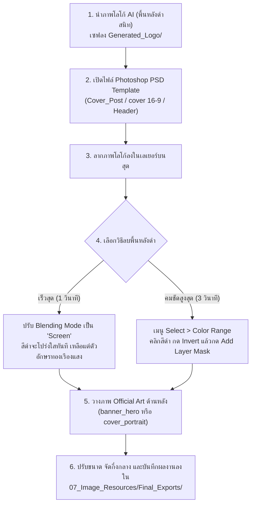

# 🎨 AI Logo & Branding Design Prompt: UNCHARTED Legacy of Thieves Collection
### คู่มือและชุดคำสั่ง Prompt สำหรับสร้าง "โลโก้ชื่อเกมภาษาไทย" และสื่อประชาสัมพันธ์
**ผู้จัดทำ:** "หน๊ด หนวด translator" (NodNuatTranslator)  
**โฟลเดอร์ปฏิบัติการ:** `07_Image_Resources/Generated_Logo/`  

เอกสารนี้รวบรวมคำสั่ง Prompt คุณภาพสูงสำหรับนำไปใช้กับ AI สร้างภาพระดับเรือธง (**Midjourney v6.1**, **FLUX.1 Dev/Schnell**, **SDXL / ComfyUI**, **DALL-E 3**) เพื่อสร้าง **"โลโก้ชื่อเกมภาษาไทย" (Thai Stylized Game Title Logo)** ที่ถอดรหัส Art Direction, Lighting, และ Texture จากเกม **UNCHARTED Legacy of Thieves Collection** (การผจญภัยล่าขุมทรัพย์โจรสลัด Henry Avery แห่ง Libertalia และงาช้างพระพิฆเนศแห่งอินเดียโบราณ) สำหรับนำมาประกอบลงใน Photoshop PSD Templates ในโฟลเดอร์ `07_Image_Resources/` ได้อย่างสมบูรณ์แบบใน 1 คลิก

---

## 1. ข้อมูลอัตลักษณ์ทางศิลป์ของเกม (Game Visual DNA)
- **ชื่อเกมภาษาอังกฤษ:** UNCHARTED: Legacy of Thieves Collection
- **Engine สถาปัตยกรรม:** Custom Engine (Naughty Dog In-House Engine)
- **ธีมและอารมณ์ศิลป์ (Theme & Atmosphere):** Cinematic Action Adventure / Pirate Treasure Hunt / Ancient Lost Civilizations / Rugged Expedition
- **โทนสีหลัก (Color Palette):**
  - **Pirate Gold & Ancient Brass:** สีทองคำโจรสลัดโบราณ และทองเหลืองรมดำ (`#D4AF37`, `#AA7C11`)
  - **Weathered Granite & Stone:** สีหินโบราณสลักลาย ผุกร่อนตามกาลเวลา (`#5A554C`, `#2B2B2B`)
  - **Tropical Cyan & Deep Ocean:** สีน้ำทะเลเขตร้อนและท้องฟ้านอกแผนที่ (`#0E7C7B`, `#172A3A`)
  - **Pure Obsidian Black:** พื้นหลังสีดำสนิท 100% สำหรับไดคัท (`#000000`)
- **พื้นผิวและเอฟเฟกต์ (Material & Texture):** Heavy 3D beveled weathered gold and bronze, chiseled ancient stone texture, pirate skull coin engravings, subtle bullet scratches, brushed metal patina
- **การจัดแสง (Lighting):** Dramatic high-contrast golden-hour rim lighting, warm torchlight ambient glow, razor-sharp specular highlights on beveled edges
- **คีย์เวิร์ดบังคับความแม่นยำ:** `3D extruded lettering`, `completely isolated on pure solid flat black background`

---

## 💡 2. ไอเดียชื่อเกมภาษาไทย (Thai Title Concepts & Brainstorming)
> นำชื่อที่ถูกใจไปใส่แทนที่คำว่า `[THAI_TITLE]` ในกล่อง Prompt ด้านล่างนี้:

| สไตล์ / รูปแบบ | ไอเดียชื่อไตเติลภาษาไทย | คำอธิบายและจุดเด่น |
| :--- | :--- | :--- |
| **1. ทับศัพท์โมเดิร์น (Modern Transliteration)** | `อันชาร์ติด: มรดกจอมโจร คอลเลกชัน` | คงความขลังของชื่อแบรนด์ UNCHARTED ผสานคำแปลซับไตเติลทางการ ชัดเจน สื่อถึงภาครวมทั้งสองภาค |
| **2. ผจญภัยล่าสมบัติ (Narrative & Epic)** | `อันชาร์ติด: มรดกเลือด ล่าสมบัติมหาโจร` | ถ่ายทอดความเข้มข้นของเนื้อเรื่อง Nathan, Sam, Chloe, Nadine ในการตามรอยสมบัติโจรสลัด Libertalia และอารยธรรมอินเดียโบราณ |
| **3. มหากาพย์ภาพยนตร์ (Hollywood Adventure)** | `ตำนานล่าขุมทรัพย์สุดขอบฟ้า: มรดกจอมโจร` | ให้บรรยากาศแบบภาพยนตร์ผจญภัยระดับบล็อกบัสเตอร์ ยิ่งใหญ่ อารมณ์ National Treasure / Indiana Jones |
| **4. สั้นกระชับติดหู (Punchy & Iconic - แนะนำ)** | `อันชาร์ติด: มรดกจอมโจร` | สั้น คม พยางค์กระชับ จัดวางคู่กับตราสัญลักษณ์หรือฟอนต์อังกฤษได้อย่างสมดุลสูงสุด |
| **5. ภาษาไทยเพียว (Pure Thai Title)** | `มรดกจอมโจร ล่าขุมทรัพย์สุดหล้า` | สื่อถึงการเดินทางข้ามโลกไปยังดินแดนที่ไม่เคยปรากฏบนแผนที่ (Uncharted territory) |

---

## 3. ชุดคำสั่งสร้างภาพโลโก้ (Ready-to-Use Image Prompts)

### 🌟 3.1 Midjourney (v6.1) — แนะนำสูงสุดสำหรับงาน Typography & Metallic Textures
> **วิธีใช้:** คัดลอกโค้ดด้านล่างไปวางใน Discord ช่องสั่งงาน Midjourney (แทนที่ `[THAI_TITLE]` ด้วยชื่อที่เลือก เช่น `อันชาร์ติด: มรดกจอมโจร`)

```text
/imagine prompt: professional cinematic video game title logo typography, modern stylized bold 3D typography reading "[THAI_TITLE]", 3D extruded lettering, heavy beveled antique pirate gold and weathered bronze alloy, chiseled ancient ruin stone texture, subtle pirate coin engravings, dramatic warm sunset rim lighting, intense specular metallic edge highlights, cinematic adventure depth, high contrast, completely isolated on pure solid flat black background, no background elements, no scenery, no characters, no watermark, graphic design masterpiece, 8k resolution, Unreal Engine 5 render aesthetic --ar 16:9 --v 6.1 --style raw
```

---

### ⚡ 3.2 FLUX.1 (Dev / Schnell) — โครงสร้างตัวอักษรคมชัด ไร้สิ่งรบกวน
> **วิธีใช้:** ใช้บน Fal.ai, Replicate, หรือ ComfyUI (FLUX Pipeline)

**Positive Prompt:**
```text
Game logo title typography for "UNCHARTED Legacy of Thieves Collection", bold 3D extruded lettering reading "[THAI_TITLE]", stylized Thai glyph aesthetics with ancient treasure hunt motif, 3D extruded lettering, heavy dimensional beveled pirate gold and weathered brass, rustic scratches and antique patina, dramatic cinematic rim lighting, razor-sharp edges, perfectly centered, completely isolated on pure solid flat black background, graphic design promotional game logo, 8k resolution, octane render
```

---

### 🎨 3.3 Stable Diffusion XL (SDXL) / ComfyUI
**Positive Prompt:**
```text
(masterpiece, best quality:1.3), video game title logo typography, bold 3D extruded lettering reading "[THAI_TITLE]", ancient pirate gold and aged bronze material, heavy beveled dimensional letters, chiseled stone relief accents, dramatic golden rim lighting, cinematic volumetric lighting, sharp focus, perfectly centered, (completely isolated on pure solid flat black background:1.5), vector logo aesthetics, professional typography asset, 8k
```

**Negative Prompt (บังคับใส่ในช่อง Negative เสมอ):**
```text
(photorealistic humans:1.4), characters, person, complex background, scenery, landscape, jungle, sea, blurry, noisy, lowres, deformed letters, illegible mess, clutter, watercolor, gradient background, white background, multiple logos, frames, borders, watermark, signature
```

---

### 🤖 3.4 DALL-E 3 (ChatGPT Plus / Bing Image Creator)
```text
Create a high-resolution cinematic 3D video game title logo for "UNCHARTED Legacy of Thieves Collection". The logo must feature bold, heavy 3D extruded lettering reading "[THAI_TITLE]" in a rugged cinematic treasure-hunter adventure style. The lettering material should be weathered pirate gold with antique bronze beveled edges, rustic micro-scratches, and subtle ancient archaeological engravings. Illuminate the text with dramatic warm golden rim lighting and specular edge highlights. CRITICAL REQUIREMENT: The typography must be perfectly centered and completely isolated on pure solid flat black background with zero scenery, zero characters, and no background objects, ready for instant transparent cutout in Photoshop.
```

---

## 🛠️ 4. คู่มือประกอบงานใน Photoshop (1-Click Workflow)

เมื่อสร้างภาพโลโก้จาก AI แล้ว ให้ปฏิบัติตามขั้นตอนนี้เพื่อประกอบสื่อประชาสัมพันธ์สุดอลังการสำหรับเพจ **"หน๊ด หนวด translator"**:



### ขั้นตอนการประกอบละเอียด:
1. **คลังภาพ Official Art พร้อมใช้:**
   - โปสเตอร์แนวตั้งความละเอียดสูง: `Official_Art/cover_portrait_600x900.jpg`
   - แบนเนอร์จอกว้าง Ultra-wide: `Official_Art/banner_hero_1920x620.jpg`
   - โลโก้ทางการคมชัดหลายขนาด: `Official_Art/Logos/` (มีตั้งแต่ 128px จนถึง 2048px 4K)
2. **ไฟล์ Photoshop Templates ประจำโฟลเดอร์:**
   - `Cover_Post facebook.psd`: ภาพโพสต์ลงเพจ Facebook ประชาสัมพันธ์เปิดตัวม็อด
   - `Header_facebook.psd`: แบนเนอร์ปกหัวเพจ
   - `cover 16-9.psd`: ปกหลักแนวนอน 16:9 สำหรับ THub / สื่อวิดีโอ
   - `Header copy.psd`: ส่วนหัวโปรเจกต์ม็อด
3. **การส่งออกผลงาน (Export):**
   - ส่งออกภาพผลงานเป็น `.PNG` หรือ `.JPG` (คุณภาพ 100%) บันทึกไว้ที่:  
     `E:\Mod_Workspace\UNCHARTED_Legacy_of_Thieves_Collection/07_Image_Resources/Final_Exports/`
