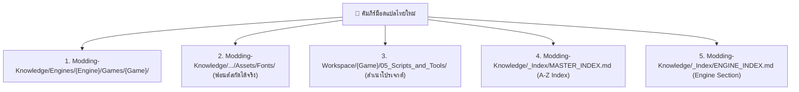

# 📖 มาตรฐานการสร้างคัมภีร์ม็อดแปลไทย (Thai Localization Bible Standard)
### Rivet Engineer Advanced Edition

เอกสารนี้กำหนดระเบียบและมาตรฐานขั้นสูงสุดสำหรับการสั่งให้ AI (Prompting) หรือนักพัฒนาม็อด ทำการวิเคราะห์เจาะลึกสถาปัตยกรรมตัวเกม (Deep Reverse Engineering) เพื่อจัดทำ **"คัมภีร์ม็อดแปลไทย" (Thai Localization Modding Bible)** และบันทึกลงในคลังความรู้ `Modding-Knowledge`

---

## 1. รูปแบบชื่อและหัวข้อเอกสาร (Naming & Header Standard)

### 1.1 กฎการตั้งชื่อไฟล์ (Filename Rule)
- **ห้าม** ตั้งชื่อไฟล์แบบกว้างหรือลอยๆ เช่น `Thai_Localization_Bible.md`, `Bible.md` หรือ `Readme.md`
- **ต้อง** ตั้งชื่อในรูปแบบ:
  ```text
  {Game_Folder}_Thai_Localization_Bible.md
  ```
  *(เช่น `Dragons_Dogma_2_Thai_Localization_Bible.md`, `LOST_EPIC_Thai_Localization_Bible.md`, `WITCHER_EE_THAI_LOCALIZATION_BIBLE.md`)*

### 1.2 หัวเรื่องเอกสาร (Header & Title)
- **H1 Title:** `# 📖 {Game Title} — Thai Localization Modding Bible`
- **Subtitle:** `### Advanced Deep Analysis Edition (Rivet Engineer)`
- **Metadata Blockquote:**
  ```markdown
  > **Engine:** {Engine Name} | **Game ID/Version:** {Game ID or Version}
  > **Complexity Rating:** ⭐⭐⭐☆☆ (คะแนน 1-5 พร้อมคำอธิบายความยากง่ายสั้นๆ)
  > **Status:** Verified & Playable
  > **Translator:** "หน๊ด หนวด translator" (NodNuatTranslator)
  > **Documented by:** WiT.Danaiwit
  > **Last Updated:** {YYYY-MM-DD}
  ```

---

## 2. โครงสร้างเนื้อหา 10 หมวดหมู่บังคับ (10 Mandatory Technical Sections)

คัมภีร์ทุกฉบับต้องมี **สารบัญ (Table of Contents)** พร้อม Anchor Links นำทาง และต้องมีเนื้อหาครบทั้ง 10 หมวดหมู่ ดังนี้:

### หมวด 1: ภาพรวมโปรเจค & สถาปัตยกรรมม็อด (Overview & Mod Architecture Pattern)
- วิเคราะห์รูปแบบทางสถาปัตยกรรมของม็อด (Architecture Pattern):
  1. **File Replacement (PAK / Loose Files):** การแทนที่ไฟล์ Assets โดยตรง
  2. **Runtime Memory Injection:** การใช้ Hook / Plugin (เช่น BepInEx, REFramework, UE4SS)
  3. **Overlay Patch:** การแทรกแซงแบบ On-the-fly
  4. **Hybrid:** การผสมผสานหลายรูปแบบ

### หมวด 2: ตาราง Technical Stack & สรุปข้อมูลทางเทคนิค (Technical Stack Summary)
ตารางสรุปข้อมูลเทคนิคแบบกระชับ:
| คุณสมบัติ | รายละเอียดทางเทคนิค |
|---|---|
| **Game Engine** | (เช่น RE Engine, Unreal Engine 5, Unity 2022.3) |
| **Developer / Publisher** | (ผู้พัฒนาเกม) |
| **Archive Container** | (เช่น .pak, .msg, .bundle, Loose Files) |
| **AES Encryption** | (No / Yes - Key: 0x...) |
| **Compression Algorithm** | (เช่น Zlib, LZ4, Oodle Kraken, None) |
| **Font Rendering System** | (เช่น Raw TTF/OTF, Signed Distance Field SDF, Unity TextMeshPro) |
| **Thai Font Injected** | (ชื่อฟอนต์ไทยที่ใช้ เช่น FC Minimal, Sarabun, Noto Sans Thai) |
| **Text Container / Format**| (เช่น .locres, .msg, .json, .csv, Binary String Table) |
| **Text Encoding** | (เช่น UTF-8, UTF-8-BOM, UTF-16LE, CP874) |
| **Modding Complexity** | ⭐⭐⭐☆☆ (ระดับความซับซ้อน) |

### หมวด 3: โครงสร้างไดเรกทอรีและไฟล์ (File Architecture & Layout)
- แสดงแผนผังไดเรกทอรีแบบ ASCII Tree ครบถ้วน:
  - โครงสร้างไฟล์ในตัวเกมจริง (`Game Installation Directory`)
  - โครงสร้าง Workspace ใน THub (`01_Original_Extracted` ถึง `06_Releases`)

### หมวด 4: การวิเคราะห์ระบบฟอนต์ (Font System & Typography)
- การระบุตำแหน่งฟอนต์ดั้งเดิมของเกม
- การเลือกใช้งานช่วง PUA (Private Use Area) `U+F000` ถึง `U+F89F` (2,208 อักขระ) สำหรับฟอนต์ไทย เพื่อป้องกันสระลอย วรรณยุกต์ซ้อน และการชนกับอักขระ CJK
- วิธีการสร้าง Texture Atlas / SDF หรือการฉีด Dynamic TTF Injection

### หมวด 5: การวิเคราะห์ระบบข้อความ (Text System & Extraction)
- เครื่องมือและขั้นตอนการ Unpack ข้อความ
- กฎเหล็กในการรักษาแท็กควบคุม: ห้ามดัดแปลงหรือทำสูญหาย เช่น `%s`, `{0}`, `{PlayerName}`, `<color=red>`, `\n`, `\r`
- ระบบ Encoding และการทดสอบ Round-trip integrity (Unpack → Pack → Unpack ต้องได้ข้อมูลเดิม)

### หมวด 6: การเปรียบเทียบข้ามเอนจิ้น (Cross-Engine Comparison)
- อ้างอิงและเปรียบเทียบกับเกมอื่นในคลัง `Modding-Knowledge` ที่ใช้เอนจิ้นเดียวกันหรือเอนจิ้นคู่ขนาน เพื่อแชร์เทคนิคที่คล้ายคลึงกัน

### หมวด 7: ขั้นตอนการสร้างม็อด & สคริปต์อัตโนมัติ (Modding Pipeline & Build Scripts)
- อธิบายขั้นตอน Pipeline การทำงานทีละขั้น
- แนบโค้ด Python Bridge Script ตัวเต็มที่รันได้จริง พร้อมจัดการข้อผิดพลาด (Exception Handling)

### หมวด 8: กับดักและบทเรียนที่ได้รับ (Troubleshooting, Traps & Lessons Learned)
- บันทึกปัญหาจริงที่พบระหว่างทำม็อด เช่น Anti-cheat / PAK integrity check, Game crashing triggers, UI clipping, ปัญหาสระลอย

### หมวด 9: เครื่องมือที่จำเป็น (Required Tools & Environment)
| ชื่อเครื่องมือ | เวอร์ชันที่แนะนำ | วัตถุประสงค์ในการใช้งาน | ลิงก์ดาวน์โหลด / ที่มา |
|---|---|---|---|
| (Tool Name) | (Version) | (หน้าที่) | (Source URL) |

### หมวด 10: ไฟล์ที่สกัดได้ & สรุปชุดแจกจ่าย (Extracted Assets & Distribution Package)
- ไฟล์ฟอนต์จริงที่สกัดได้เก็บไว้ที่ `Assets/Fonts/` หรือเขียนบันทึกใน `EXTRACTION_NOTE.txt`
- โครงสร้างโฟลเดอร์สำหรับแจกจ่ายใน `06_Releases`
- เอกสารคำแนะนำสำหรับผู้เล่น: `คู่มือติดตั้ง_README.txt`

---

## 3. ระเบียบการบันทึกและส่งมอบ 5 ปลายทาง (5 Mandatory Destinations)

เมื่อจัดทำคัมภีร์เสร็จสมบูรณ์ จะต้องส่งไฟล์และอัปเดตดัชนีไปยัง **5 ตำแหน่ง** ต่อไปนี้เสมอ:



1. **Destination 1 (คัมภีร์หลัก):**  
   `E:\Mod_Workspace\Modding-Knowledge\Engines\{Engine_Folder}\Games\{Game_Folder}\{Game_Folder}_Thai_Localization_Bible.md`
2. **Destination 2 (ฟอนต์สกัดได้จริง):**  
   `E:\Mod_Workspace\Modding-Knowledge\Engines\{Engine_Folder}\Games\{Game_Folder}\Assets\Fonts\`
3. **Destination 3 (สำเนาคู่โปรเจกต์):**  
   `{Workspace_Path}\05_Scripts_and_Tools\{Game_Folder}_Thai_Localization_Bible.md`
4. **Destination 4 (ดัชนีรวมเกมทั้งหมด Master Index):**  
   `E:\Mod_Workspace\Modding-Knowledge\_Index\MASTER_INDEX.md`  
   *(เพิ่มแถวในตารางเรียงตามตัวอักษร A-Z)*
5. **Destination 5 (ดัชนีแยกตามเอนจิ้น Engine Index):**  
   `E:\Mod_Workspace\Modding-Knowledge\_Index\ENGINE_INDEX.md`  
   *(เพิ่มแถวในตารางใต้หัวข้อ Engine ของเกมนั้นๆ)*

---

## 4. การใช้งานผ่าน THub 2.0 AI Helper

ในหน้าจอ **AI Helper** ของ THub 2.0:
1. เลือกโปรเจกต์เกมที่ต้องการ
2. กดปุ่ม Segmented Button **`[📖 เขียนคัมภีร์ (Bible)]`** ด้านบนขวา
3. คัดลอก Prompt ที่ระบบเจนขึ้นมาอัตโนมัติ ส่งให้ AI Agent (เช่น Claude Code หรือ Antigravity)
4. AI Agent จะดำเนินการตามแบบแผนมาตรฐาน 10 หมวด 5 ปลายทางโดยอัตโนมัติ
