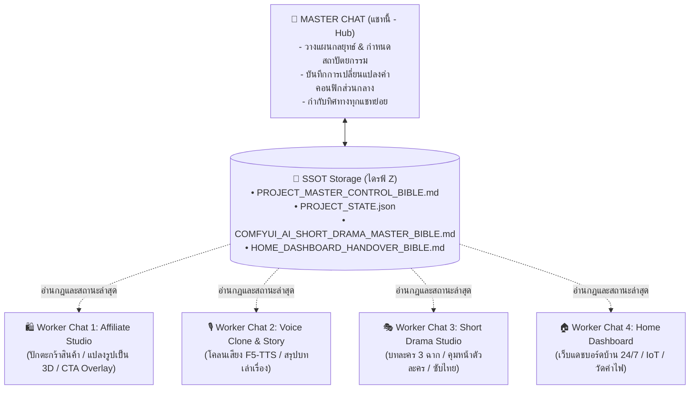

# 👑 PROJECT MASTER CONTROL BIBLE: Autonomous AI Studio & Home Automation
> **บทบาทเอกสาร:** แหล่งข้อมูลความจริงหนึ่งเดียว (Single Source of Truth - SSOT) ประจำโปรเจกต์  
> **Master Chat Conversation ID:** `ec35ca32-12a6-4378-8ce3-ce0a8d7dc7ad`  
> **Project Directory:** `Z:\01_Work\01_ComfyUi_Project\`  
> **วันที่มีผล:** 2026-09-17  
> **สถานะปัจจุบัน:** Active Master Hub

---

## 1. กฎและโปรโตคอลการทำงานร่วมกันระหว่างแชท (Hub & Spoke Protocol)

ระบบนี้ใช้โครงสร้างแบบ **Hub & Spoke (แชทแม่บท + แชทย่อยเฉพาะทาง)** เพื่อให้การทำงานมีประสิทธิภาพสูงสุด:



### 📜 กฎเหล็กสำหรับทุก Worker Chat:
1. **Always Read Master State First**: เมื่อเริ่มแชทใหม่หรือเริ่มงานใหม่ ต้องอ่านไฟล์ `PROJECT_MASTER_CONTROL_BIBLE.md` และ `PROJECT_STATE.json` เป็นอันดับแรกเสมอ
2. **Do Not Overwrite Shared Services**: ห้ามแก้ไขพอร์ตเซิร์ฟเวอร์หลัก (`192.168.1.102:5050` และ `192.168.1.11:8188`) หรือเปลี่ยนโครงสร้างฐานข้อมูล `power_history.db` โดยพลการ หากต้องการเพิ่มตาราง ให้ใช้คำสั่ง `CREATE TABLE IF NOT EXISTS` เท่านั้น
3. **Report Back to Master**: เมื่อพัฒนางานหรือสร้างไฟล์ใหม่เสร็จสิ้น ให้บันทึกการเปลี่ยนแปลงลงใน Changelog หรือแจ้งกลับมายัง Master Chat เสมอ

---

## 2. ข้อมูลระบบและพิกัดเครือข่ายส่วนกลาง (Central System Topology)

| เครื่อง / อุปกรณ์ | Network IP | บริการหลัก | สเปกฮาร์ดแวร์ | บทบาทในโปรเจกต์ |
| :--- | :--- | :--- | :--- | :--- |
| **🗄️ NAS Server** | `192.168.1.102:5050` | FastAPI Docker (`ai_power_monitor`) | Intel N100 (4C/4T)<br>RAM 16GB, HDD 8TB + 2x NVMe | โฮสต์ Web Dashboard, รัน SQLite 24 ชม., ตัดต่อรวมคลิป FFmpeg + Subtitles |
| **🤖 เครื่อง AI (AiPC1)** | `192.168.1.11:8188` | ComfyUI + MiniMax H3 FL2VA | RTX 4070 (12GB)<br>Ryzen 7 5800X (8C/16T) | เอนจินเรนเดอร์วิดีโอ 8-Step Turbo LoRA, รัน Voice Cloning Inference |
| **💻 เครื่องฉัน (Main PC)** | `192.168.1.100:8188` | ComfyUI Studio + Master Controller | RTX 4080 SUPER (16GB)<br>Ryzen 9 5950X (16C/32T) | จุดควบคุมหลัก & AI Generation Node 2 (สเปกแรงสูงสุด) |

- **ฐานข้อมูล SQLite:** `/volume1/ai_power_monitor/data/power_history.db` บน NAS
- **คีย์คำนวณค่าไฟ:** 4.18 บาท / kWh (กฟน./กฟภ. ปกติ)
- **โฟลเดอร์เก็บโมเดล AI:** `//192.168.1.102/06_Ai_Model/`
- **คลังผลงานวิดีโอ & รูปภาพ AI (Central Footage):** `Z:\05_VideoFootage\01_ComfyUi_Footage\` (`//192.168.1.102/05_VideoFootage/01_ComfyUi_Footage/`)

---

## 3. แผนที่โมดูลและงานของแต่ละแชท (Module Breakdown)

### 👑 แชทแม่บท (Master Chat - แชทนี้)
- **หน้าที่:** ควบคุมทิศทาง, ปรับแก้สถาปัตยกรรม, ตัดสินใจเลือกเทคโนโลยี, บันทึกการเปลี่ยนแปลง (Sync State), และตรวจเช็กความเรียบร้อยของทุกโมดูล

### 🛍️ แชทย่อยที่ 1: ระบบปักตะกร้าสินค้า Affiliate (Affiliate Product Studio)
- **เป้าหมาย:** สร้างวิดีโอรีวิวและโปรโมตสินค้าสำหรับ TikTok Shop / Shopee / Reels
- **โฟลเดอร์ทำงาน:** `01_AI_Short_Drama_Engine/affiliate_engine.py`
- **หน้าที่สำคัญ:**
  - แปลงรูปสินค้า 1 รูป เป็นคลิป 3D หมุนโชว์ความงามด้วย MiniMax H3
  - ซ้อนเลเยอร์ (Overlay): ตะกร้าสีเหลืองกระพริบ + ลูกศรชี้มุมซ้ายล่าง + ป้ายราคาลดพิเศษ
  - เสียงพากย์กระตุ้นการสั่งซื้อ (Call-To-Action)

### 🎙️ แชทย่อยที่ 2: ระบบโคลนเสียง AI & ช่องเล่าเรื่อง (Voice Clone & Storytelling)
- **เป้าหมาย:** สร้างช่องเล่าเรื่อง (เรื่องผี/ประวัติศาสตร์/ข้อคิด) ด้วยเสียงพูดของคุณเอง
- **โฟลเดอร์ทำงาน:** `01_AI_Short_Drama_Engine/storyteller_engine.py` & `voice_cloning_engine.py`
- **หน้าที่สำคัญ:**
  - รับไฟล์เสียงอัด 15-30 วินาที เพื่อโคลนเสียงภาษาไทย (F5-TTS / CosyVoice)
  - เจนเนื้อเรื่อง + คำบรรยายบรรยากาศ + ภาพฉากดาร์กๆ ลึกลับ
  - มิกซ์เสียง Ambient (เสียงฝน, เสียงลม, ดนตรีคลอ) + ซับไตเติล Kinetic ตามคำ

### 🎭 แชทย่อยที่ 3: ระบบละครสั้น AI พูดไทย (Short Drama Optimization)
- **เป้าหมาย:** ละครสั้นแนวตั้ง 3-4 ฉาก อารมณ์ดราม่าเข้มข้น
- **โฟลเดอร์ทำงาน:** `01_AI_Short_Drama_Engine/short_drama_engine.py`
- **หน้าที่สำคัญ:**
  - คุมความต่อเนื่องตัวละคร (Character Consistency via first_frame)
  - พากย์เสียงโต้ตอบชาย-หญิงแยกตามบทสนทนา
  - ฝังซับไตเติลภาษาไทยสีสันคมชัดด้วยฟอนต์ `Garuda`

### 🏠 แชทย่อยที่ 4: เว็บแดชบอร์ดบ้านอัจฉริยะ (Home Dashboard Integration)
- **เป้าหมาย:** ขยายแดชบอร์ดให้กลายเป็น Smart Home Hub ประจำบ้าน
- **โฟลเดอร์ทำงาน:** `02_NAS_Server_And_Deployment/`
- **หน้าที่สำคัญ:**
  - รวมหน้าต่างควบคุมทั้ง 3 สตูดิโอไว้ในหน้าเว็บเดียว
  - เชื่อมต่ออุปกรณ์ Smart Home / ปลั๊กไฟ / มอนิเตอร์ค่าไฟ 24 ชม.

---

## 4. ข้อความสั่งงานสำหรับเริ่มแชทย่อย (Universal Worker Prompt Template)

เมื่อคุณเปิดแชทใหม่ในหัวข้อใดก็ตาม ให้ก๊อปปี้ข้อความนี้ไปวางเปิดหัวได้ทันที:

```markdown
สวัสดีครับ นี่คือ Worker Chat สำหรับภารกิจ: [เลือก: 🛍️ Affiliate Studio / 🎙️ Voice Clone & Story / 🎭 Short Drama / 🏠 Home Dashboard]

กรุณาอ่านพิมพ์เขียวและสถานะล่าสุดของโปรเจกต์จาก Master Chat ก่อนเริ่มงาน:
1. Z:\01_Work\01_ComfyUi_Project\PROJECT_MASTER_CONTROL_BIBLE.md
2. Z:\01_Work\01_ComfyUi_Project\PROJECT_STATE.json

โปรโตคอลการทำงาน:
- ทำงานภายใต้สถาปัตยกรรมและพิกัดระบบเดิม (NAS 192.168.1.102:5050, ComfyUI 192.168.1.11:8188)
- โฟกัสเฉพาะภารกิจของแชทนี้ โดยไม่ไปกระทบระบบส่วนกลาง
- เมื่อทำส่วนใดเสร็จ ให้รายงานสรุปเพื่อนำไปแจ้งอัปเดตสถานะใน Master Chat

เมื่อเข้าใจกฎและข้อมูลแล้ว กรุณารายงานความพร้อม แล้วเริ่มงานในส่วนนี้ได้เลย
```

---

---

## 5. ระบบบูตอัตโนมัติของเครื่อง AI (AiPC1 Autonomous Autostart Architecture)

เพื่อให้เครื่อง `AiPC1` (`192.168.1.11`) ทำงานเสมือน Dedicated Server 24/7 เมื่อเปิดเครื่องหรือรีสตาร์ต ระบบจะรัน ComfyUI และ Telemetry Agent ขึ้นมาโดยอัตโนมัติด้วยคุณสมบัติดังนี้:

1. **Dual Fail-safe Launch Mechanism**:
   - **กลไกที่ 1 (Primary):** Windows Task Scheduler Task `\ComfyUI` ทริกเกอร์แบบ `AtLogOn` (ผู้ใช้ `Ai`) ด้วยสิทธิ์ `Highest` พร้อม Hidden window
   - **กลไกที่ 2 (Secondary):** Windows Startup Folder Script (`C:\Users\Ai\AppData\Roaming\Microsoft\Windows\Start Menu\Programs\Startup\Start-ComfyUI.vbs`)
2. **Zero-Window & Background Daemon**:
   - ควบคุมผ่าน VBScript wrapper (`start_comfyui_silent.vbs`) เรียก PowerShell ด้วยโหมด `-WindowStyle Hidden` และ `wscript.exe` ปราศจากหน้าต่างดำ CMD กวนใจบนหน้าจอ
3. **Idempotency & Auto Network Discovery**:
   - `autostart_comfyui.ps1` ทำการ Ping ตรวจสอบเครือข่าย NAS (`192.168.1.102`) นานสูงสุด 30 วินาทีเพื่อรอเน็ตเวิร์กพร้อม
   - ทำการ Map ไดรฟ์โมเดล SMB `\\192.168.1.102\06_Ai_Model` โดยอัตโนมัติ
   - ตรวจสอบพอร์ต 8188 หากพบว่า ComfyUI รันอยู่แล้ว จะไม่รันซ้ำซ้อน (Safe Duplicate Guard)
   - ตรวจสอบ `aipc1_agent.py` หากรันอยู่แล้ว จะไม่เปิดซ้ำ
4. **เครื่องมือบริหารจัดการบน AiPC1 (`C:\ComfyUI_windows_portable\`):**
   - `Check-ComfyUI-Status.bat`: ตรวจสอบสถานะ PID, พอร์ต 8188, และ 15 บรรทัดล่าสุดของ Log
   - `Restart-ComfyUI.bat`: รีสตาร์ต ComfyUI ในเบื้องหลังอย่างปลอดภัย
   - `Stop-ComfyUI.bat`: ปิด ComfyUI และ Telemetry Agent

---

## 6. บันทึกประวัติการปรับปรุงส่วนกลาง (Master Change Log)

| วันที่-เวลา | แชทที่สั่งการ | รายละเอียดการปรับปรุง | ผลกระทบต่อระบบ |
| **2026-09-17 22:05** | 👑 Master Chat | กำหนดคลังผลงานส่วนกลาง `Z:\05_VideoFootage\01_ComfyUi_Footage` | ComfyUI ทุกเครื่องบันทึกไฟล์วิดีโอ/รูปภาพลงคลังกลางอัตโนมัติ 100% |
| **2026-09-17 22:00** | 👑 Master Chat | ติดตั้ง ComfyUI Studio บน Main PC (RTX 4080 SUPER 16GB) | ขยายขีดความสามารถ AI Node 2 พร้อมแชร์โมเดลจาก NAS ก้อนเดียวกัน 100% |
| **2026-09-17 21:35** | 👑 Master Chat | ติดตั้งระบบ Autonomous Autostart บน AiPC1 (Dual Task Scheduler + Startup VBS) | ComfyUI & Telemetry Agent บูตตัวเองอัตโนมัติ 100% ไร้หน้าต่างดำ |
| **2026-09-17 15:30** | 👑 Master Chat | สถาปนาระบบ Master Control & Registry (Hub & Spoke) | สร้างมาตรฐานควบคุมทุกแชทย่อยในโปรเจกต์ |
| **2026-09-17 15:10** | 👑 Master Chat | จัดผังโหนด ComfyUI MiniMax H3 เป็น 4 โซนสีภาษาไทย | สร้างไฟล์ `MiniMax_H3_Short_Drama_Studio_UI.json` ติดตั้งบน AiPC1 |
| **2026-09-17 14:30** | 👑 Master Chat | แก้ไขบั๊กสัดส่วน 9:16 และตัวล้างวรรคตอน Edge-TTS | อัปเกรด `short_drama_engine.py` บน NAS Docker |

