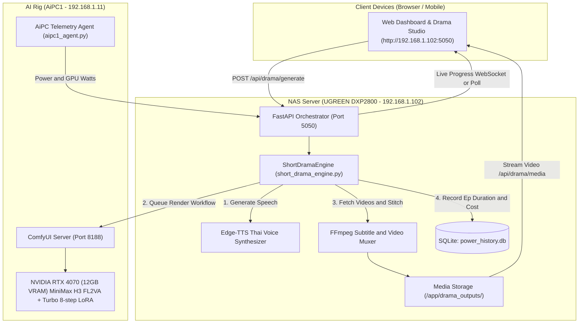

# 🎭 ComfyUI & MiniMax H3: AI Short Drama Automation Master Bible
> **Version:** 2.0 (Production Release)  
> **Target System:** ComfyUI on AiPC1 (RTX 4070 12GB) + Orchestrator on NAS (Docker UGOS Pro)  
> **Project Directory:** `Z:\01_Work\01_ComfyUi_Project`  
> **Network IP:** AiPC1 (`192.168.1.11:8188`), NAS (`192.168.1.102:5050`), Main PC (`192.168.1.100`)

---

## 1. Executive Summary & Core Objective

โปรเจกต์นี้คือระบบ **Autonomous AI Micro-Drama Production Engine** ที่สามารถผลิต **"ละครสั้นแนวตั้ง (TikTok / Reels / Shorts 9:16)"** หรือภาพยนตร์สั้นแบบอัตโนมัติเต็มรูปแบบ โดยผสาน:
1. **ComfyUI + MiniMax H3 (FL2VA)**: โมเดลสร้างวิดีโอระดับโลกพร้อม Turbo 8-step LoRA บน AiPC1 (RTX 4070).
2. **Thai Neural TTS (Edge-TTS)**: พากย์เสียงภาษาไทยสมจริง แยกบทบาทตัวละคร (พระเอก / นางเอก / ผู้จัดการ / ผู้บรรยาย).
3. **FFmpeg Auto-Stitching & Styled ASS Subtitles**: ตัดต่อรวมฉาก มิกซ์เสียงพากย์ และฝังซับไตเติลภาษาไทยสีสันคมชัดด้วยฟอนต์ `Garuda`.
4. **Hardware & Power Telemetry Integration**: คำนวณระยะเวลาสร้าง, การใช้พลังงานไฟฟ้าจริง (Watt, kWh), และต้นทุนค่าไฟ (THB) ของทุกเอพิโซดที่ผลิตออกมาแบบเรียลไทม์.
5. **Web Control Studio**: หน้าแดชบอร์ดควบคุมบน NAS (`http://192.168.1.102:5050`) พร้อมระบบเลือกพล็อตเรื่อง, เล่นวิดีโอย้อนหลัง, และดาวน์โหลดไฟล์ผลลัพธ์.

---

## 2. System Architecture & Network Topology



---

## 3. ComfyUI MiniMax H3 Model & Configuration

โมเดลที่ใช้งานถูก Optimize ให้รันบนการ์ดจอขนาดกลาง (RTX 4070 VRAM 12GB) ได้อย่างรวดเร็วและไม่เกิด Out-Of-Memory (OOM):

| Component | Model / Node File | Description |
|---|---|---|
| **Base UNET** | `minimax_h3_fl2va_pruned_int8_convrot.safetensors` | MiniMax H3 Diffusion model quantized INT8 |
| **Text Encoder** | `qwen3vl_32b_minimax_h3_nvfp4_awq.safetensors` | Qwen 3 VL 32B NVFP4 AWQ Multimodal CLIP |
| **Video VAE** | `minimax_h3_video_vae_fp16.safetensors` | VAE decode video frames |
| **Audio VAE** | `minimax_h3_audio_vae_fp32.safetensors` | MiniMax audio latent decode |
| **Lightning LoRA** | `minimax_h3_fl2v_turbo_8step_v1.0_comfyui_bf16.safetensors` | Turbo 8-step LoRA (ลดรอบ KSampler จาก 20 -> 8 steps) |
| **Sampler Setup** | `res_multistep` + `simple` scheduler | 8 steps, Denoise 1.0 |
| **Resolution Node** | Node 115 (`ResolutionSelector`) | **สำคัญ:** ค่าต้องเป็น `"9:16 (Portrait Widescreen)"` หรือ `"16:9 (Widescreen)"` เท่านั้น |

---

## 4. Key Engineering Discoveries & Best Practices

### 4.1 ComfyUI ResolutionSelector Node String Constraint
- **ปัญหา:** ส่งค่า `"9:16 (Portrait)"` แล้ว ComfyUI โยน `HTTP 400 Value not in list`.
- **วิธีแก้:** ใน `short_drama_engine.py` ทำ Normalization:
  ```python
  if "9:16" in raw_ar:
      ar = "9:16 (Portrait Widescreen)"
  elif "16:9" in raw_ar:
      ar = "16:9 (Widescreen)"
  ```

### 4.2 Edge-TTS Thai Punctuation Sanitization
- **ปัญหา:** ข้อความภาษาไทยที่มีเครื่องหมายตกใจ `!`, ปรัศนี `?`, หรือจุดไข่ปลา `...` ทำให้ Microsoft Edge-TTS ตอบกลับว่า `No audio was received`.
- **วิธีแก้:** แยกการประมวลผลข้อความ:
  - **สำหรับไฟล์เสียง (TTS):** ตัดเครื่องหมายวรรคตอนออก (`c not in "?!.,:;'~..."`) เพื่อให้ Edge-TTS สังเคราะห์เสียงได้ 100% ไม่มีล้มเหลว.
  - **สำหรับซับไตเติล (ASS):** เก็บเครื่องหมายวรรคตอนไว้ครบถ้วนเพื่ออารมณ์ของตัวละคร.

### 4.3 Non-Blocking Asynchronous Engine Loop
- **ปัญหา:** การใช้ `time.sleep()` หรือ synchronous `urllib.request.urlopen()` ภายใน FastAPI async task จะบล็อก Event Loop ทำให้ Web Dashboard ค้าง.
- **วิธีแก้:** แปลง `wait_for_scene_video` ให้เป็น `async def` โดยใช้ `await asyncio.sleep(3.0)` และครอบฟังก์ชัน I/O หนักๆ ด้วย `await asyncio.to_thread(...)`.

### 4.4 Linux Docker Thai Subtitle Font Rendering
- **ปัญหา:** การระบุฟอนต์ Windows เช่น `Leelawadee UI` บน Linux Docker (Debian/Ubuntu) ทำให้ `libass` ตกไปใช้ฟอนต์ Fallback ซึ่งอาจแสดงสระลอยหรือวรรณยุกต์เพี้ยน.
- **วิธีแก้:** กำหนดสไตล์ ASS ให้ใช้ฟอนต์ `Garuda` ซึ่งเป็นฟอนต์มาตรฐานของระบบ Linux ที่ติดตั้งผ่านแพ็กเกจ `fonts-tlwg-garuda`.

---

## 5. Storyline Presets Library

ระบบมีพล็อตเรื่องสำเร็จรูปพร้อมคำสั่งมุมกล้อง (Visual Prompts) และบทสนทนาภาษาไทย:

1. **`undercover_ceo` (ประธานปลอมตัวมาสืบงาน)**
   - ฉากที่ 1: การดูถูก (The Humiliation) - ผู้จัดการสาวดูถูกพนักงานใหม่ในห้องทำงานหรู
   - ฉากที่ 2: การเผชิญหน้า (The Confrontation) - พระเอกเลื่อนบัตรประธานผ่านโต๊ะกระจก
   - ฉากที่ 3: เปิดเผยความจริง (The Reveal) - บอดี้การ์ดโค้งคำนับ ผู้จัดการสาวตกตะลึง
2. **`revenge_daughter` (การกลับมาของทายาทตัวจริง)**
   - ฉากที่ 1: ก้าวแรกของการทวงคืน - ทายาทสาวในชุดราตรีแดงเดินเข้างานเต้นรำหรูหรา
   - ฉากที่ 2: สัญญาพลิกชะตา - เคาะปากกาลงบนสัญญาซื้อกิจการ บังคับผู้บริหารเก่าลุกจากเก้าอี้
   - ฉากที่ 3: ชัยชนะสมบูรณ์แบบ - ยืนมองวิวตึกระฟ้าและไฟนีออนยามค่ำคืน
3. **`billionaire_bodyguard` (บอดี้การ์ดลับมหาเศรษฐี)**
   - ฉากที่ 1: การลอบจู่โจม - รถลีมูซีนถูกดักโจมตีในลานจอดรถชั้นใต้ดิน
   - ฉากที่ 2: ผู้พิทักษ์ลงมือ - บอดี้การ์ดคว้ามีดกลางอากาศด้วยมือเปล่า
   - ฉากที่ 3: ตัวตนระดับตำนาน - โชว์แหวนตรามังกรดำ ศัตรูคุกเข่ายอมจำนน

---

## 6. Real-Time Telemetry & Cost Calculation

ทุกตอนที่สร้าง จะถูกบันทึกค่าลงในตาราง SQLite `short_drama_episodes`:
```sql
CREATE TABLE IF NOT EXISTS short_drama_episodes (
    id INTEGER PRIMARY KEY AUTOINCREMENT,
    drama_id TEXT UNIQUE,
    preset_key TEXT,
    title TEXT,
    aspect_ratio TEXT,
    filename TEXT,
    duration_sec REAL,
    scenes_count INTEGER,
    render_time_sec REAL,
    avg_watts REAL,
    kwh REAL,
    cost_thb REAL,
    timestamp INTEGER,
    filesize TEXT
);
```

- **เวลาเรนเดอร์เฉลี่ย:** ~180 - 240 วินาที ต่อ 3 ฉาก (ที่ 8 steps Turbo LoRA).
- **กำลังไฟเฉลี่ยขณะเรนเดอร์ (RTX 4070 + Ryzen 7 5800X):** ~240.0 - 255.0 Watts.
- **พลังงานที่ใช้ต่อตอน:** ~0.012 - 0.016 kWh.
- **ต้นทุนค่าไฟฟ้าจริงต่อตอน:** ~0.05 - 0.07 บาท (คำนวณที่อัตรา 4.18 บาท/หน่วย).

---

## 7. How to Run & Expand

### 7.1 รันผ่าน Web Dashboard (แนะนำ)
1. เปิดเบราว์เซอร์ไปที่ `http://192.168.1.102:5050`
2. คลิกแถบ **🎭 ละครสั้น AI**
3. เลือกพล็อตเรื่อง และสัดส่วนภาพ (`9:16 (แนวตั้ง TikTok/Reels)` หรือ `16:9 (แนวนอน)`)
4. กดปุ่ม **🎬 สั่งสร้างละครสั้น (Start Production)**
5. แดชบอร์ดจะแสดงแถบความคืบหน้าเรียลไทม์ และเปิดวิดีโอให้เล่นทันทีเมื่อเสร็จ

### 7.2 รันผ่าน Command Line (AiPC1 หรือเครื่องใดๆ ในวงแลน)
```bash
cd Z:\01_Work\01_ComfyUi_Project\01_AI_Short_Drama_Engine
python short_drama_engine.py undercover_ceo
```
หรือดับเบิลคลิกไฟล์ `run_short_drama.bat`.

### 7.3 โหมดผู้กำกับระดับโปร (Higgsfield-Style Director Studio v2.8)
1. เปิด `http://192.168.1.102:5050` แล้วไปที่แถบ **🎭 สตูดิโอละครสั้น**
2. คลิกเลือกโหมด **`[🎬 Higgsfield Director Studio]`**
3. **Character Vault (คลังตัวละคร):** เลือกตัวละครเริ่มต้น (CEO Lalita, Agent Ray, Detective Wichai) หรือกด **`+ สร้างตัวละครใหม่`** เพื่ออัปโหลดภาพใบหน้า/เต็มตัว ซึ่งระบบจะส่งไปยัง Node 114 (`first_frame`) ของ ComfyUI เพื่อล็อกหน้าและชุดตัวละครให้คงที่ 100%
4. **9 Camera Motions:** คลิกเลือกมุมกล้องจากแถบเครื่องมือ (Zoom In/Out, Pan L/R, Crane Up, Tilt Down, Orbit 360, Handheld Shake, Static) ระบบจะใส่คำสั่งมุมกล้องและแท็กกำกับภาพเข้า Prompt ของฉากที่เลือกทันที
5. **Timeline & Re-roll:** ตรวจสอบบทพูดและ Prompt ของแต่ละฉาก (Scene 1, 2, 3) สั่งเรนเดอร์เฉพาะฉากที่ต้องการได้ทันที และหากฉากไหนยังไม่ถูกใจ สามารถกด **`🔄 เรนเดอร์เฉพาะฉากนี้ใหม่ (Re-roll)`** ได้ตลอดเวลา
6. **Frame Continuity:** เปิดสวิตช์ **`🔗 ส่งต่อภาพเฟรมสุดท้าย (Continuity)`** ในฉากที่ 2 หรือ 3 เพื่อนำภาพเฟรมสุดท้าย (`last_frame.png`) ของฉากก่อนหน้ามาเป็นจุดเริ่มต้นของฉากใหม่ ทำให้ภาพไม่โดด
7. **Master Movie Stitcher:** เมื่อตรวจสอบพรีวิวทุกฉากเรียบร้อย กดปุ่ม **`🎬 รวมทุกฉากเป็นมูฟวี่เต็มเรื่อง`** ระบบ FFmpeg จะทำการ Concat วิดีโอ มิกซ์เสียงพากย์ และฝังซับไตเติลภาษาไทย Garuda ส่งออกไปยัง `Z:\05_VideoFootage\01_ComfyUi_Footage\04_Finished_Productions\Drama_Episodes\`

---

## 8. Directory Manifest (`Z:\01_Work\01_ComfyUi_Project`)

- **`01_AI_Short_Drama_Engine/`**: โค้ด Core Automation Engine (`short_drama_engine.py`), Template API workflow (`drama_workflow_template.json`), ไฟล์ UI Workflow ฉบับจัดระเบียบ 4 โซนสีภาษาไทย (`MiniMax_H3_Short_Drama_Studio_UI.json`), ไฟล์ bat และ requirements.txt.
- **`02_NAS_Server_And_Deployment/`**: ซอร์สโค้ดเซิร์ฟเวอร์ FastAPI (`nas_server.py`), Docker compose, และไฟล์ Frontend แดชบอร์ด (`index.html`, `app.js`, `style.css`).
- **`03_Power_Telemetry_Agents/`**: เอเจนต์ตรวจวัดวัตต์ไฟของ AiPC1 (`aipc1_agent.py`) และ Main PC (`main_pc_agent.py`).
- **`04_Episodes_And_Media/`**: ผลงานละครสั้นที่สร้างเสร็จสมบูรณ์ (`ShortDrama_Pilot_Episode_FINAL.mp4`).
- **`05_Chat_Session_And_History/`**: บันทึกบทสนทนาทั้งหมด (`transcript.jsonl`, `transcript_full.jsonl`), แผนงาน (`implementation_plan.md`), Walkthrough, และภาพประกอบทั้งหมด.
