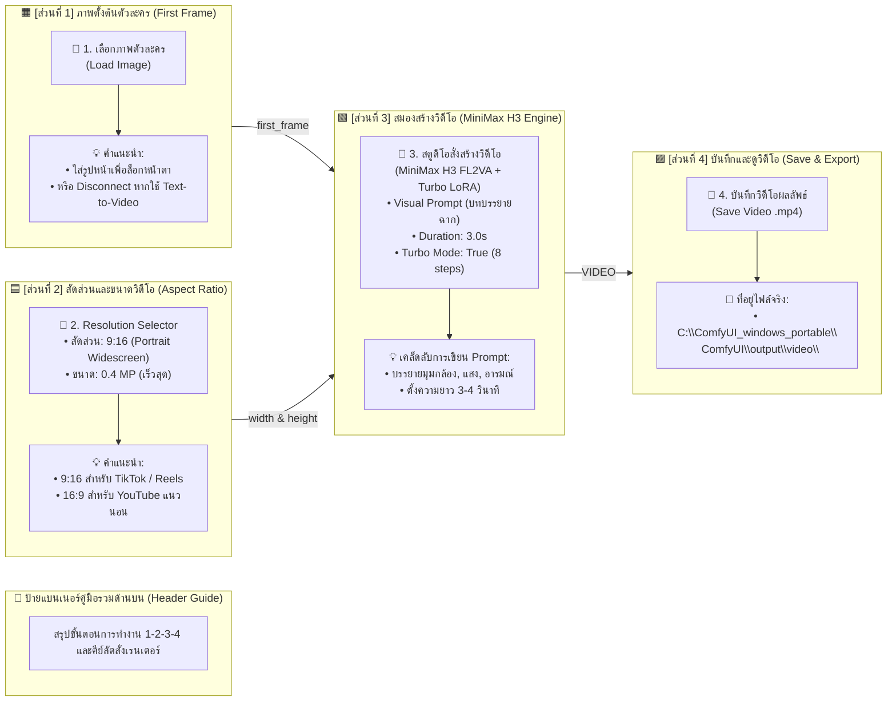

# 🎭 คู่มือผังโหนด ComfyUI: MiniMax H3 Short Drama Studio (ภาษาไทย)

เอกสารนี้อธิบายการแบ่งสัดส่วนและหน้าที่ของแต่ละโหนดในหน้าต่าง **ComfyUI** บนเครื่อง **AiPC1 (`http://192.168.1.11:8188`)** เพื่อให้เข้าใจง่าย ไม่ซับซ้อน และรู้หน้าที่ของทุกส่วนทันทีที่เปิดดู

---

## 🗺️ แผนผังภาพรวมการจัดกลุ่มโหนด (Layout Overview)

บนผืนผ้าใบ (Canvas) ของ ComfyUI เราได้จัดระเบียบโหนดออกเป็น **4 โซนสีหลัก เรียงจากซ้ายไปขวาตามลำดับการทำงาน (Workflow Flow)** พร้อมป้ายแบนเนอร์คู่มือขนาดใหญ่ด้านบน:

---

## 🔍 รายละเอียดหน้าที่ของแต่ละส่วน (Section Breakdown)

| โซน | กรอบสี | ชื่อส่วนงาน | โหนดหลัก | หน้าที่การทำงาน | วิธีใช้งาน / คำแนะนำ |
| :---: | :---: | :--- | :--- | :--- | :--- |
| **1** | 🟧 **สีส้ม** | **ภาพตั้งต้นตัวละคร (First Frame)** | `LoadImage` | นำเข้ารูปภาพเริ่มต้นเพื่อกำหนดหน้าตาหรือฉากเปิด | • คลิกเลือกไฟล์ภาพจากคอมฯ • หากต้องการสร้างจากข้อความล้วน ให้คลิกขวาที่เส้นสายสีฟ้า `first_frame` แล้วกด **Disconnect** |
| **2** | 🟦 **สีน้ำเงิน** | **กำหนดขนาดภาพ (Aspect Ratio)** | `ResolutionSelector` | คำนวณความกว้างและสูงของวิดีโออัตโนมัติ | • ตั้งค่าไว้ที่ `9:16 (Portrait Widescreen)` สำหรับคลิปแนวตั้ง TikTok/Shorts • Megapixels แนะนำ `0.4` เพื่อความเร็วสูงสุด (~3 นาทีต่อคลิป) |
| **3** | 🟩 **สีเขียว** | **สตูดิโอสร้างวิดีโอ (MiniMax H3 Engine)** | `MiniMax H3 Video Engine` | รับคำสั่ง Prompt, กำหนดเวลาคลิป, และประมวลผลโมเดล Turbo 8-step LoRA | • พิมพ์คำสั่งบรรยายฉากในช่องข้อความใหญ่ • `duration`: 3.0 วินาที • `turbo_mode`: **True** (เปิด LoRA 8 steps เสมอ) • `turbo_steps`: **8** |
| **4** | 🟪 **สีม่วง** | **ส่งออกไฟล์วิดีโอ (Save Video)** | `SaveVideo` | รวมเฟรมภาพและเสียง แล้วบันทึกเป็นไฟล์ `.mp4` | • คลิปจะเล่นในกรอบนี้ทันทีเมื่อเสร็จ • ไฟล์จะถูกเซฟที่ `ComfyUI\output\video\` อัตโนมัติ |
| **5** | 🟨 **สีเขียวหัวเป็ด** | **คู่มือภาพรวม (Master Banner)** | `MarkdownNote` | สรุปขั้นตอน 1-2-3-4 และคีย์ลัด | วางอยู่ด้านบนสุดเพื่อให้อ่านขั้นตอนได้ทันทีที่เปิดจอ |

---

## 🚀 วิธีเปิดใช้งาน Workflow นี้ใน ComfyUI บนเครื่อง AiPC1

เราได้นำไฟล์ Workflow ฉบับจัดระเบียบนี้ไปวางไว้ที่โฟลเดอร์ของ ComfyUI บนเครื่อง **AiPC1** เรียบร้อยแล้ว คุณสามารถเปิดได้ 2 วิธีง่ายๆ:

### วิธีที่ 1: โหลดผ่านเมนูของ ComfyUI (สะดวกที่สุด)
1. เปิดเบราว์เซอร์ไปที่ **`http://192.168.1.11:8188`**
2. คลิกที่แถบเมนูด้านบนหรือด้านข้าง เลือก **Workflows** (หรือไอคอนแฟ้ม 📁)
3. คุณจะเห็นชื่อ **`MiniMax_H3_Short_Drama_Studio`**
4. คลิกเลือกได้ทันที! ผืนผ้าใบจะโหลดโหนดทั้ง 4 โซนสีพร้อมคำอธิบายภาษาไทยขึ้นมาทันที

### วิธีที่ 2: ลากและวางไฟล์ (Drag & Drop)
1. เปิดโฟลเดอร์ในไดรฟ์ Z:  
   👉 `Z:\01_Work\01_ComfyUi_Project\01_AI_Short_Drama_Engine\`
2. ลากไฟล์ **`MiniMax_H3_Short_Drama_Studio_UI.json`** มาปล่อยลงบนหน้าเว็บ ComfyUI ได้ทันที
