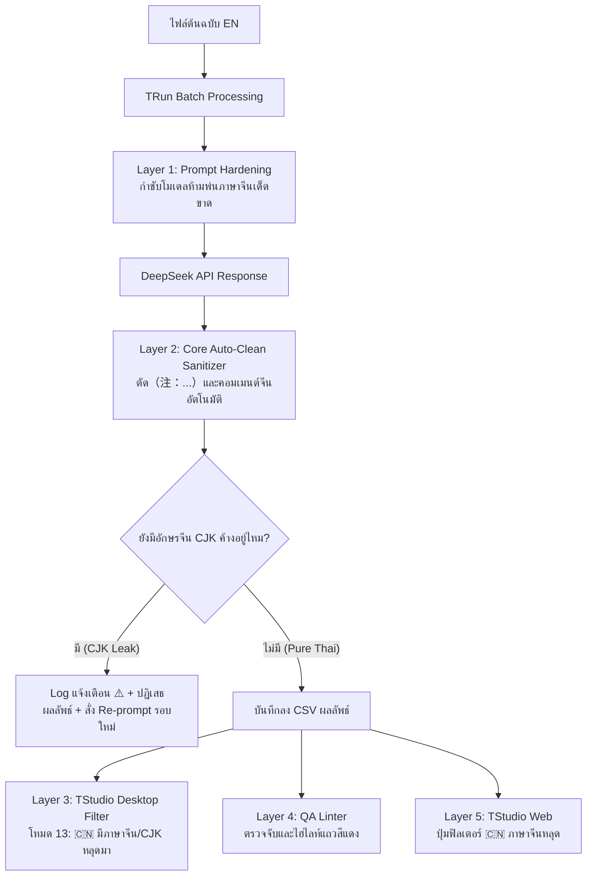

# คู่มือระบบตรวจจับและกรองภาษาจีน/CJK แปลกปลอม (CJK Leak Filter & Language Purity Guide)
*สำหรับ TRun, TStudio Desktop และ TStudio Web Ecosystem*

---

## 1. ที่มาและปัญหา (The Problem)

เมื่อม็อดเดอร์นำไฟล์ข้อความเกมไปแปลอัตโนมัติแบบชุดข้อมูลขนาดใหญ่ (**Batch Translation**) ผ่านโปรแกรม **TRun** โดยเลือกใช้โมเดล **DeepSeek** (เช่น DeepSeek-V3 หรือ DeepSeek-R1) มักพบปัญหาข้อความภาษาจีนหรืออักขระ CJK หลุดปะปนเข้ามาในผลลัพธ์คำแปลไทย:

1. **คอมเมนต์หรือคำอธิบายของ AI ในวงเล็บ**: เช่น `（注：这是武器名称）`, `(注: ...)`, `【注：...】`, `（翻译说明：...）`
2. **การทับศัพท์หรือแปลค้างภาษาจีน (Hanzi)**: คำศัพท์บางคำที่โมเดลนึกคำไทยไม่ออก หรือติดบริบทจีนมา เช่น `โจมตีด้วย 魔法`, `ดาบของ 骑士`
3. **ปัญหาการตรวจจับสถานะ `is_translated` แบบเดิม**: 
   - ระบบเดิมจะตรวจเพียงแค่มีตัวอักษรไทย `[\u0E00-\u0E7F]` หรือไม่
   - หากมีภาษาไทยปนกับภาษาจีน เช่น `ดาบ（注：武器）` ระบบเดิมจะเข้าใจผิดว่า "แปลเสร็จสมบูรณ์แล้ว"
   - เมื่อม็อดเดอร์นำไฟล์เดิมกลับมากด Resume หรือแปลต่อ ระบบจึงข้ามแถวเหล่านี้ไป ทำให้ภาษาจีนค้างอยู่ในไฟล์ม็อดอย่างถาวร

---

## 2. สถาปัตยกรรมป้องกัน 5 ระดับ (Multi-Layer Defense Architecture)

---

## 3. รายละเอียดการทำงานของแต่ละส่วนประกอบ

### 3.1 Core Engine (`tstudio_core.py`)
- **Unicode Coverage**: ตรวจจับครอบคลุมทุกย่านของอักขระ CJK:
  - CJK Unified Ideographs (`\u4E00-\u9FFF`)
  - CJK Extension A (`\u3400-\u4DBF`)
  - CJK Compatibility (`\uF900-\uFAFF`)
  - CJK Symbols and Punctuation (`\u3000-\u303F`, `\uFF01-\uFF5E`)
- **ฟังก์ชันมาตรฐาน**:
  - `TStudioCore.has_cjk(text)`: คืนค่า `True` หากพบตัวอักษรจีน
  - `TStudioCore.extract_cjk(text)`: ส่งคืนรายการตัวอักษรจีนที่พบ
  - `TStudioCore.clean_cjk_leak(text)`: ตัดวงเล็บหมายเหตุภาษาจีน AI อัตโนมัติ เช่น `（注：...）`, `(注: ...)`, `【注：...】`
- **Prompt Hardening**: กำชับกฎ `STRICT LANGUAGE PURITY` ใน Prompt เริ่มต้นของระบบ

### 3.2 TRun Batch Translator (`trun_app.py`)
- **ตัวเลือกเปิด/ปิด (UI Toggle)**:
  - มี Checkbox ในกล่อง *🔠 การประมวลผลภายหลัง (Post-Processing)*:
    `[x] 🇨🇳 กรอง/ล้างภาษาจีนที่หลุดมา (CJK Leak Filter)` (เปิดใช้งานเป็นค่าเริ่มต้น)
- **ระบบ `is_translated()` อัจฉริยะ**:
  - หากเปิด CJK Filter: ข้อความที่มีตัวอักษรจีนหลุดมาจะไม่ถูกนับว่าแปลเสร็จแล้ว
  - **ประโยชน์**: เมื่อกด Resume จากไฟล์เดิม TRun จะดึงแถวที่เสียหายเหล่านั้นมาแปลใหม่อัตโนมัติทันที
- **ระบบ Auto-Clean & Retry Loop**:
  - ขั้นที่ 1: ตัดวงเล็บคอมเมนต์ AI ภาษาจีนออกก่อน
  - ขั้นที่ 2: หากยังมีอักษรจีนตกค้าง ระบบจะไม่ยอมรับผลลัพธ์ลง CSV แต่จะส่งคำสั่งย้ำและแปลซ้ำในรอบ Retry ต่อไป
  - แสดง Log แจ้งเตือนสีส้มชัดเจน: `⚠️ [CJK Leak] Detected Chinese chars (...) in ID ... Retrying purely in Thai...`

### 3.3 TStudio Desktop App (`tstudio_app.py`)
- **Filter Mode 13**:
  - ในกล่องดรอปดาวน์ฟิลเตอร์ของหน้าต่างหลัก เพิ่มโหมด:
    **`🇨🇳 มีภาษาจีน/CJK หลุดมา (Chinese Leaks)`**
  - คลิกเลือกแล้วตารางจะแสดงเฉพาะแถวที่มีตัวอักษรจีนหลุดมาทันที (ทั้งในช่องคำแปลหรือช่อง AI Reference)
- **Visual Warning & Tooltip ในตาราง**:
  - แถวที่มีภาษาจีนจะแสดงสีตัวอักษรแบบเตือน (Peach `#fab387`) พร้อมพื้นหลังสีกากีอมแดง (`#3d2218`)
  - เมื่อนำเมาส์ไปชี้ จะมี Tooltip แจ้งเตือน: `🇨🇳 ตรวจพบตัวอักษรจีน/CJK หลุดมา: [รายการตัวอักษร]`
- **QA Linter Check (`on_toggle_qa`)**:
  - ตรวจสอบ CJK Leak เป็นหนึ่งในข้อผิดพลาดของ QA (แม้โปรเจกต์จะยังไม่ได้ใส่ Glossary ก็สามารถกดรัน QA เพื่อเช็คภาษาจีนได้)
- **เครื่องมือล้างคอมเมนต์ด่วน (Quick Tool)**:
  - ในเมนูปุ่มปรับแต่งพิเศษ มีคำสั่ง:
    `🇨🇳 ล้างคอมเมนต์ภาษาจีน (Clean Chinese Annotations)` สำหรับตัดวงเล็บ AI ในแถวที่เลือกออกในคลิกเดียว

### 3.4 TStudio Web App (`StringNavigator.tsx`)
- เพิ่มปุ่มฟิลเตอร์: **`🇨🇳 ภาษาจีนหลุด (CJK)`** ในแผงนำทางด้านซ้าย
- รายการคำแปลที่มีตัวอักษรจีนจะติดป้ายแท็กกำกับ: `🇨🇳 CJK` สีชมพูแดงอย่างเด่นชัด

---

## 4. วิธีการใช้งานสำหรับ Modder

### กรณีที่ 1: กำลังจะแปลไฟล์ใหม่ผ่าน TRun
1. เปิด **TRun**
2. ตรวจสอบว่าในหัวข้อ *🔠 การประมวลผลภายหลัง* มีเครื่องหมายถูกหน้า **`🇨🇳 กรอง/ล้างภาษาจีนที่หลุดมา (CJK Leak Filter)`** อยู่ (เปิดไว้เป็นค่าเริ่มต้น)
3. กดปุ่ม **`▶️ เริ่มการแปล`** ระบบจะตัดและป้องกันข้อความภาษาจีนให้อัตโนมัติ 100%

### กรณีที่ 2: มีไฟล์เก่าที่เคยแปลเสร็จแล้ว แต่สงสัยว่ามีภาษาจีนปน
**วิธีแก้ด้วย TStudio Desktop:**
1. เปิดไฟล์ CSV ใน **TStudio**
2. ตรงเมนูกรอง (Filter Dropdown) ด้านบน เลือกโหมด **`🇨🇳 มีภาษาจีน/CJK หลุดมา (Chinese Leaks)`**
3. ตารางจะดึงเฉพาะแถวที่เสียหายขึ้นมาทั้งหมด
4. คุณสามารถ:
   - กดเลือกแถวทั้งหมด แล้วคลิกเมนู *⚙️ More Options* -> **`🇨🇳 ล้างคอมเมนต์ภาษาจีน (Clean Chinese Annotations)`** เพื่อตัดวงเล็บ AI ทิ้ง
   - หรือกดปุ่ม **`🤖 แปลหลายบรรทัดที่เลือก (AI)`** เพื่อสั่งให้แปลใหม่เฉพาะแถวที่กรองออกมา

**วิธีแก้ด้วย TRun (Auto Re-translate):**
1. นำไฟล์เดิมมาใส่เป็นทั้งช่อง Input และ Output
2. กดปุ่ม **`▶️ เริ่มการแปล`**
3. TRun จะสแกนพบว่าแถวที่มีภาษาจีนถือว่า "ยังไม่แปล" และจะดำเนินการแปลแถวเหล่านั้นใหม่ให้บริสุทธิ์โดยอัตโนมัติ!
