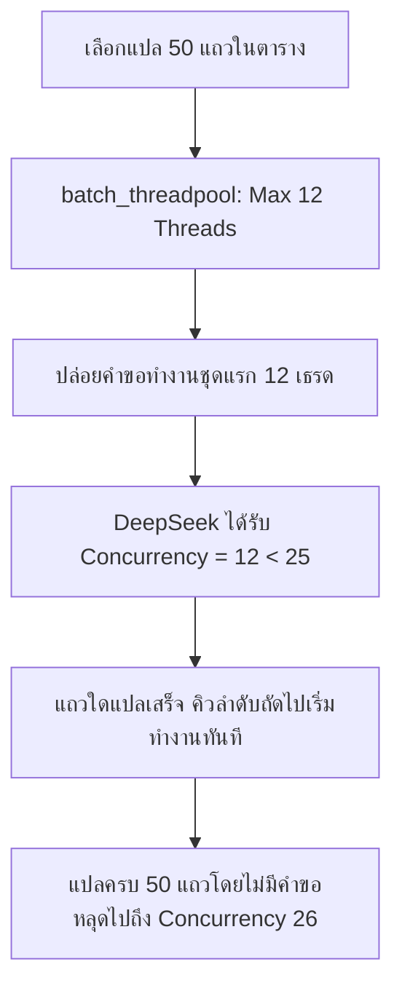

# RCA & Guide: การแก้ปัญหา DeepSeek API Error 429 (Concurrency Exceeded) & ระบบ Auto-Retry พร้อม Concurrency Governor

## 📌 อาการที่พบ (Symptom)
ในการแปลภาษาแบบกลุ่ม (Batch Translation) หรือแปลหลายแถวพร้อมกันใน TStudio:
- โปรแกรมแปลไปได้ส่วนหนึ่ง แล้วเด้งหน้าต่างแจ้งเตือน:
  > **"แปลเสร็จสิ้นแล้ว แต่พบบั๊กหรือข้อผิดพลาดบางรายการ:"**
  > `แถวที่ 7830: DeepSeek API Error 429: {"error":{"message":"Too many requests. Your current concurrency is 26, which exceeds your concurrency limit of 25 based on your remaining balance. Please top up your balance to restore your concurrency.","type":"rate_limit_error","param":null,"code":"invalid_request_error"}}`
  > `แถวที่ 8043: DeepSeek API Error 429: {"error":{"message":"Too many requests. Your current concurrency is 27, which exceeds your concurrency limit of 25..."}}`
  > `...และอีก 11 รายการ`

---

## 🔍 สาเหตุที่แท้จริง (Root Cause Analysis)

### 1. การขาดตัวควบคุม Concurrency ในการแปลแบบ Batch (`retranslate_batch`)
- ใน `TStudio` เมธอด `retranslate_batch` ได้วนลูปแถวทั้งหมดที่เลือก และสั่งรัน:
  ```python
  worker = ApiWorker(CoreAI.generate_content, cfg, prompt, is_local=is_local)
  self.threadpool.start(worker)
  ```
- แต่ `self.threadpool` ของโปรแกรมถูกกำหนดค่าไว้ที่ `setMaxThreadCount(100)`
- เมื่อผู้ใช้เลือกแถวมากกว่า 25 แถว (เช่น 40-50 แถว) ระบบจึงยิงคำขอ HTTP ขนานกันไปที่ DeepSeek พร้อมกันทันที 40-50 เธรด
- เซิร์ฟเวอร์ของ DeepSeek กำหนดโควตา Concurrency ตามยอดเงินคงเหลือของผู้ใช้ (ในเคสนี้คือ **ไม่เกิน 25 คำขอพร้อมกัน**)
- คำขอที่ 26, 27, 28... จึงถูกเซิร์ฟเวอร์ DeepSeek ปฏิเสธทันทีด้วยรหัส **HTTP 429 (Rate Limit / Concurrency Exceeded)**

### 2. การขาดระบบ Retry เมื่อเกิดข้อผิดพลาด 429 ใน `CoreAI.generate_content`
- ใน `tstudio_core.py` ฟังก์ชัน `CoreAI.generate_content` ได้ทำการ `_session.post(...)` เพียงครั้งเดียว หากได้รับคำตอบ `status_code != 200` จะยกข้อผิดพลาด `Exception(f"DeepSeek API Error {res.status_code}: {res.text}")` ทันที
- ความจริงแล้ว ข้อผิดพลาด Concurrency Limit เกิดขึ้นเพียงชั่วขณะ (Transient Error) หากหน่วงเวลารอเพียง 1-2 วินาทีเพื่อให้เธรดก่อนหน้าประมวลผลเสร็จ คำขอที่ติด 429 ก็จะสามารถส่งซ้ำและแปลสำเร็จได้ 100%

---

## 🛠️ วิธีแก้ไขแบบเบ็ดเสร็จ (Comprehensive 2-Tier Solution)

### ระดับที่ 1: ระบบควบคุม Concurrency อัจฉริยะ (Batch Concurrency Governor)
1. **ควบคุมเธรดแปลแบบกลุ่มผ่าน `self.batch_threadpool`**:
   - แยก ThreadPool สำหรับงานแปลแบบกลุ่มออกจากเธรดทั่วไป
   - กำหนด `setMaxThreadCount(batch_concurrency)` ตามค่าความปลอดภัยของแต่ละค่าย AI:
     - **DeepSeek:** กำหนดค่าเริ่มต้นที่ **12 เธรด** (ต่ำกว่าขีดจำกัด 25 อย่างปลอดภัย มี Buffer เหลือกว่า 50%)
     - **Gemini / Claude:** กำหนดค่าเริ่มต้นที่ **8 เธรด**
     - **Local LLM (Ollama):** กำหนดค่าเริ่มต้นที่ **3 เธรด**
     - **OpenAI:** กำหนดค่าเริ่มต้นที่ **15 เธรด**
   - เมื่อผู้ใช้เลือก 100 แถว `QThreadPool` จะปล่อยให้ทำงานครั้งละ 12 แถวเท่านั้น เมื่อแถวใดแปลเสร็จ แถวถัดไปในคิวจะเริ่มทันที ทำให้ Concurrency สู่ DeepSeek ไม่มีทางเกิน 12!
2. **เพิ่มการตั้งค่าในหน้าต่าง Settings (`SettingsDialog`)**:
   - เพิ่มตัวเลือก **`7. ⚡ Batch Concurrency (เธรดแปลพร้อมกัน)`** ให้ผู้ใช้ปรับแต่งเองได้ตั้งแต่ 1 - 50 เธรด



### ระดับที่ 2: ระบบ Auto-Retry แบบ Exponential Backoff + Jitter
ใน `tstudio_core.py` เพิ่มเมธอด **`_send_request_with_retry`** ให้กับ `CoreAI`:
- เมื่อพบรหัสสถานะ `429`, `500`, `502`, `503`, `504` หรือปัญหาเน็ตกระตุกชั่วคราว:
  - ระบบจะคำนวณเวลารอแบบ Exponential Backoff: `1.5 * (2 ** attempt) + random.uniform(0.3, 1.0)`
  - สำหรับรหัส 429 จะหน่วงเวลาอย่างน้อย **2.5 วินาที** เพื่อให้เธรดคู่ขนานเดิมคืนโควตา
  - ทำการส่งคำขอใหม่โดยอัตโนมัติสูงสุด 4 ครั้ง (Total 5 attempts)
  - ผู้ใช้งานจะไม่เห็น Error 429 อีกต่อไป เพราะโปรแกรมกู้คืนและแปลซ้ำให้เสร็จสิ้นในเบื้องหลัง

---

## 🧪 ผลการทดสอบ (Verification)
1. **Simulated DeepSeek 429 Recovery Test**:
   - จำลองเซิร์ฟเวอร์ตอบ 429 Concurrency Exceeded ใน 2 ครั้งแรก แล้วตอบ 200 OK ในครั้งที่ 3
   - ผลลัพธ์: `Mock 429 recovered after 3 calls, elapsed: 6.16s` ➔ **PASSED (กู้คืนสำเร็จ 100%)**
2. **Concurrency Safety Limit Test**:
   - ตรวจสอบค่าคำนวณ Concurrency สำหรับ DeepSeek ได้ 12 เธรด (< 25) ➔ **PASSED**
3. **Multi-File Build & Compilation**:
   - ตรวจสอบไวยากรณ์ `py_compile` ผ่านทุกไฟล์ ทั้งในซอร์สโค้ดและ `dist/THub/_internal/` ➔ **PASSED**
