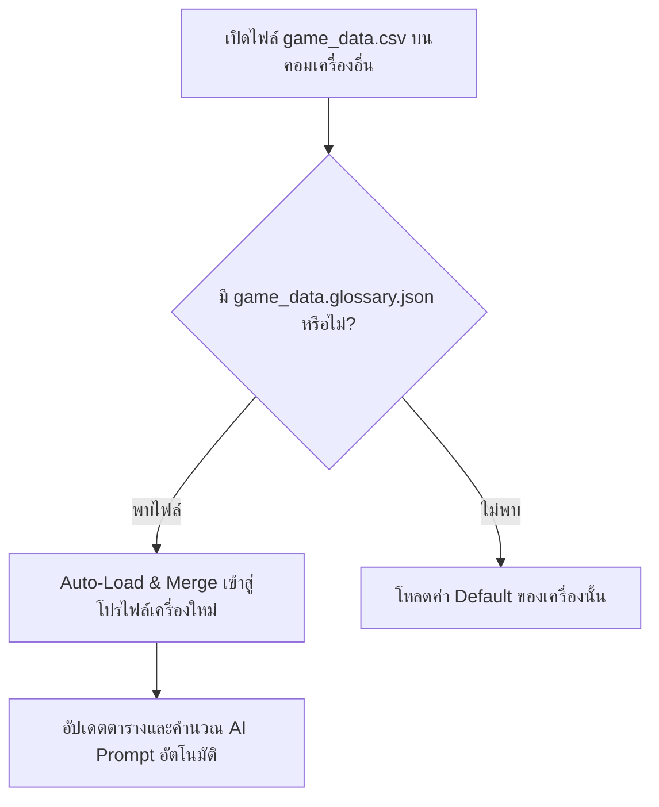

# TStudio & TRun: คู่มือสถาปัตยกรรมคลังคำศัพท์ข้ามเครื่องและการจับคู่คำหลายภาษา (Cross-Machine Portability & Multi-Script Term Matching)

## 📌 สรุปปัญหาและที่มา (Problem Statement)
เมื่อผู้ใช้งานแปลเกมด้วย **Translation Studio (TStudio)** หรือ **TRun** มักพบปัญหา:
1. **ย้ายไปแปลอีกเครื่อง ("แปลคอมอื่น") แล้วคำศัพท์ไม่ตามมา**:
   - เดิมที Glossary ถูกเซฟอยู่เฉพาะในโฟลเดอร์โปรแกรม THub บนเครื่องหลัก (`tools/flagship/Core/prompts.json`)
   - เมื่อก๊อปปี้ไฟล์ `.csv` หรือแชร์โฟลเดอร์งานม็อดไปอีกเครื่อง อีกเครื่องจะไม่มี Glossary ล่าสุด หรือใช้ Glossary ว่างเปล่า
2. **แก้ไขคำศัพท์ในตารางแล้วแต่แปลคำอื่นไม่เปลี่ยนตาม**:
   - การดับเบิลคลิกแก้ไขข้อความในตาราง Glossary โดยตรง ไม่ได้ผูกกับ Signal Auto-Save ทำให้การแก้ไขไม่ถูกบันทึกลงดิสก์
   - คำแปลแถวเก่าที่เคยแปลไปแล้วยังค้างคำเดิม ไม่มีการถามเพื่อช่วยแทนที่แบบกลุ่ม (Batch Replace)
3. **คำศัพท์ภาษาญี่ปุ่น / ภาษาจีน (CJK) ไม่ทำงาน (Match 0%)**:
   - การจับคู่คำศัพท์เดิมใช้ `\b` (Word Boundary) ของ Regex ภาษาอังกฤษ
   - ในภาษาญี่ปุ่น (Hiragana/Katakana/Kanji) และภาษาจีน ตัวอักษรติดกันเป็นพืดไม่มีการเว้นวรรค และตัวอักษรเหล่านี้ถือเป็น `\w` ในไพธอน ส่งผลให้ `\bライザ\b` เมื่อเทียบกับ `ライザのアトリエ` ล้มเหลว 100%
   - นอกจากนี้ `RE_CJK` เดิมดักจับเฉพาะตัวอักษรจีน (Kanji/Hanzi) แต่ลืมอักษรคาตากานะ/ฮิรางานะ ทำให้ชื่อตัวละครภาษาญี่ปุ่นหลุดไปเข้าลอจิก `\b`
4. **คำนามภาษาอังกฤษที่มีรูปพหูพจน์ (-s, -es, -'s) หลุดการตรวจจับ**:
   - Glossary มักเก็บคำนามเอกพจน์ เช่น `Sword`, `Quest` แต่ในประโยคเกมจริงเป็น `Swords`, `Quests` ทำให้ Regex `\bSword\b` ไม่ตรง

---

## 🏗️ โครงสร้างสถาปัตยกรรมใหม่ (Architectural Design)

### 1. ไฟล์คลังคำศัพท์คู่หู (Companion Glossary: `<csv_name>.glossary.json`)
เพื่อแก้ปัญหา **"แปลคอมอื่น"** ให้สมบูรณ์ 100%:
- เมื่อใดก็ตามที่มีการบันทึก Glossary ใน TStudio ระบบจะ Export ไฟล์ `<ชื่อไฟล์>.glossary.json` ไว้ในโฟลเดอร์เดียวกับไฟล์ `.csv` เสมอ
- เมื่อเปิดไฟล์ CSV หรือ Project ใดๆ บนเครื่องอื่น (`_load_csv` หรือ `TRunWorker.__init__`):
  - ระบบจะสแกนหา `<ชื่อไฟล์>.glossary.json` หรือ `glossary.json` ในโฟลเดอร์เดียวกันโดยอัตโนมัติ
  - ทำการ Merge คำศัพท์เข้าสู่ Profile ของเครื่องนั้นทันที พร้อมแจ้งสถานะบน Status Bar
  - ผลลัพธ์: ก๊อปปี้โฟลเดอร์งานไปเครื่องไหน Glossary จะติดตามไปด้วยเสมอโดยไม่ต้องตั้งค่าใดๆ เพิ่มเติม



---

### 2. ตัวตรวจจับอักขระเอเชียหลายระบบ (Multi-Script Asian Detection)
ขยายขอบเขตการตรวจจับภาษาใน `TStudioCore`:
- **`RE_ASIAN_SCRIPTS`**:
  - อักษรจีน/คันจิ: `[\u4E00-\u9FFF\u3400-\u4DBF\uF900-\uFAFF]`
  - ฮิรางานะ: `[\u3040-\u309F]`
  - คาตากานะ: `[\u30A0-\u30FF\u31F0-\u31FF]`
  - ฮันกึล (เกาหลี): `[\uAC00-\uD7AF\u1100-\u11FF\u3130-\u318F]`
  - ภาษาไทย: `[\u0E00-\u0E7F]`
- ฟังก์ชัน **`TStudioCore.has_cjk_or_kana(text)`**:
  - หากพบอักขระเอเชีย: ใช้การตรวจแบบ Substring (`term_lower in source_lower`) ทำให้ชื่อภาษาญี่ปุ่นอย่าง `ライザ` หรือ `ポーション` สามารถ Match เจอกับข้อความเกมได้ 100%
  - หากเป็นภาษาละติน/อังกฤษ: ใช้ `\b` ร่วมกับ Suffix พหูพจน์ `(?:s|es|\'s)?\b`

---

### 3. การประกอบ Prompt แบบ Imperative และฉีดแทนที่ `[GLOSSARY TO USE]`
- กำหนดกฎให้ AI ปฏิบัติตามอย่างเคร่งครัดระดับ Mandate:
```
CRITICAL TERMINOLOGY RULES (MANDATORY LOCALIZATION GLOSSARY):
You MUST strictly translate the following recognized terms using their exact specified Thai translations:
- "Sword" ➔ "ดาบวิเศษ" (Weapon)
- "ライザ" ➔ "ไรซ่า" (Person)
(DO NOT translate these terms into alternative synonyms. Follow the glossary strictly.)
```
- แทนที่ตำแหน่ง `[GLOSSARY TO USE]` ใน Template Prompt ทันที เพื่อให้อยู่ในลำดับต้นของคำสั่งที่ AI ให้ความสำคัญสูงสุด

---

### 4. การจัดการแก้ไขในตารางและการแทนที่ทั้งไฟล์ (In-Table Edit & Batch Update)
- ผูก Event `itemChanged` บน `self.tbl_glossary` เข้ากับ `QTimer` 500ms ป้องกันการบันทึกซ้ำซ้อน และบันทึกคำศัพท์ลงดิสก์ทันทีหลังผู้ใช้พิมพ์เสร็จ
- เมื่อแก้ไขคำแปลในกล่อง `✏️ แก้ไขคำศัพท์` หาก `new_trans != old_trans` โปรแกรมจะสแกนทั้งไฟล์และแสดงหน้าต่างถาม:
  > *"พบแถวที่แปลไปแล้วจำนวน X แถว ที่มีคำแปลเดิม ('ดาบ') ต้องการแทนที่ด้วยคำแปลใหม่ ('ดาบวิเศษ') อัตโนมัติทั้งหมดหรือไม่?"*
  หากตอบ Yes ระบบจะอัปเดตคำแปลในตารางทั้งหมดทันที

---

## 🧪 การทดสอบและยืนยันผล (Verification Suite)
ชุดทดสอบครอบคลุม:
1. การตรวจจับภาษาญี่ปุ่น คาตากานะติดกับฮิรางานะ (`ライザのアトリエ`) ➔ **PASS**
2. การตรวจจับภาษาจีน (`艾丝蒂尔`) ➔ **PASS**
3. การตรวจจับภาษาอังกฤษพหูพจน์ (`Swords`, `Quests`) ➔ **PASS**
4. การรัน Enforce Glossary หลังบ้าน ➔ **PASS**
5. การบันทึกและอ่าน Companion Glossary ข้ามโฟลเดอร์ ➔ **PASS**
