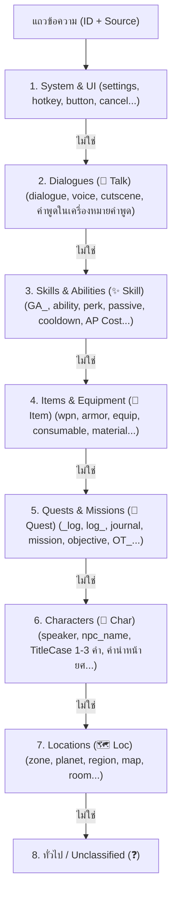

# คู่มือสถาปัตยกรรมระบบตัวกรองและการจัดหมวดหมู่อัจฉริยะ (TStudio Smart Filter & Classification Engine)

## 1. บทนำ (Introduction)
ในกระบวนการแปลและแปลงภาษาเกม (Game Localization) ไฟล์แค็ตตาล็อกภาษา เช่น Unreal Engine Locres / CSV มักมีข้อความรวมกันหลักหมื่นถึงหลักแสนแถว ทั้งบทสนทนา (Dialogues), ชื่อตัวละคร (Characters), สกิล/ความสามารถ (Skills & Abilities), ไอเทม (Items), เควสต์ (Quests) และคำสั่งระบบ (System UI)

การมีระบบจัดหมวดหมู่และฟิลเตอร์ที่แม่นยำ 100% เป็นหัวใจสำคัญที่ช่วยให้นักแปล:
1. แปลชื่อเฉพาะ (Proper Nouns) เช่น ตัวละคร และ สกิล ได้อย่างสอดคล้องกันทั้งเกม
2. คัดแยกงานแปลตามประเภทได้อย่างรวดเร็ว
3. ทำ Glossary / Terminology Consistency ได้อย่างมีประสิทธิภาพ

---

## 2. ปัญหาเดิมและข้อจำกัดของระบบก่อนหน้า (Root Cause Analysis)

### 2.1 บั๊ก `_Name` เหมาทุกอย่างเป็นตัวละคร
- **ปัญหา**: โค้ดเดิมตรวจจับคีย์เวิร์ด `'name'` ใน Asset ID ทำให้ ID ที่ลงท้ายด้วย `_Name` ถูกจัดเป็น `👤 Char` ทั้งหมด
- **ตัวอย่าง**:
  - `GA_PowerSurge_Name` (ชื่อสกิล Unreal GAS) -> ถูกตีเป็น `👤 Char`
  - `OT_0033_Name` (ชื่อเควสต์ Operation Title) -> ถูกตีเป็น `👤 Char`
  - `Wpn_Blaster_Name` (ชื่อไอเทมอาวุธ) -> ถูกตีเป็น `👤 Char`
- **ผลกระทบ**: มีข้อมูลตัวละครปลอมปนเข้ามามากกว่า 3,500 แถว ทำให้ฟิลเตอร์ตัวละครใช้งานจริงไม่ได้

### 2.2 บั๊กคำว่า `'log'` กลืนบทสนทนาเป็นเควสต์
- **ปัญหา**: คำว่า `'diaLOGue'` มีซับสตริง `'log'` อยู่ข้างใน เมื่อตรวจจับเควสต์ด้วยคำว่า `'log'` ก่อนที่จะแยกประเภทให้รัดกุม ทำให้บทสนทนากว่า 16,500 แถว ถูกเข้าใจผิดว่าเป็นเควสต์
- **ผลกระทบ**: ฟิลเตอร์บทสนทนาว่างเปล่า ส่วนฟิลเตอร์เควสต์บวมขึ้นไปถึง 16,593 แถว

### 2.3 สกิล (Skills & Abilities) ไม่มีหมวดหมู่แยก
- **ปัญหา**: สกิลตระกูล Gameplay Ability (`GA_`), Perk, Talent, Passive ถูกนำไปรวมกับไอเทมทั่วไป (`⚔️ Item`) หรือถูกแย่งไปเป็นตัวละครเนื่องจากลงท้ายด้วย `_Name`

---

## 3. สถาปัตยกรรม V4 Smart Classification Engine

เพื่อให้ได้ความแม่นยำสูงสุด ระบบ V4 ใน `TStudioCore.get_row_tag(id_str, source_str)` จึงจัดลำดับความสำคัญในการตัดสินใจ (Priority Cascade) ดังนี้:

### รายละเอียดการดักจับในแต่ละลำดับ:
1. **System & UI (`⚙️ Sys`)**:
   - ID: `settings`, `config`, `option`, `video`, `audio`, `keybind`, `control`, `slider`, `button`, `hud`, `prompt_`, `company`, `brand`, `studio`
   - Source: ข้อความสั้นที่ตรงกับคำสั่งสากล เช่น `OK`, `Cancel`, `Yes`, `No`, `Apply`, `Default`
2. **Dialogues (`💬 Talk`)**:
   - ตัดสินก่อนเควสต์เพื่อป้องกัน Substring `log` ชนกับ `dialogue`
   - ID: `dialogue`, `voice`, `speech`, `conv_`, `cutscene`, `subtitle`, `narrat`, `line_`, `chatter`
   - Source: ขึ้นต้นด้วยเครื่องหมายคำพูด (`"`, `“`, `「`), มี Speaker Prefix (`[Speaker]: ...`), หรือประโยคยาวที่มีจุดวรรคตอน
3. **Skills & Abilities (`✨ Skill`)**:
   - ID: `ga_` (Unreal Gameplay Ability), `ability`, `skill`, `spell`, `magic`, `perk`, `talent`, `passive`, `ultimate`, `buff`, `debuff`, `technique`, `combo`, `stance`, `force_power`, `actionpoint`
   - Source: ข้อความที่มี `Cooldown:`, `Mana Cost`, `Action Points`, `AP Cost`, `Cast Time:`, `Deals damage`
4. **Items & Equipment (`🎒 Item`)**:
   - ID: `item`, `wpn`, `weapon`, `armor`, `equip`, `relic`, `artifact`, `shield`, `potion`, `consumable`, `material`, `craft`, `ingredient`, `loot`, `gear`, `blaster`, `medpac`
5. **Quests & Missions (`📜 Quest`)**:
   - ใช้ `_log`, `log_`, `journal` แทนคำว่า `log` โดดๆ
   - ID: `quest`, `mission`, `task`, `objective`, `bounty`, `hunt`, `contract`, `ot_\d{3,4}_name`
6. **Characters (`👤 Char`)**:
   - ID: `speaker_name`, `charactername`, `charname`, `actor_name`, `hero_name`, `npc_name`
   - Source: คำนำหน้ายศ เช่น `Darth `, `Master `, `General `, `Captain `, `Commander `, `Lord `, `Lady `
   - TitleCase 1-3 คำที่ไม่มีเครื่องหมายวรรคตอนและไม่ได้อยู่ใน Blacklist คำสั่งระบบ

---

## 4. โหมดตัวกรองใน TStudio (16 Filter Modes)

| Mode Index | ชื่อตัวกรอง (Display Label) | แท็กเป้าหมาย | คำอธิบาย |
| :---: | :--- | :---: | :--- |
| **0** | **ทุกบรรทัด (All Rows)** | ทั้งหมด | แสดงทุกแถวในโปรเจกต์ |
| **1** | **❓ ยังไม่แปล (Untranslated)** | - | แถวที่ช่องคำแปลยังว่างเปล่า |
| **2** | **✅ แปลแล้ว (Translated)** | - | แถวที่มีการใส่คำแปลแล้ว |
| **3** | **🤖 AI เพ้อเจ้อ (Hallucinations)** | - | แถวที่คำแปลยาวกว่าต้นฉบับเกิน 4 เท่า |
| **4** | **🎭 วลี/สำนวน (Quotes/Idioms)** | - | แถวที่เป็นคำพูดในคำคม สำนวน หรือสุนทรพจน์ |
| **5** | **👤 ชื่อตัวละคร (Characters)** | `👤 Char` | กรองเฉพาะชื่อตัวละครจริง 100% |
| **6** | **🗺️ สถานที่ (Locations)** | `🗺️ Loc` | ดาวเคราะห์, แมพ, เขตพื้นที่ |
| **7** | **✨ สกิล / ความสามารถ (Skills)** | `✨ Skill` | ท่าไม้ตาย, ความสามารถ, Passive, GAS |
| **8** | **🎒 ไอเทม / อุปกรณ์ (Items)** | `🎒 Item` | อาวุธ, ชุดเกราะ, ไอเทมใช้งาน |
| **9** | **⚔️ รวมไอเทมและสกิล (Items & Skills)** | `Item` หรือ `Skill` | รวมทั้งสองหมวดสำหรับคนที่ต้องการตรวจภาพรวม |
| **10** | **📜 เควสต์ / ภารกิจ (Quests)** | `📜 Quest` | ชื่อภารกิจและเป้าหมายเควสต์ |
| **11** | **⚙️ ระบบ & UI (System & UI)** | `⚙️ Sys` | เมนูตั้งค่าและปุ่มควบคุม |
| **12** | **💬 บทสนทนา (Dialogues)** | `💬 Talk` | บทสนทนา คัตซีน ซับไตเติล |
| **13** | **🔤 ผสมไทย-อังกฤษ (Mixed)** | - | ข้อความที่มีทั้งไทยและอังกฤษผสมกัน |
| **14** | **🇬🇧 อังกฤษตกค้าง (Eng Leftovers)** | - | ข้อความที่ AI แปลแล้วแต่ยังเป็นภาษาอังกฤษ |
| **15** | **🇨🇳 มีภาษาจีน/CJK หลุดมา** | - | ข้อความที่มีตัวอักษรจีนปนเข้ามา |

---

## 5. คำค้นหาอัจฉริยะ (Smart Tag Search Aliases)
ในช่องค้นหา `🔍 Search Box` บน Table View ผู้ใช้สามารถพิมพ์คีย์เวิร์ดภาษาไทยหรืออังกฤษเพื่อกรองหมวดหมู่ได้ทันที:

- **พิมพ์ `สกิล`, `skill`, `ความสามารถ`, `ability`** ➔ แสดงเฉพาะแถวที่เป็น **`✨ Skill`**
- **พิมพ์ `ตัวละคร`, `char`, `character`, `ชื่อตัวละคร`** ➔ แสดงเฉพาะแถวที่เป็น **`👤 Char`**
- **พิมพ์ `ไอเทม`, `item`, `อุปกรณ์`** ➔ แสดงเฉพาะแถวที่เป็น **`🎒 Item`**
- **พิมพ์ `บทสนทนา`, `dialogue`, `talk`** ➔ แสดงเฉพาะแถวที่เป็น **`💬 Talk`**
- **พิมพ์ `เควสต์`, `quest`, `ภารกิจ`** ➔ แสดงเฉพาะแถวที่เป็น **`📜 Quest`**
- **พิมพ์ `สถานที่`, `location`** ➔ แสดงเฉพาะแถวที่เป็น **`🗺️ Loc`**
- **พิมพ์ `ระบบ`, `system`, `ui`, `เมนู`** ➔ แสดงเฉพาะแถวที่เป็น **`⚙️ Sys`**
- **พิมพ์ `ภาษาจีน`, `จีน`, `cjk`** ➔ แสดงเฉพาะแถวที่มีอักษรจีนหลุดมา

---

## 6. การรีเฟรชแท็กข้อมูลสด (Live Refresh Shortcut)
เมื่อมีการปรับแก้โค้ดแท็ก หรือต้องการจัดหมวดหมู่ข้อมูลในโปรเจกต์ที่เปิดค้างอยู่ใหม่ทั้งหมด:
- กดปุ่มลัด **`F5`** บนคีย์บอร์ด
- หรือไปที่เมนู **เครื่องมือ (Tools) ➔ 🔄 คำนวณหมวดหมู่แถวใหม่ทั้งหมด (Refresh Row Tags)**
- ระบบจะคำนวณแท็กของทุกแถวใหม่ อัปเดตตัวนับสถิติบนดรอปดาวน์ และรีเฟรชหน้าจอให้อัตโนมัติทันที
