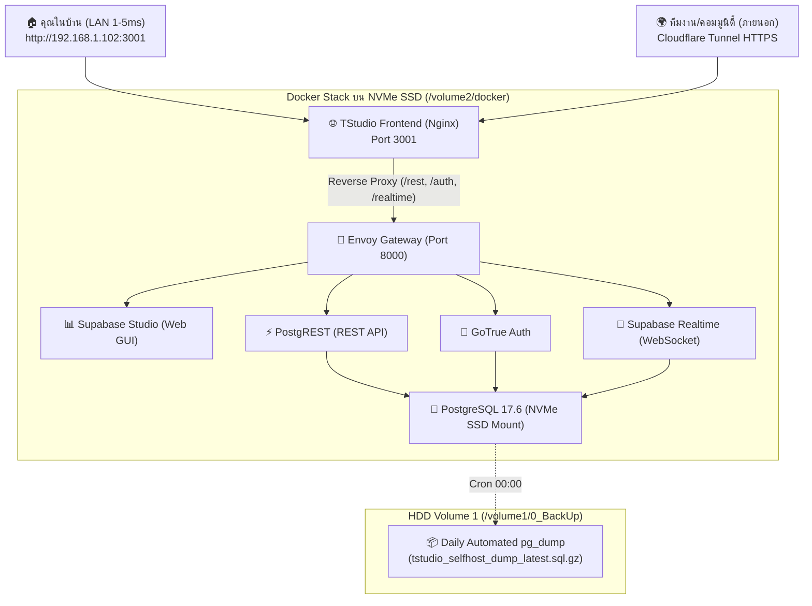

# คู่มือการบริหารจัดการ NAS UGREEN DXP2800 สำหรับสตูดิโองานม็อดและ TStudio Web (Full Self-Host)

เอกสารนี้ระบุสถาปัตยกรรมโครงสร้างระบบ เครือข่าย การจัดสรรพื้นที่จัดเก็บข้อมูล คอนเทนเนอร์ Docker ความเร็วสูง สแต็ก Supabase แบบ Full Self-Host และระบบสำรองข้อมูลอัตโนมัติบน NAS UGREEN DXP2800

---

## 1. ข้อมูลฮาร์ดแวร์และเครือข่าย (System & Network Profile)

* **รุ่นอุปกรณ์:** UGREEN NASync DXP2800 (Hostname: `HSH-DXP2800`)
* **หน่วยประมวลผล (CPU):** Intel® Processor N100 (4 Cores / 4 Threads, สูงสุด 3.4 GHz, สถาปัตยกรรม x86_64)
* **หน่วยความจำ (RAM):** 8GB DDR5 4800MHz
* **พอร์ตเครือข่าย (LAN):** 2.5GbE High-Speed LAN
* **ระบบปฏิบัติการ:** UGOS Pro (Linux Kernel 6.18.x บนฐาน Debian)
* **IP Address ประจำเครื่อง:** `192.168.1.102`
* **การเชื่อมต่อ SSH (Passwordless):** `ssh -i C:\Users\Danaiwit.WiT\.ssh\id_ed25519 crysers@192.168.1.102`
* **สิทธิ์ผู้ใช้:** `crysers` (กลุ่ม `admin`, `users`, `docker`)

---

## 2. การจัดสรรพื้นที่จัดเก็บข้อมูล (Tiered Storage Topology)

| Volume | สื่อบันทึก | ความจุ | เส้นทางบน NAS | โฟลเดอร์ที่เปิดแชร์ | หน้าที่การใช้งาน |
| :--- | :--- | :--- | :--- | :--- | :--- |
| **Volume 1** | **HDD 8TB** (bcache) | **7.3 TB** | `/volume1` | `0_BackUp`, `02_Source`, `03_Movie` | **Cold Storage & Backup:** สำรองข้อมูลงานม็อด `E:\Mod_Workspace` และเก็บไฟล์ Database Dump อัตโนมัติ |
| **Volume 2** | **NVMe SSD 1TB** | **901 GB** | `/volume2` | `01_Work`, `docker` | **Hot Storage (High IOPS):** รัน Supabase Stack, PostgreSQL Data, Redis Cache, Nginx Web Frontend |

---

## 3. สถาปัตยกรรม Full Self-Host (TStudio Web & Supabase)

ระบบทั้งหมดทำงานแบบเบ็ดเสร็จบน NAS โดยไม่ต้องพึ่งพาเซิร์ฟเวอร์ Cloud ภายนอก:

---

## 4. รายการพอร์ตและช่องทางการเข้าใช้งาน (Access Endpoints)

| บริการ (Service) | URL / พอร์ต | การยืนยันตัวตน (Auth) | หน้าที่ |
| :--- | :--- | :--- | :--- |
| **TStudio Web (LAN)** | `http://192.168.1.102:3001` | บัญชีในระบบ TStudio | หน้าเว็บหลักของสตูดิโอแปลเกม (ความเร็ว 1–5ms) |
| **TStudio Web (Public)** | `https://<tunnel-domain>.trycloudflare.com` | บัญชีในระบบ TStudio | ลิงก์สาธารณะสำหรับคนนอก เข้าใช้งานผ่าน Cloudflare |
| **Supabase Studio** | `http://192.168.1.102:8000` | User: `supabase` Pass: `3781dc42e89c6f9143cf06452febab32` | หน้าแดชบอร์ดจัดการ Database, ดูตาราง, รันคำสั่ง SQL |
| **Portainer CE** | `http://192.168.1.102:9000` | บัญชี Admin ของ Portainer | หน้าเว็บ GUI สำหรับตรวจสอบสถานะและควบคุม Docker |
| **Redis Cache** | Port `6380` | Password: `...` | แคชความเร็วสูง |
| **PostgreSQL Pooler** | Port `5435` | User: `postgres` | พอร์ตเชื่อมต่อฐานข้อมูลโดยตรง |

---

## 5. ระบบสำรองข้อมูลอัตโนมัติ (Automated Backup Engine)

### 1. สำรองข้อมูลฐานข้อมูลอัตโนมัติบน NAS (`pg_dump` Daily Cron)
* **สคริปต์:** `/volume2/docker/backup_daily.sh`
* **รอบเวลา:** รันอัตโนมัติทุกเที่ยงคืน (00:00 น.) ผ่าน `/etc/cron.d/tstudio_backup`
* **ไฟล์ผลลัพธ์:** `/volume1/0_BackUp/Database_Backups/tstudio_selfhost_dump_latest.sql.gz`
* ลบไฟล์สำรองเก่าที่มีอายุเกิน 14 วันทิ้งอัตโนมัติเพื่อประหยัดพื้นที่

### 2. สำรองข้อมูลไฟล์งานม็อดจาก PC (`backup_to_nas.ps1`)
* **สคริปต์:** `E:\Mod_Workspace\scripts\backup_to_nas.ps1`
* ใช้ Robocopy แบบมัลติเธรด 16 ท่อ ซิงค์โฟลเดอร์ `E:\Mod_Workspace` สู่ `\\192.168.1.102\0_BackUp\Mod_Workspace_Backup`

---

## 6. การปรับแต่งประสิทธิภาพสำหรับข้อมูลขนาดใหญ่ (High-Throughput Performance Tuning)

สำหรับการโหลดเกมแปลขนาดใหญ่ (ระดับ 50,000 - 100,000 ข้อความ เช่น Dawnwalker, Starfield, Baldur's Gate):

1. **PostgREST Configuration (`/volume2/docker/supabase/.env`):**
   * `PGRST_DB_MAX_ROWS=60000`: ขยายเพดานจำนวนแถวต่อคำขอ เพื่อให้เกมขนาด 50,000 ข้อความดึงข้อมูลได้ใน 1 คำขอ (เวลา ~400ms) แทนที่จะต้องแบ่งเป็น 50+ คำขอซึ่งจะชนข้อจำกัด 6 TCP Sockets ของเบราว์เซอร์
   * `PGRST_DB_POOL=25`: เพิ่มขนาด Connection Pool ของ PostgREST รองรับการยิงคิวรีพร้อมกันได้ลื่นไหล

2. **Nginx High-Performance Gzip Proxy (`/volume2/docker/tstudio-web/nginx.conf`):**
   * `gzip_proxied any;`: เปิดการบีบอัดข้อมูล JSON ที่ส่งผ่าน Reverse Proxy ลดขนาดเพย์โหลดจาก 35MB เหลือไม่ถึง 4MB (ลดลง 88%)
   * `proxy_buffers 16 128k; proxy_buffer_size 256k;`: ป้องกันไม่ให้ Nginx เขียนบัฟเฟอร์ขนาดใหญ่ลงดิสก์ชั่วคราว

3. **Frontend Instant First-Paint:**
   * ดึง 250 บรรทัดแรก (`FIRST_CHUNK_SIZE=250`) เพื่อปลดล็อกหน้าจอแปลทันทีภายใน **<25ms**
   * ข้อความที่เหลือจะสตรีมขนานด้วยขนาดก้อนละ 25,000 บรรทัดในแบ็กกราวด์
   * ตารางแปล (`TableTranslateView`) กำหนดขนาดเริ่มต้นเป็น 100 แถวต่อหน้า เพื่อรักษาอัตราเรนเดอร์ 60 FPS ใน DOM