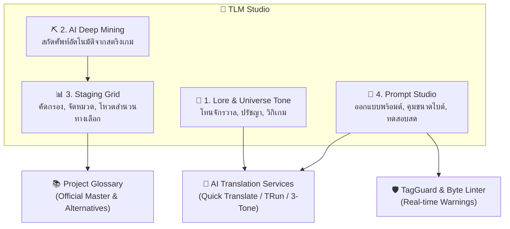

# 🧠 TLM Studio: Translation Lore & Memory Engineering Guide
**ระบบคลังบริบทจักรวาล วิศวกรรมศัพท์เฉพาะ และแม่แบบพร้อมต์อัจฉริยะ สำหรับม็อดแปลภาษาไทย**

**ผู้พัฒนา:** [หน๊ด หนวด translator](https://www.facebook.com/NodNuatTranslator/) (Official Facebook Fanpage)  
**แพลตฟอร์ม:** TStudio Web (Community Crowdsourced Localization Platform)  
**ตำแหน่งในระบบ:** `E:\Mod_Workspace\Modding-Knowledge\Tools\TLM_Studio_Terminology_Engineering_Guide.md`

---

## 🌟 1. บทนำและวัตถุประสงค์ (Overview & Philosophy)

ในการแปลเกมขนาดใหญ่ที่มีเนื้อเรื่องลึกซึ้ง (Lore-Heavy RPGs, Dark Fantasy, Sci-Fi) ปัญหาที่พบบ่อยที่สุดของระบบ Crowdsourcing และ AI ทั่วไปคือ:
1. **สำนวนแตกแยก (Tone Drift)**: นักแปลแต่ละคนหรือ AI แต่ละรอบใช้สรรพนามและน้ำเสียงไม่ตรงกัน เช่น พระเอกพูด "ข้า-เจ้า" ในฉากหนึ่ง แต่อีกฉากกลายเป็น "ฉัน-นาย"
2. **ศัพท์เฉพาะหลุด (Terminology Inconsistency)**: ชื่อมอนสเตอร์ สถานที่ หรือไอเทมถูกแปลคนละคำกันในแต่ละไฟล์
3. **แท็กคำสั่งเกมพัง & ตัวอักษรเกินขนาด (Tag Loss & Byte Overflow)**: สตริงภาษาไทยมีความยาวเกินขีดจำกัดหน่วยความจำของเอนจินเกม (Byte Limit) จนตัวหนังสือทะลักกรอบ UI
4. **ความไม่ต่อเนื่องระหว่างไฟล์ (Context Isolation)**: AI ทั่วไปมองเห็นเฉพาะข้อความบรรทัดเดียว ไม่รับรู้กฎจักรวาลของเกม

**TLM Studio (Translation Lore & Memory)** ถูกพัฒนาขึ้นเพื่อแก้ปัญหาเหล่านี้อย่างเบ็ดเสร็จ โดยทำหน้าที่เป็น **"มันสมองกลาง (Central Brain)"** ที่หลอมรวม **จักรวาลเกม (Lore), กฎศัพท์เฉพาะ (Glossary), ขีดจำกัดทางเทคนิคของเกม (Tech Limits)** และ **แม่แบบคำสั่ง AI (Custom Prompts)** เข้าด้วยกัน

---

## 🏛️ 2. สถาปัตยกรรม 4 เสาหลักของ TLM Studio (The 4 Pillars)

---

## 🧭 เสาหลักที่ 1: Lore & Universe Tone (บริบทและทิศทางจักรวาล)

- **Universe Tone Presets**: เลือกโทนบรรยากาศของเกมได้ทันที เช่น:
  - *Dark Medieval Fantasy* (สำนวนโบราณ เคร่งขรึม สรรพนาม ข้า-เจ้า)
  - *Grimdark Dystopian Cyberpunk* (ดิบ หยาบคาย สรรพนาม มึง-กู สแลงสตรีท)
  - *High Fantasy Epic* (สละสลวย ทางการ ราชาศัพท์)
  - *Modern Casual / Comedy* (เป็นกันเอง สบายๆ ยุคปัจจุบัน)
- **Directives & Philosophy**: ระบุหลักการแปล เช่น *"คงชื่อเฉพาะของบอสเป็นภาษาอังกฤษตามต้นฉบับ"*, *"เว้นช่องไฟหน้าคำอุทาน"*, *"ห้ามแปลทับศัพท์คำว่า Rune ให้ใช้ รูน"*
- **Lore Scout & Web Wiki Fetcher**:
  - ดึงข้อมูล Lore จาก URL วิกิของเกม (เช่น Fandom Wiki, Wikipedia) โดยมีระบบ **Automatic URL Normalization** (`https://`) และ **CORS Proxy Fallback** (AllOrigins) ป้องกันปัญหาเบราว์เซอร์บล็อก Cross-Origin
  - AI Scout วิเคราะห์สรุปประเด็นจักรวาลให้อัตโนมัติด้วย Token Cap 4,096 tokens

---

## ⛏️ เสาหลักที่ 2: AI Deep Mining (การขุดสกัดศัพท์อัจฉริยะ)

- **Targeted Category Extraction**: สกัดคำศัพท์ได้ 5 หมวดหมู่หลัก:
  1. 👤 Character & NPC Names (ชื่อตัวละครและตำแหน่ง)
  2. 🗺️ Locations & Realms (สถานที่ อาณาจักร ดันเจียน)
  3. ⚔️ Items, Skills & Spells (ไอเทม ทักษะ เวทมนตร์ อาวุธ)
  4. 📜 Lore & Artifact Concepts (แนวคิดจักรวาล วัตถุโบราณ)
  5. 🖥️ UI & Game Mechanics (คำศัพท์ระบบและเมนู)
- **High-Capacity Mining Engine**:
  - ยกระดับเพดาน Token ของ LLM ขึ้นเป็น **6,000 Tokens** รองรับการสกัดคำศัพท์คราวละ 25–50 คำ พร้อมคำอธิบายและคำแปลทางเลือก
- **Resilient Truncation Recovery**:
  - กรณีที่ข้อความยาวจัดจน AI หยุดส่งกลางคัน ระบบมีตัวกู้คืน JSON Array แบบ Partial อัตโนมัติ (`recoverPartialJsonArray`) เพื่อสกัดคำศัพท์คู่ที่สมบูรณ์ออกมาใช้งานได้ทันทีโดยไม่เกิด Runtime Crash
  - มี Regex Fallback Extractor ตรวจจับแพทเทิร์น `{ "source": "...", "target": "..." }` แม้ JSON จะปิดแท็กไม่สมบูรณ์

---

## 📊 เสาหลักที่ 3: Staging Grid & Glossary Term Management (ตะแกรงคัดกรอง)

- **Safety Quarantine**: คำศัพท์ที่สกัดได้จะไม่ถูกยัดเข้าพจนานุกรมจริงทันที แต่จะเข้าสู่ **Staging Grid** เพื่อให้ Host หรือ Lead Review ก่อน
- **Granular Selection**: มีช่องติ๊กเลือกคำศัพท์ทีละคำ หรือเลือกทั้งหมด
- **Alternative Translations Preservation**:
  - เมื่อนำเข้าคำศัพท์จาก Staging ระบบจะเก็บคำแปลทางเลือก (`alternatives`) ไว้ด้วยเสมอ ทำให้นักแปลในทีมสามารถเข้ามาร่วมโหวตเลือกสำนวนที่ดีที่สุดได้ภายหลัง
- **Smart Primary Key Merging**:
  - เมื่อกดผสานเข้าพจนานุกรมโปรเจกต์ (`handleMergeTLMTerms`) ระบบจะตรวจสอบว่ามีคำศัพท์เดิมอยู่หรือไม่ หากมีอยู่แล้ว จะคง `id` เดิมไว้ เพื่อให้การบันทึกไปยัง Supabase Cloud เป็นการ **UPDATE** ไม่เกิดข้อมูลซ้ำซ้อน (Duplicate Rows)

---

## 🧪 เสาหลักที่ 4: Prompt Studio & Custom Engineering (วิศวกรรมพร้อมต์)

- **Prompt Presets**: มีแม่แบบมาตรฐาน 3 รูปแบบ:
  1. *Story & Dialogue Focus* (เน้นอารมณ์ บทสนทนา และความลื่นไหลของภาษาไทย)
  2. *Strict Terminology & UI* (เน้นความเป๊ะของคีย์และปุ่มเมนู ห้ามแปลงเกินตัวอักษร)
  3. *Unreal/Unity Game Engine Safe* (เน้นความปลอดภัยของแท็กคำสั่ง `%s`, `{0}`, `\n`)
- **Preserve Lore & Rules on Template Switch**:
  - เมื่อสลับแม่แบบ ระบบจะไม่ล้าง Lore หรือข้อกำหนดจักรวาลที่พิมพ์ไว้ แต่จะคงไว้ในบริบทพร้อมต์เสมอ
- **Max Bytes Limit Enforcement (UTF-8 Byte Guard)**:
  - กำหนดขีดจำกัดขนาดข้อมูลเป็นไบต์ (Byte Limit) เพื่อป้องกันเกม Crash จากบัฟเฟอร์หน่วยความจำล้น
  - ระบบเชื่อมต่อกับ `tagGuard.ts` โดยตรง เมื่อผู้ใช้หรือ AI แปลข้อความที่ความยาวไบต์เกินกำหนด ระบบจะขึ้นคำเตือนสีส้มทันที:
    `⚠️ ขนาดคำแปล (45 ไบต์) เกินขีดจำกัดสูงสุดของเกม (40 ไบต์)`
- **Live Test Translation Bench**:
  - กล่องทดสอบคำแปลจริงพร้อมแทนที่ `[GLOSSARY TO USE]` และส่งไปยัง LLM API เพื่อดูผลลัพธ์ก่อนนำไปใช้งานจริง

---

## 🔒 3. ระบบสิทธิ์และการเข้าถึง (Role-Based Access & Read-Only Mode)

- **Lead Role**: มีสิทธิ์เต็มในการแก้ไข Lore, รัน Deep Mining, ปรับแต่ง Prompt Studio, และกดบันทึกเข้า Cloud / Local Storage
- **Non-Lead Members (Translators / Proofreaders)**:
  - เดิมทีระบบจะล็อกปิดไม่ให้เข้า แต่ในเวอร์ชันปรับปรุงใหม่นี้ สมาชิกทั่วไปสามารถกดเปิด **TLM Studio ในโหมด Read-Only** เพื่อ:
    - เข้ามาอ่าน **Universe Tone** และ **Directives** ของโปรเจกต์
    - ดูแนวทางการแปลและปรัชญาภาษาไทยที่หัวหน้าทีมวางไว้
    - ดูการทดสอบพร้อมต์เพื่อเข้าใจบริบทของเกม
    - โดยปุ่มบันทึกและนำเข้าคำศัพท์จะแสดงสถานะ `🔒 เฉพาะ Lead ที่บันทึกได้`

---

## ⌨️ 4. การเข้าถึงและการใช้งานในห้องแปล (Integration & Shortcuts)

1. **คีย์ลัดระดับสากล (`Ctrl + L`)**:
   - กด `Ctrl + L` (หรือ `Cmd + L` บน Mac) ได้จากทุกที่ในหน้าห้องแปล ทั้งแบบ **Table Mode (ตารางโปรเจกต์)** และ **Standard 3-Column Studio** เพื่อเปิด/ปิดหน้าต่าง TLM Studio ทันที
2. **ปุ่มแถบเครื่องมือหลัก**:
   - มีปุ่ม **`🧠 TLM Studio`** สีทองเด่นชัดบน Toolbar ด้านบนของทั้งสองหน้าจอ
3. **Interactive Universe Tone Banner**:
   - แบนเนอร์แสดงสถานะโทนจักรวาลที่ถูกบังคับใช้ (Enforced) สามารถคลิกเพื่อกระโดดเข้าหน้า TLM ได้ทันที
   - หากโปรเจกต์ยังไม่ได้ตั้งค่า TLM แบนเนอร์จะแสดงเป็นกรอบประสีน้ำเงินพร้อมข้อความชวนตั้งค่า:
     `✨ ตั้งค่าบริบทจักรวาล TLM Studio (เปิด Studio →)`

---

## ☁️ 5. ระบบซิงค์ข้อมูลสองชั้น (Double-Write Hybrid Vault)

เพื่อให้ข้อมูล Lore และกฎของจักรวาลไม่สูญหายแม้ทำงานออฟไลน์หรือเปลี่ยนเครื่อง:
1. **Cloud Database (`supabase.projects.tlm_lore` / `tlm_prompts`)**:
   - ข้อมูลถูกเก็บเป็น JSONB Columns ในตาราง `projects` บน Supabase ทำให้ทุกคนในทีมที่เปิดโปรเจกต์เดียวกันได้รับชุดคำสั่ง Lore เดียวกันแบบเรียลไทม์
2. **IndexedDB Local Project Cache**:
   - ข้อมูลถูกสำรองไว้ใน IndexedDB ของเบราว์เซอร์ เพื่อให้โหลดขึ้นมาแสดงได้ทันทีในระดับมิลลิวินาที (Zero-Latency Instant Hydration)
3. **Global Vault Backup (`__sys_tlm_vault__`)**:
   - มีระบบ Cloud Vault สำรองสำหรับกู้คืนการตั้งค่าในกรณีที่โครงสร้างโปรเจกต์มีการเปลี่ยนแปลง

---

## 📝 6. บันทึกประวัติการปรับปรุง (Changelog)

- **v2.0.0 (กันยายน 2026)**:
  - แก้ปัญหา Token Cap 1200 ให้เป็น Dynamic Options (4096 สำหรับทดสอบ, 6000 สำหรับ Deep Mining)
  - เพิ่ม Resilient Partial JSON Array Recovery ป้องกันบั๊กสกัดคำศัพท์หลุดกึ่งกลาง
  - เชื่อมโยง `maxBytesLimit` เข้ากับ Linter `tagGuard.ts` แสดงคำเตือนแบบเรียลไทม์
  - เพิ่มปุ่ม TLM Studio และ Interactive Banner ใน Table Translate View และ Workarea
  - เพิ่มคีย์ลัด `Ctrl+L` ทั่วทั้งแอปพลิเคชัน
  - ปรับปรุงการนำเข้าคำศัพท์ไม่ให้เกิด Duplicate Key ใน Supabase
  - เพิ่ม Read-Only Mode สำหรับนักแปลทั่วไป
