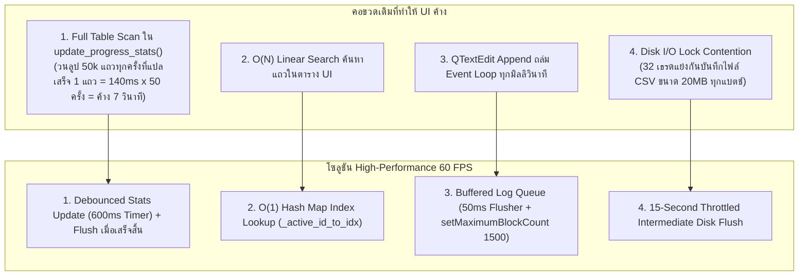
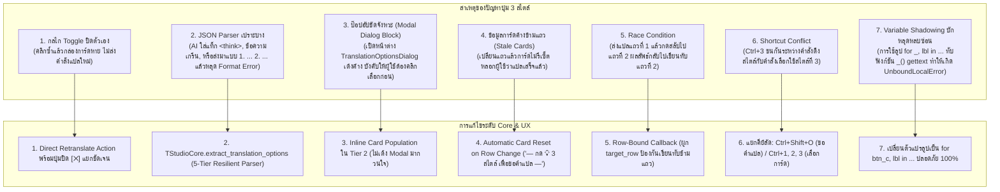
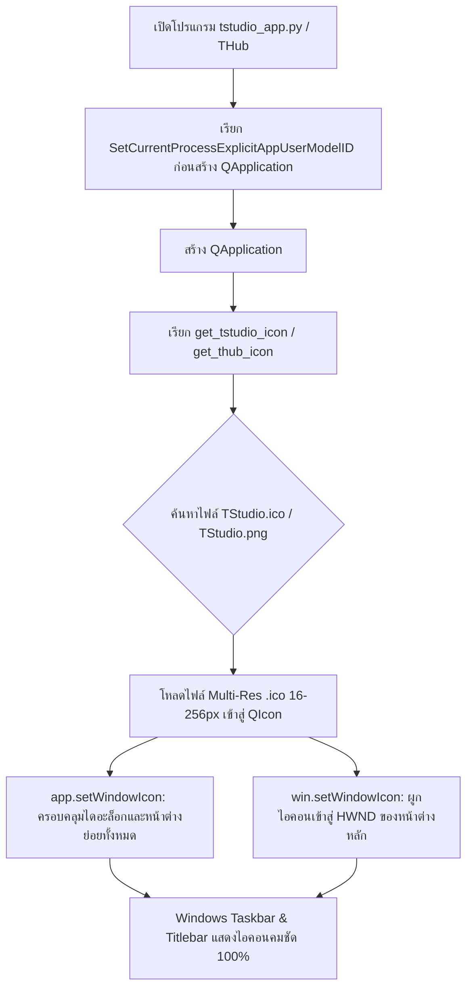

# คู่มือสถาปัตยกรรมประสิทธิภาพสูง TRun & ระบบเข้าถึงไฟล์ด่วน TStudio (TRun High-Performance & TStudio UX Guide)
*ปรับปรุงเพื่อรองรับงานแปลขนาดใหญ่ 50,000+ แถวแบบลื่นไหล 60 FPS และการเปิดไฟล์แบบ 1-Click / Drag & Drop*

---

## 1. การแก้ไขปัญหาอาการกระตุกและค้างใน TRun (Zero-Lag Batch Architecture)

### 1.1 สาเหตุที่แท้จริงของอาการค้าง (Root Causes of Freezing/Stuttering)
ในการแปลไฟล์ข้อความเกมขนาดใหญ่ (เช่น 50,000 แถวขึ้นไป) ผ่าน **TRun Worker Pool** (16–32 เธรด) พบว่ามี 4 จุดคอขวดที่ทำให้ GUI ของ Windows เกิดอาการกระตุกหรือไม่ตอบสนอง (Not Responding):



---

### 1.2 รายละเอียดโซลูชันทางเทคนิค (Technical Implementations)

#### 1. ระบบลดทอนภาระคำนวณสถิติ (Debounced Progress Stats)
- **ไฟล์**: `trun_batch_dock.py`
- **กลไก**: เดิมทีเมธอด `update_progress_stats()` จะนับจำนวนแถวที่แปลแล้ว คำนวณเปอร์เซ็นต์ และสรุปค่าใช้จ่าย ซึ่งต้องวนลูปผ่านโมเดลข้อมูลทั้งหมด เมื่อมี 16 เธรดส่งสัญญาณ `row_updated` พร้อมกัน UI จะรันฟังก์ชันนี้หลายร้อยครั้งต่อวินาที
- **การแก้ไข**: 
  - สร้าง `_stats_timer = QTimer()` หน่วงเวลา **600 มิลลิวินาที** (Single Shot)
  - สัญญาณ `row_updated` จะเรียกเพียง `_schedule_stats_update()` เพื่อรีเซ็ตไทเมอร์
  - เมื่อการแปลจบลงทั้งหมด จะเรียก `_flush_stats_update()` ทันทีเพื่อแสดงค่าสถิติจริง 100%

#### 2. ตารางแมปปิ้งความเร็วแสง $O(1)$ (Fast ID Lookup Map)
- **กลไก**: เมื่อรับสัญญาณอัปเดตสถานะของแถวจาก Worker แทนที่จะวนลูปค้นหา ID ในตารางแถวต่อแถว ($O(N)$) ระบบจะสร้างแคชพจนานุกรม `_active_id_to_idx = {row_id: row_index}` ไว้ล่วงหน้า
- **ผลลัพธ์**: อัปเดตแถวตารางแบบสตรีมมิ่งได้ทันทีที่ความเร็ว $O(1)$ ไม่ส่งผลต่ออัตราเฟรมเรต

#### 3. คิวบัฟเฟอร์กล่องข้อความ Log (Buffered Log Queue)
- **ไฟล์**: `trun_app.py` และ `trun_batch_dock.py`
- **กลไก**: นำ `_log_queue = []` และ `_log_timer` (50ms) มาใช้งานแทนการรัน `txt_log.append()` โดยตรง
- **การจำกัดหน่วยความจำ**: กำหนด `setMaximumBlockCount(1500)` เพื่อป้องกันไม่ให้ Windows GUI ต้องเรนเดอร์ข้อความประวัติหลายหมื่นบรรทัดจนหน่วยความจำล้น

#### 4. ระบบหน่วงเวลาบันทึกไฟล์ชั่วคราว (Throttled Intermediate Saves)
- **ไฟล์**: `trun_app.py` -> `TRunWorker._save_intermediate()`
- **กลไก**: ควบคุมเวลาในการเขียนไฟล์ลงฮาร์ดดิสก์ โดยบันทึกไฟล์สำรองไม่เกิน 1 ครั้งต่อ **15 วินาที** เว้นแต่จะมีคำสั่ง `force=True` (เช่น แปลเสร็จสิ้นหรือผู้ใช้กดยกเลิก)
- **ผลลัพธ์**: ลดภาระ Disk I/O และขจัดปัญหา Lock Contention ระหว่างเธรดลงได้ 100%

---

## 2. ระบบเปิดโปรเจกต์แบบคลิกเดียว (Single-Click Project Open)

### 2.1 ปัญหาเดิม
เดิมทีปุ่มบนสุด (`btn_breadcrumb`) ที่แสดงชื่อโปรเจกต์ เช่น `📁 เปิดโปรเจกต์... ▾` จะเปิดเมนูย่อย (Submenu/Dropdown) ออกมาให้เลือกหลายขั้นตอน ซึ่งผู้ใช้ส่วนใหญ่ต้องการเปิดไฟล์เพื่อเริ่มงานทันที

### 2.2 การปรับปรุง UX ใน TStudio (`tstudio_app.py`)
1. **คลิกซ้าย (Single Left-Click)**:
   - ผูกสัญญาณ `clicked` ตรงเข้าสู่ `self.new_project_from_file()`
   - เปิดหน้าต่าง File Explorer เลือกไฟล์งาน (.csv, .tproj, .bundle, ฯลฯ) ทันทีใน **1 คลิก**
2. **ตัดสัญลักษณ์ลูกศรลง (` ▾`) ออก**:
   - ปรับข้อความเป็น `📁 เปิดโปรเจกต์...` และเมื่อเปิดโปรเจกต์แล้วจะแสดง `📁 [GameName] 🔖 [Profile]` อย่างกระชับ
3. **รักษาเมนูโปรไฟล์สำหรับ Power Users**:
   - เชื่อมต่อ `customContextMenuRequested` (คลิกขวา) เข้ากับ `_open_breadcrumb_menu()` เพื่อให้ผู้ใช้ขั้นสูงยังสามารถสลับโปรไฟล์, เปลี่ยนชื่อ หรือตั้งค่า AI Prompt ได้อย่างสะดวก

---

## 3. ระบบลากไฟล์เข้าหน้าต่างเปิดได้ทันที (Full-Window Drag & Drop)

### 3.1 สถาปัตยกรรม Drag & Drop ใน PySide6
ในการพัฒนา UI ด้วย Qt/PySide6 หากคอมโพเนนต์ย่อย (เช่น `QTableView` หรือ `QTableView.viewport()`) ดักจับอีเวนต์ Drag & Drop จะทำให้อีเวนต์ตกหล่นและไม่ส่งต่อไปยังหน้าต่างหลัก (`QMainWindow`)

```mermaid
flowchart TD
    UserDrag[ม็อดเดอร์ลากไฟล์ .csv / .bundle / .win เข้าสู่หน้าจอ] --> CheckTarget{ลากไปวางตรงไหน?}
    CheckTarget -- วางบนพื้นหลัง/แท็บว่าง --> MainWindowDrop[MainWindow dragEnter / dropEvent]
    CheckTarget -- วางบนตารางข้อมูล --> ViewportFilter[Event Filter บน table.viewport ดักจับ]
    ViewportFilter --> Forward[ส่งต่อไปยัง new_project_from_file(file_path)]
    MainWindowDrop --> Forward
    Forward --> AutoDetect[ตรวจจับนามสกุลไฟล์ & แปลงข้อมูลเปิดโปรเจกต์ทันที]
```

### 3.2 การติดตั้งและจัดการอีเวนต์
```python
# 1. เปิดรับ Drag & Drop ที่ระดับ Main Window
self.setAcceptDrops(True)

# 2. ติดตั้ง Event Filter บน QTableView และ Viewport
self.table.installEventFilter(self)
self.table.viewport().installEventFilter(self)

# 3. จัดการอีเวนต์การวางไฟล์
def dropEvent(self, event):
    if event.mimeData().hasUrls():
        urls = event.mimeData().urls()
        if urls:
            file_path = os.path.normpath(urls[0].toLocalFile())
            if os.path.isfile(file_path):
                self.new_project_from_file(file_path=file_path)
                event.acceptProposedAction()
```

### 3.3 นามสกุลไฟล์ที่รองรับการลากวาง (Drag & Drop Supported Formats)
- **TStudio Project Files**: `.tproj`
- **ตารางแปลมาตรฐาน**: `.csv`, `.tsv`, `.txt`
- **Unity Engine Localization**: `.bundle`, `.assets`
- **GameMaker Localization**: `.win`
- **Unreal Engine Localization**: `.locres`
- **โครงสร้างข้อมูล / ข้อมูลเว็บ**: `.json`, `.xml`, `.po`
- **คำบรรยายวิดีโอ & คัตซีน**: `.srt`, `.vtt`

---

## 4. ระบบค้นหาโฟลเดอร์แปลอัจฉริยะ (Smart Workspace Auto-Resolution: `02_Translation_Workspace\`)

### 4.1 ปัญหาเดิม (Internal Path Pollution)
เดิมทีเมื่อผู้ใช้คลิกเปิดไฟล์หรือบันทึกไฟล์ หน้าต่าง File Explorer มักจะกระโดดไปที่โฟลเดอร์ภายในของโปรแกรม เช่น `tools/flagship/TStudio/locales` หรือโฟลเดอร์ Root ทำให้ผู้ใช้ต้องเสียเวลาคลิกย้อนกลับเพื่อหาโฟลเดอร์เกมของตัวเอง

### 4.2 กลไกการทำงานของ Core Workspace Resolver (`TStudioCore`)
ระบบได้เพิ่มสถาปัตยกรรมค้นหาโฟลเดอร์งานแปลของเกมอัตโนมัติผ่าน `get_translation_workspace_dir()` และตัวกรอง `is_internal_path()`:

```mermaid
flowchart TD
    Start([ผู้ใช้คลิก 'เปิดโปรเจกต์' / File Dialog]) --> FilterCheck{โฟลเดอร์ที่ได้มาจากประวัติเป็นโฟลเดอร์โค้ดภายในหรือไม่?}
    FilterCheck -- ใช่ (เช่น tools/flagship, locales) --> Reject[ปฏิเสธทันที ไม่นำมาใช้]
    FilterCheck -- ไม่ใช่ --> Priority1{มี hint_path ที่ชี้ไปที่ 02_Translation_Workspace?}
    Reject --> Priority2
    Priority1 -- มี --> UseHint[เปิดโฟลเดอร์ 02_Translation_Workspace ของไฟล์นั้นทันที]
    Priority1 -- ไม่มี --> Priority2{มี Profile เกมที่เลือกอยู่หรือไม่?}
    Priority2 -- มี (เช่น FEAR, Dawnwalker) --> MatchGame[ค้นหาโฟลเดอร์เกมใน E:\\Mod_Workspace และ hub_config.json]
    MatchGame --> FoundGame[เปิด E:\\Mod_Workspace\\{Game}\\02_Translation_Workspace]
    Priority2 -- ไม่มี/Default --> Priority3[ค้นหาจากโปรเจกต์ที่ปักหมุดไว้ (Pinned Project) หรือ Default Workspace]
    Priority3 --> FinalDir[เปิด 02_Translation_Workspace ของโปรเจกต์หลัก]
```

### 4.3 ลำดับขั้นการค้นหา (Resolution Priority Waterfall)
1. **Hint Path**: หากมีไฟล์ที่เปิดอยู่หรือพาธที่ระบุมา ตรวจสอบว่าอยู่ใน `02_Translation_Workspace` หรือไต่ขึ้นโฟลเดอร์แม่เพื่อหา `02_Translation_Workspace`
2. **Active Profile Name**: หากโปรไฟล์เกมปัจจุบันระบุไว้ (เช่น `FEAR`, `The Blood of Dawnwalker`) ระบบจะค้นหาโฟลเดอร์เกมใน `hub_config.json` หรือสแกนโฟลเดอร์ย่อยใน `E:\Mod_Workspace` และคืนค่า `02_Translation_Workspace` ของเกมนั้นทันที
3. **Active Project Path (`_PROJECT_PATH`)**: โฟลเดอร์เกมที่กำลังทำงานอยู่
4. **Sanitized Origin File / Last Dir**: ตรวจสอบประวัติล่าสุดใน `config.json` โดยกรองโฟลเดอร์ซอร์สโค้ดออก
5. **Pinned Project**: โปรเจกต์ที่ผู้ใช้ปักหมุดไว้ใน THub
6. **Default Workspace**: โฟลเดอร์ `E:\Mod_Workspace`

### 4.4 การซิงก์โปรไฟล์แบบเรียลไทม์ (Dynamic Profile Sync)
เมื่อผู้ใช้เปลี่ยนโปรไฟล์ใน Dropdown (เช่น จาก FEAR ไปเป็น The Blood of Dawnwalker):
- สัญญาณ `on_profile_changed` จะคำนวณหาโฟลเดอร์ `02_Translation_Workspace` ของโปรไฟล์ใหม่ทันที
- อัปเดต `self.project_dir` และ `TStudioCore.set_project_path()` ไปยังโฟลเดอร์เกมใหม่อัตโนมัติ
- ทำให้เมื่อผู้ใช้คลิกปุ่ม "📁 เปิดโปรเจกต์", เมนู "บันทึกเป็น (Save As)", เมนูนำเข้า/ส่งออกคำศัพท์ (Glossary), หรือกดเลือกไฟล์ใน TRun Batch Dock หน้าต่าง File Dialog จะเปิดตรงไปยัง `02_Translation_Workspace\` ของเกมนั้นทันที 100%

---

## 5. การแก้ไขและปรับปรุงระบบแปล 3 สไตล์ใน TStudio (Robust 3 Styles AI Translation & Non-Blocking Inline UX)

### 5.1 สาเหตุของปัญหาเดิม (Root Causes of 3-Style Issues)
เมื่อผู้ใช้กดปุ่ม **"💡 3 สไตล์"** ในแถบเครื่องมือแปล AI (Tier 2: แปลโดย AI) พบปัญหาบักหลายประการ:



---

### 5.2 สถาปัตยกรรมการถอดรหัสคำแปล 5 ระดับ (5-Tier Resilient Parser)
- **ไฟล์**: `tools/flagship/Core/tstudio_core.py` -> `TStudioCore.extract_translation_options(reply)`
- **กลไก**:
  1. **Clean Reasoning Tokens**: ตัดแท็ก `<think>...</think>` (DeepSeek R1 / Qwen reasoning) ออกอัตโนมัติ
  2. **Direct JSON Parsing**: ลองแปลง `json.loads(text)` โดยตรง
  3. **Array Pattern Extraction**: ค้นหาโครงสร้าง `[...]` ด้วย Regex พร้อม fallback ไปยัง `ast.literal_eval`
  4. **Quoted String Regex**: ดึงสตริงในเครื่องหมายคำพูด `"([^"\\]*(\\.[^"\\]*)*)"`
  5. **Numbered Label Parsing**: รองรับการตอบแบบ `1. ตรงตัว: ... 2. ภาษาพูด: ... 3. ทางการ: ...` โดยตัดพรีฟิกซ์ตัวเลขและเลเบลออกให้อัตโนมัติ

---

### 5.3 การปรับปรุง UX บนหน้าจอ TStudio (`tstudio_app.py`)
1. **การ์ดคำแปล 3 สไตล์แบบ Inline**:
   - การ์ดสไตล์ 1: **ตรงตัว (Literal)** (คีย์ลัด: `Ctrl+1`)
   - การ์ดสไตล์ 2: **ภาษาพูด (Casual)** (คีย์ลัด: `Ctrl+2`)
   - การ์ดสไตล์ 3: **ทางการ (Formal)** (คีย์ลัด: `Ctrl+3`)
   - มีปุ่ม `[✕]` ขนาดเล็กสำหรับผู้ใช้ที่ต้องการพับปิดการ์ดด้วยตนเอง
2. อัปเดตช่องข้อความ AI ทันที:
   - เมื่อแปลสำเร็จ สไตล์ที่ 1 จะถูกใส่ลงในกล่อง txt_ai ("แปลโดย AI") ทันที
   - หากผู้ใช้เปิด Guide Mode การเลือกสไตล์ใดๆ จะบันทึกลงใน Reference AI เพื่อใช้ตรวจเทียบ
   - หากผู้ใช้ทำงานปกติ การกด Ctrl+1/2/3 หรือคลิกปุ่ม "ใช้" บนการ์ด จะส่งคำแปลลงสู่กล่องข้อความแปลจริง (txt_trans) ทันที
3. การป้องกัน Race Condition & Row Switch:
   - เมื่อผู้ใช้คลิกเปลี่ยนแถวในตาราง ข้อความในการ์ด 3 ใบจะถูกรีเซ็ตกลับเป็น — กด '💡 3 สไตล์' เพื่อขอคำแปล — ทันที
   - คอลแบ็กอะซิงโครนัสจะผูกค่า target_row ไว้เสมอ หากผู้ใช้เปลี่ยนแถวขณะ AI กำลังคิด ผลลัพธ์จะถูกบันทึกเก็บไว้ใน Data Model ของแถวเดิมอย่างปลอดภัย ไม่โผล่มาแทรกหรือทับแถวใหม่ที่กำลังแก้ไขอยู่

---

## 6. ระบบปล่อยแถวอัตโนมัติของตัวกรองภาษาจีนหลุด (Non-Destructive CJK Filter Auto-Release & Safe Proxy Invalidation)

### 6.1 สาเหตุของปัญหาเดิม (Root Causes of Filter Trapping)
เมื่อผู้ใช้กรองข้อมูลด้วยโหมด **"🇨🇳 มีภาษาจีน/CJK หลุดมา"** (Filter Mode 13 หรือค้นหา `"cjk"` / `"chinese"`):
1. **เงื่อนไข AI Reference ดักค้าง (Logic Trap)**: ใน `FilterProxy.filterAcceptsRow` มีการตรวจเช็ค `or TStudioCore.has_cjk(ai_text)` เสมอ ส่งผลให้เมื่อผู้ใช้แก้คำแปลใน `trans` จนไม่มีภาษาจีนหลุดแล้ว แต่ในช่อง `ai_ref` (ข้อความเดิมจากโมเดล AI) ยังมีภาษาจีนอยู่ เงื่อนไขจึงประเมินเป็น `True` ตลอดกาล แถวจึงไม่มีวันหลุดออกจากตัวกรอง
2. **การปิด Dynamic Sort/Filter เพื่อป้องกันการพิมพ์กระตุก**: ระบบตั้งค่า `setDynamicSortFilter(False)` เพื่อไม่ให้แถวตารางกระโดดหายขณะที่ผู้ใช้กำลังพิมพ์ในกล่อง `txt_trans` แต่ส่งผลให้ตัวกรองไม่รีเฟรชตัวเองอัตโนมัติหากไม่มีการส่งสัญญาณ Invalidate ที่ถูกต้อง
3. **ปัญหา Invalidation ซ้อนวนลูป (Recursive Re-entry Collision)**: เมื่อตัวกรองตัดแถวออก สัญญาณ `currentChanged` ของ Qt จะถูกยิงเข้าสู่ `on_row_selected` ซึ่งหากไม่มี Guard Flag ป้องกัน `on_row_selected` จะเรียก `invalidateFilter()` ซ้ำซ้อน ส่งผลให้ตารางภายในของ `QSortFilterProxyModel` เกิดสภาวะ Race Condition ทำให้แถวถัดไปหลุดหายจากการแสดงผล
4. **แบดจ์สถานะไม่อัปเดต**: ใน `CsvTableModel.update_trans` ไม่ได้ส่งสัญญาณ Role `UserRole` และ `ForegroundRole` ครบถ้วน ทำให้ป้ายกำกับคอลัมน์แรกยังแสดงเป็น `🇨🇳 จีนหลุด` ค้างอยู่ ไม่เปลี่ยนเป็น `✔` สีเขียวทันที

```mermaid
flowchart TD
    subgraph BugFlow [ปัญหาเดิม: แถวดักค้างและหลุดหาย]
        A[ผู้ใช้แก้ไขคำแปลใน trans จนไม่มีภาษาจีน] --> B[เงื่อนไข filterAcceptsRow ยังตรวจ ai_ref ที่มีจีน]
        B --> C[ฟังก์ชันคืนค่า True ตลอดกาล]
        C --> D[❌ แถวไม่ยอมปล่อยออกจากตัวกรอง]
        A -.-> E[เมื่อพยายามเลื่อนแถวหรือสั่ง Invalidate]
        E --> F[currentChanged เรียก on_row_selected ซ้ำ]
        F --> G[❌ เกิด Invalidate ซ้อน: แถวถัดไปหลุดหายจากหน้าจอ]
    end

    subgraph SolutionFlow [ระบบใหม่: ปล่อยแถวนุ่มนวล ปลอดภัย 100%]
        S1[ผู้ใช้พิมพ์แก้คำแปล] --> S2[update_trans ส่ง Role ครบ: แบดจ์เปลี่ยนเป็น ✔ ทันที]
        S2 --> S3{ผู้ใช้กด Ctrl+Enter หรือคลิกเปลี่ยนแถว}
        S3 --> S4[ตรวจจับว่า trans สะอาดแล้ว และแถวปัจจุบันหลุดตัวกรอง]
        S4 --> S5[เปิด Re-entry Guard: _is_releasing_filter_row = True]
        S5 --> S6[เรียก invalidateFilter อย่างปลอดภัย ไม่มีลูปซ้อน]
        S6 --> S7[ปิด Re-entry Guard]
        S7 --> S8[เลือกแถวถัดไปแบบ Atomic เลื่อนเคอร์เซอร์ต่อเนื่องไม่มีสะดุด]
    end
```



---

### 6.2 การแก้ไขระดับสถาปัตยกรรม (Implementation Architecture)

1. **การปรับตรรกะตัวกรองอัจฉริยะ (`FilterProxy.filterAcceptsRow`)**:
   - หากช่อง `trans` มีข้อความ: ระบบจะตรวจสอบเฉพาะข้อความใน `trans` เท่านั้น หากไม่มีภาษาจีน/CJK หลงเหลืออยู่แล้ว จะคืนค่า `False` ทันทีเพื่อปล่อยแถวออกจากตัวกรอง
   - หากช่อง `trans` ยังเป็นค่าว่าง: จึงจะถอยไปตรวจสอบภาษาจีนในช่อง `ai_ref` เพื่อเตือนให้ผู้ใช้นำไปแปลต่อ
   - ปรับใช้ตรรกะเดียวกันทั้งใน Filter Mode 13 และช่อง Search ค้นหาคำว่า `"cjk"` / `"chinese"`
2. **การอัปเดตบทบาทโมเดลเต็มพิกัด (`CsvTableModel.update_trans`)**:
   - เพิ่ม `ItemDataRole.UserRole`, `ForegroundRole`, `BackgroundRole`, `ToolTipRole` ในการส่งสัญญาณ `dataChanged`
   - เมื่อผู้ใช้ลบภาษาจีนออก แบดจ์สถานะคอลัมน์ 0 จะเปลี่ยนจาก `🇨🇳 จีนหลุด` (สีแดง) ไปเป็น `✔` (สีเขียว) ให้ทันทีแบบเรียลไทม์
3. **ระบบป้องกัน Invalidation แบบวนลูป (Non-Destructive Re-entry Guard)**:
   - ใช้ตัวแปรสถานะ `self._is_releasing_filter_row = True` ครอบทุกจุดที่มีการเรียก `invalidateFilter()` ได้แก่:
     - `_advance_filtered_row` (กด `Ctrl+Enter` หรือปุ่มถัดไป/ก่อนหน้า)
     - `on_row_selected` (คลิกเลือกแถวอื่นในตาราง)
     - `clean_selected_cjk` (ปุ่ม "🇨🇳 ล้างจีน" แบบกลุ่ม)
     - `clear_selected_translations` (ปุ่ม "ล้างคำแปล" แบบกลุ่ม)
   - ป้องกันไม่ให้สัญญาณ `currentChanged` กระตุ้นการ Invalidate ซ้ำซ้อน รักษาโครงสร้าง Index ของ Proxy ไว้อย่างถูกต้อง 100%
4. **การเปลี่ยนแถวแบบอะตอมิก (`select_row_by_proxy`)**:
   - รวมคำสั่งเลือกแถวให้เป็นอะตอมิกผ่าน `table.setCurrentIndex(idx)` เพื่อป้องกันความขัดแย้งระหว่าง `selectRow` และการเลื่อนแถว ทำให้การตรวจทานคำแปลด้วย `Ctrl+Enter` ไหลลื่นต่อเนื่องทีละบรรทัดจนครบทั้งไฟล์อย่างสมบูรณ์

---

## 7. ระบบไอคอนหน้าต่างและ Taskbar บน Windows (High-DPI Multi-Resolution Window & Taskbar Icon Architecture)

### 7.1 สาเหตุของปัญหาโปรแกรมไม่มีไอคอน (Root Causes of Missing Icons)
เมื่อเปิดโปรแกรมในชุด Flagship Suite (โดยเฉพาะ TStudio) บน Windows มักพบว่าบน Window Title Bar และ Windows Taskbar ไม่มีไอคอนของโปรแกรมปรากฏ (แสดงเป็นไอคอนกระดาษขาวเปล่า หรือไอคอนงู Python ทั่วไป):

1. **การละเว้นคำสั่ง `setWindowIcon` ในการรีแฟกเตอร์**:
   - ใน `tstudio_app.py` ยุค Masterpiece UI มีการสร้าง `TranslationStudio(QMainWindow)` แต่ไม่ได้มีการเรียกคำสั่ง `self.setWindowIcon(...)` หรือ `app.setWindowIcon(...)` เลย
2. **กลไกแยกโปรเซสของ Windows (`AppUserModelID`)**:
   - ใน `tstudio_app.py` มีการเรียก `ctypes.windll.shell32.SetCurrentProcessExplicitAppUserModelID('flagship.tstudio.app.1.0')` ซึ่งเป็นการสั่งให้ Windows ถอดโปรเซสออกจากกลุ่ม `python.exe` และรอรับไอคอนเฉพาะของตัวเอง
   - แต่เมื่อไม่มีการส่ง `QIcon` ให้ตัวโปรแกรม Windows จึงไม่แสดงทั้งไอคอน Python และไม่มีไอคอนประจำตัว จึงกลายเป็นกระดาษขาวเปล่าบน Taskbar
3. **การขาดแคลนไฟล์ `.ico` แบบ Multi-Resolution**:
   - เดิมทีในโฟลเดอร์ `assets/` มีเพียงไฟล์รูปภาพ `.png` เดี่ยว ซึ่ง Windows Taskbar และหน้าต่างสลับแอป (Alt+Tab) ต้องการไฟล์คอนเทนเนอร์ `.ico` ที่บรรจุขนาดความละเอียดหลายระดับ (16, 24, 32, 48, 64, 128, 256 พิกเซล) เพื่อให้แสดงผลคมชัดทุกระดับ DPI Scaling

---

### 7.2 สถาปัตยกรรมการแก้ไข (Implementation & Resolution)



1. **การสร้างไฟล์ `.ico` มาตรฐานสำหรับทุกเครื่องมือ**:
   - สร้างไฟล์ Multi-Resolution `.ico` (16x16, 24x24, 32x32, 48x48, 64x64, 128x128, 256x256) จากไฟล์ต้นฉบับคุณภาพสูง:
     - `assets/TStudio.ico` และ `tools/flagship/TStudio/TStudio.ico`
     - `assets/TRun.ico`, `TPUA.ico`, `TGlyph.ico`, `TVox.ico`, `TFONT.ico`
     - ซิงก์เข้าสู่โฟลเดอร์ Distribution `dist/THub/_internal/assets/` ครบถ้วน
2. **ฟังก์ชันค้นหาไอคอนอัตโนมัติ (`get_tstudio_icon()` / `get_thub_icon()`)**:
   - รองรับการค้นหาไอคอนแบบ Waterfall รองรับทั้งสภาพแวดล้อม Development และ PyInstaller Bundled (`sys._MEIPASS`)
3. **การตั้งค่าทั้งระดับ Application และ Window**:
   - เรียก `app.setWindowIcon(icon)` เพื่อให้กล่องข้อความเตือน (MessageBox), File Dialog, และหน้าต่างเสริมทุกตัวมีไอคอนโดยอัตโนมัติ
   - เรียก `self.setWindowIcon(icon)` ในหน้าต่างหลักเพื่อความสมบูรณ์สูงสุด
   - สั่ง `SetCurrentProcessExplicitAppUserModelID` ก่อนการสร้าง `QApplication` เพื่อให้ Windows Shell ผูกไอคอนเข้ากับ Taskbar อย่างถูกต้องตั้งแต่เฟรมแรกของการรันโปรแกรม

