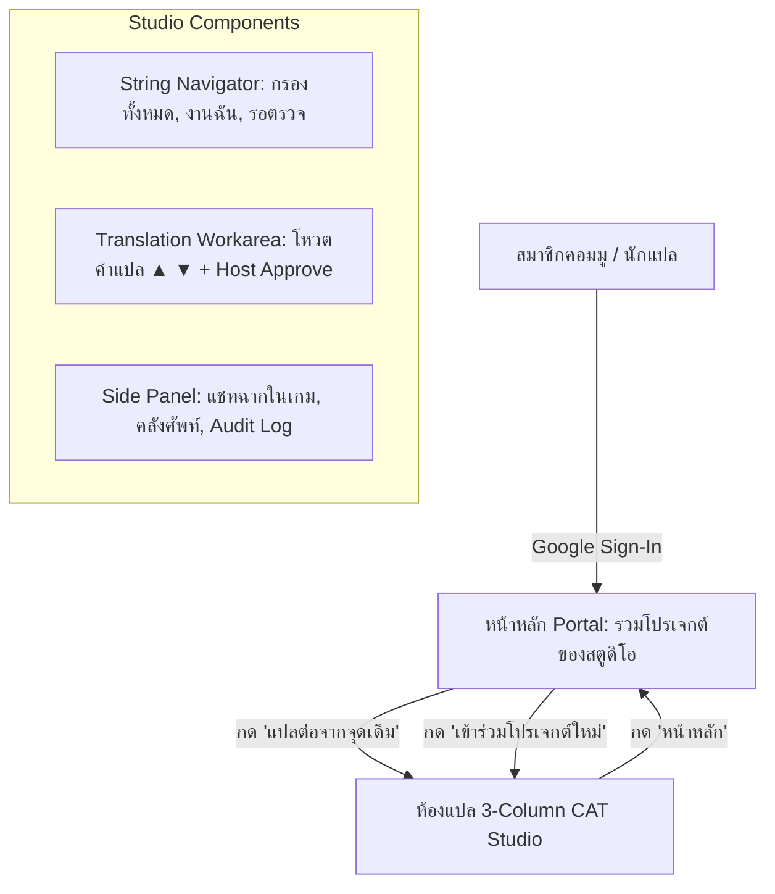

# 🌐 TStudio Web - Community Crowdsourced Localization Architecture Guide

คู่มือสถาปัตยกรรมและการพัฒนา **TStudio Web (Community Edition)** แพลตฟอร์มแปลเกมและซับไตเติ้ลบนเว็บที่ขับเคลื่อนด้วยพลังคอมมูม็อดภาษาไทย

**ผู้สร้างและพัฒนา:** [หน๊ด หนวด translator](https://www.facebook.com/NodNuatTranslator/) (Official Facebook Fanpage)

---

## 🏗️ 1. ปรัชญาการออกแบบ: Host & Community Ecosystem
* **Host-Centric Platform (สตูดิโอของคุณเป็นศูนย์กลาง):** 
  - ผู้สร้างหลัก: **หน๊ด หนวด translator** (`danaiwit.dwb@gmail.com`)
  - หน้าเว็บและทุกส่วนมีการเชื่อมโยงไปยัง [Facebook Fanpage](https://www.facebook.com/NodNuatTranslator/)
  - สมาชิกคอมมูเข้ามาร่วมแปลผ่านลิงก์ที่คุณแชร์ โดยล็อกอินผ่าน Google Account
* **Smart User Memory (ระบบจดจำสถานะผู้ใช้):**
  - จดจำว่าผู้ใช้แต่ละคนกำลังร่วมแปลเกมไหนของคุณอยู่บ้าง
  - จดจำบรรทัดล่าสุดที่ทำค้างไว้ พร้อมปุ่มเด่น **`[ ▶ แปลต่อจากจุดเดิมทันที ]`**
  - มีตัวกรอง **`👤 งานฉัน (My Work)`** ให้สมาชิกดูประวัติข้อความที่ตัวเองเคยแปล และดูว่า Host อนุมัติแล้วหรือยัง
* **Human-Centric with AI Co-Pilot:** คนแปล คนโหวต Host ตรวจอนุมัติ AI เป็นผู้ช่วยเสนอไอเดียและตรวจสอบแท็ก

---

## 🧭 2. โครงสร้างหน้าจอและ Flow การใช้งาน

---

## 🗄️ 3. โครงสร้างฐานข้อมูล (PostgreSQL / Supabase Schema)
* `users`: Google OAuth ID, display_name, karma_points, preferences
* `projects`: ข้อมูลโปรเจกต์เกมที่คุณสร้าง (title, slug, stats)
* `user_project_memberships`: ตารางจดจำตำแหน่งงานแปลล่าสุด (`last_string_id`, `last_active_at`, `contributions_count`, `approved_count`)
* `strings`: คีย์และข้อความต้นฉบับในเกม
* `suggestions`: คำแปลที่คอมมูส่งเข้ามาแข่งกัน พร้อมคะแนนโหวต Upvote/Downvote
* `glossary_terms`: คลังคำศัพท์ทางการและคำต้องห้าม (Forbidden terms)
* `audit_logs`: บันทึกประวัติการกระทำเพื่อความปลอดภัยและ Rollback

---

## 🎨 4. ระบบค้นหาภาพปกเกมจาก Steam (Steam Cover Integration)
* **Multi-Tier Steam Search Architecture**:
  1. **Vite Dev Server Proxy (`/steam-api`)**: เชื่อมต่อไปยัง `store.steampowered.com` ผ่าน Node Server โดยตรง เพื่อตัดปัญหา CORS 100% ในขณะรันเครื่อง
  2. **Direct AppID & URL Resolution**: ตรวจจับและแยกแยะ AppID จากลิงก์หน้าร้าน Steam (`store.steampowered.com/app/...`) หรือตัวเลขไอดีอัตโนมัติ พร้อมดึงชื่อเกมและภาพความละเอียดสูงทันที
  3. **Hashed CDN Asset Support**: รองรับระบบเก็บภาพ CDN ยุคใหม่ของ Steam ที่ใส่ Content Hash ในพาร์ธ (เช่น เกมใหม่ๆ อย่าง *The Blood of Dawnwalker* AppID 3751260) โดยเรียกผ่าน `appdetails` เพื่อดึงภาพจริงที่แสดงผลได้ 100%
  4. **Open CORS Proxy Fallback**: มีระบบสำรองผ่าน AllOrigins และแคชชื่อเกมยอดนิยม (Instant Catalog)
* **Graceful Image Fallback**:
  - หากรูปภาพใดโหลดไม่ผ่าน ระบบจะไม่แสดงกรอบภาพแตก (`[X] Preview`) แต่จะแสดงกรอบการ์ดจำลองพร้อมไอคอนเกมและชื่อเกมแบบพรีเมียมแทน
* **3 Image Selection Modes**:
  1. 🎮 **ค้นหาจาก Steam**: ค้นหาด้วยชื่อเกมหรือวางลิงก์ Steam Store เพื่อเลือกปกจากรายการที่เจอ
  2. 🔗 **กรอก URL รูปภาพ**: ใส่ลิงก์รูปภาพโดยตรง หรือวางลิงก์หน้า Steam Store เพื่อให้ระบบดึงภาพให้อัตโนมัติ
  3. 📁 **อัปโหลดภาพจากเครื่อง**: เลือกไฟล์ภาพจากเครื่องของผู้สร้างพร้อมแปลงเป็น Data URL
* **Live Card Preview**: แสดงตัวอย่างการ์ดโปรเจกต์แบบเรียลไทม์ขณะกำลังตั้งชื่อและเลือกรูปปก ก่อนกดยืนยันสร้างโปรเจกต์

---

## 💬 5. ระบบเชื่อมโยงคอมมูนิตี้ (Community Link Integration)
* **Direct Community Linking**: รองรับการใส่ลิงก์ต้นทางที่ผู้สร้างนำโปรเจกต์ไปโพสต์/เปิดตัว เช่น:
  - 📘 **Facebook**: ลิงก์โพสต์เพจหรือกลุ่มคอมมูม็อด
  - 💬 **Discord**: ลิงก์ Invite เข้าห้องพูดคุยและประสานงานแปล
  - 🎮 **Steam Community**: ลิงก์กระทู้หรือ Community Hub บน Steam
  - 📺 **YouTube**: ลิงก์คลิปตัวอย่างหรือรีวิวม็อด
* **Auto Platform Detection & Styling**: ระบบตรวจจับโดเมนของ URL อัตโนมัติและแสดงผลเป็น Badge สีและไอคอนตามแพลตฟอร์มนั้นๆ
* **Visible Touchpoints**:
  1. **Create Project Modal**: ช่องกรอกลิงก์คอมมูพร้อม Live Badge Preview
  2. **Project Card (Portal)**: ปุ่มกดและ Badge ลิงก์ตรง `[ 💬 ไปยังคอมมู ↗ ]`
  3. **Resume Banner**: ปุ่มเปิดคอมมูข้างปุ่มแปลต่อทันที
  4. **Studio Navbar**: ปุ่มคอมมูนิตี้ข้างชื่อเกมในห้องแปล ให้ผู้ช่วยแปลกดเปิดดูข้อเสนอแนะในโพสต์หลักได้ตลอดเวลา

---

## 📥 6. ระบบนำเข้าไฟล์แปลอัตโนมัติ (Self-Service File Ingestion)
* **ไม่ต้องพึ่งพา AI หรือผู้ดูแลระบบ (Zero-Intervention):** ผู้สร้าง (Host) สามารถนำไฟล์ที่พร้อมแปล หรือไฟล์ดัมพ์ข้อความจากเกมเข้าสู่ระบบได้ด้วยตัวเองทันทีผ่าน Web UI
* **รองรับ 3 ฟอร์แมตหลักของวงการม็อด:**
  1. **`.csv` (Standard / Unreal Engine LOCRES Override):**
     - ตรวจจับคอลัมน์อัตโนมัติ (`key`, `source`, `translation`, `context`, `file_path`)
     - รองรับ UTF-8 with / without BOM (`\uFEFF`) เพื่อป้องกันปัญหาชื่อคอลัมน์แรกเพี้ยน
     - รองรับ Multiline Quoted Strings (ข้อความยาว ข้ามบรรทัด มีเครื่องหมายคำพูดซ้อน `""`) ตามมาตรฐาน RFC-4180
  2. **`.json` (Nested / Key-Value Objects):** ทะลวงโครงสร้าง JSON ซ้อนกันหลายชั้นเป็น Dot-notation keys อัตโนมัติ
  3. **`.srt` (Subtitle Blocks):** สกัดเลขบรรทัด ไทม์โค้ด และบทบรรยายเป็นคีย์พร้อมบริบท
* **2 ช่องทางการนำเข้า:**
  1. **ตอนสร้างโปรเจกต์ใหม่ (Create Project Modal):** แนบไฟล์ลงในกล่องดรอปไฟล์ "5. นำเข้าไฟล์แปลเริ่มต้นเข้าโปรเจกต์" ระบบจะอ่าน วิเคราะห์ และเปิดห้องแปลพร้อมข้อมูลทั้งหมดทันที
  2. **ในห้องแปล (Studio Navbar):** ปุ่ม `[ 🔄 ซิงค์/อัปเดตไฟล์ ]` สำหรับอัปเดตไฟล์เมื่อมีคำแปลใหม่หรือสตริงใหม่จากเกม

---

## 🔄 7. ระบบซิงค์อัปเดตไฟล์แบบไม่สูญเสียข้อมูลคอมมู (Non-Destructive Incremental Diff Engine)
* **ปัญหาเดิม:** เมื่อเกมอัปเดตแพตช์ใหม่ หรือมีคนส่งไฟล์แปลฉบับใหม่มา การอัปโหลดทับแบบเดิมจะทำให้ข้อเสนอของคอมมู (Community Suggestions), คะแนนโหวต (Votes), และคอมเมนต์ฉาก (Scene Comments) สูญหายทั้งหมด
* **โซลูชันของ TStudio Web:**
  - **Smart Key Matching:** ตรวจจับสตริงด้วย `key` ของข้อความ
  - **Diff Analysis Report (รายงานผลต่างก่อนเริ่มรวมไฟล์):**
    - ➕ **ข้อความใหม่ (New Strings):** บรรทัดที่เพิ่มเข้ามาใหม่จากเกม
    - 🔄 **คำแปลอัปเดต (Updated Translations):** บรรทัดเดิมที่มีคำแปลใหม่เข้ามา
    - ⏸️ **ข้อความเดิมไม่เปลี่ยน (Unchanged):** บรรทัดที่ตรงกันทั้งคีย์และคำแปล
    - 🛡️ **ข้อความที่คอมมูร่วมทำไว้ (Community Contributions Preserved):** ยืนยันว่างานของคอมมูจะไม่สูญหาย
  - **2 กลยุทธ์การผสานไฟล์ (Merge Strategies):**
    1. **Master Update (อัปเดตคำแปลใหม่เข้า Master ทันที - แนะนำ):** นำคำแปลจากไฟล์ใหม่เข้าเป็นคำแปลหลักของ Host พร้อมเก็บข้อเสนอเดิมของคอมมูไว้เปรียบเทียบ
    2. **Safe Merge (เพิ่มเป็นตัวเลือกใหม่ ไม่ทับงานเดิม):** เก็บคำแปลหลักของเดิมไว้ และใส่คำแปลใหม่เป็นตัวเลือกเพิ่มเติมของ Host เพื่อให้สมาชิกคอมมูช่วยโหวตเลือก

---

## ⚡ 8. สถาปัตยกรรมรองรับไฟล์ขนาดมหึมา (50,000+ Lines High-Volume Engine)
* **Client-Side Progressive Display Rendering:** 
  - การเรนเดอร์ DOM พร้อมกัน 50,000 บรรทัดจะทำให้เบราว์เซอร์ค้าง (DOM Tree Freeze)
  - TStudio Web ใช้เทคนิค **Progressive Display Slice** แสดงผลครั้งละ 150 รายการแรกสำหรับการเลื่อนดูอย่างรวดเร็วที่ 60fps และมีปุ่ม `[ ⬇ โหลดเพิ่มอีก 200 บรรทัด ]` เมื่อต้องการเลื่อนดูต่อเนื่อง
  - **Virtual Memory Search:** การค้นหาและตัวกรอง (เช่น กรองเฉพาะ "ยังไม่ได้แปล", "อนุมัติแล้ว", "งานฉัน") ทำงานบนหน่วยความจำของ Array เต็มรูปแบบ (53,000+ รายการ ค้นหาเจอภายใน ~5ms)
* **BOM-Safe & Zero Memory Leak Export:**
  - ส่งออกผลงานแปลกลับเป็น `.csv` ที่มี UTF-8 BOM (`\uFEFF`) ในตัว เพื่อให้เปิดใน Excel และนำไปแพ็กด้วยเครื่องมือม็อดเกม (เช่น UnrealLocres, UnrealPAK, BepInEx) ได้ 100% โดยสระและวรรณยุกต์ภาษาไทยไม่เป็นภาษาต่างดาว

---

## 📁 9. ระบบจัดการหลายไฟล์ & เวอร์ชั่น (Multi-File & Version Management)
* **ปัญหาเดิมของนักแปลเกม:** ในเกมหนึ่งๆ มักมีหลายไฟล์ (เช่น `Dialogue.csv`, `UI.json`, `Items.csv`) หรือมีไฟล์แพตช์เวอร์ชันใหม่ออกมาเรื่อยๆ (เช่น `Dawnwalker (v1)`, `Dawnwalker (v2)`) ทำให้นักแปลสับสนว่ากำลังทำงานกับไฟล์ไหน
* **โซลูชันของ TStudio Web:**
  - **ProjectFile Model:** แต่ละโปรเจกต์สามารถบรรจุไฟล์ได้ไม่จำกัด โดยแต่ละไฟล์มี `id`, `fileName`, `versionName`, `versionNumber`, และสถิติของตัวเอง
  - **Auto-Versioning Engine (`resolveFileVersion`):**
    - เมื่อนำเข้าไฟล์ที่ชื่อซ้ำกัน หรือไฟล์ที่ไม่มีเวอร์ชันระบุ ระบบจะตรวจนับและใส่เลขเวอร์ชันให้อัตโนมัติ (`v1`, `v2`, `v3`...)
    - หากชื่อไฟล์มีคำระบุเวอร์ชันอยู่แล้ว (เช่น `Dawnwalker_v2.csv` หรือ `Patch_1.1.json`) ระบบจะดึงชื่อเวอร์ชันนั้นมาแสดงเป็น Badge อย่างสวยงาม
  - **File & Version Switcher Component (`FileSelector`):**
    - แถบเมนูด้านบนสุดของ String Navigator แสดงไฟล์ปัจจุบันพร้อม Badge เวอร์ชัน
    - เมนูดรอปดาวน์ให้สลับไฟล์ หรือเลือก `📂 แสดงข้อความทุกไฟล์รวมกัน (All Files)`
    - สามารถกด `[ + เพิ่มไฟล์หรือเวอร์ชันใหม่ ]` เข้ามาแปลต่อยอดได้ตลอดเวลา
  - **File-Scoped Filtering:** เมื่อเลือกไฟล์ใด ระบบจะกรองและแสดงผลเฉพาะข้อความของไฟล์นั้น พร้อมคำนวณจำนวนบรรทัดแยกตามไฟล์อย่างถูกต้อง

---

## 🛡️ 10. ระบบลบไฟล์และโปรเจกต์พร้อมมาตรการป้องกันข้อมูลสูญหาย (Safe Deletion Lifecycle)
* **Delete File (ลบไฟล์ในโปรเจกต์):**
  - Host/Lead สามารถกดลบไฟล์ที่ไม่ต้องการได้จากเมนู File Selector
  - ระบบจะทำการ Cascading Clean: ลบเฉพาะข้อความ (`strings`) และคำแปล (`suggestions`) ที่ผูกกับ `fileId` นั้นออกจากหน่วยความจำ โดยไม่กระทบกับไฟล์อื่นๆ ในโปรเจกต์
  - สถิติของโปรเจกต์ (Total / Translated / Approved) จะถูกคำนวณใหม่โดยอัตโนมัติ
* **Delete Project (ลบโปรเจกต์ทั้งอัน):**
  - Host/Lead สามารถกดปุ่ม `[ 🗑️ ]` บนการ์ดโปรเจกต์ในหน้า Portal เพื่อลบโปรเจกต์ที่เสร็จสิ้นหรือไม่ได้ใช้แล้ว
  - เคลียร์ข้อมูลการเป็นสมาชิก (`memberships`) และประวัติที่เกี่ยวข้องทั้งหมด
* **Delete Confirmation Modal (Accidental Data Loss Prevention):**
  - มีหน้าต่างป๊อปอัปแจ้งเตือนสีแดงเด่นชัด ระบุชื่อไฟล์/โปรเจกต์ที่จะถูกลบ พร้อมเตือนจำนวนบรรทัดที่จะสูญหายถาวร เพื่อให้ Host กดยืนยันอย่างมีสติ ป้องกันการเผลอกดผิดพลาด 100%

---

## 🤖 11. ระบบคำแปลร่าง AI สู่การขัดเกลาโดยชุมชน (AI Baseline Draft & Community Polish Architecture)
* **ปัญหาและข้อจำกัดของกระบวนการเดิม:**
  - **Blank Canvas Friction (เริ่มจากศูนย์):** หากนำเข้าเฉพาะไฟล์ภาษาอังกฤษเปล่าๆ (เช่น `Dawnwalker_English_to_Thai_TStudio_CLEAN.csv` 58,887 บรรทัด) สมาชิกคอมมูมักจะถอดใจเพราะปริมาณงานมหาศาล
  - **100% Pre-approved Stagnation (อนุมัติล่วงหน้าทั้งหมด):** หากนำเข้าไฟล์ที่แปลด้วย AI ทั้งหมดเป็น Master อนุมัติแล้ว (100% Approved) คอมมูจะไม่รู้ว่าต้องช่วยเกลาตรงไหน หรือเข้าใจว่าโปรเจกต์เสร็จสิ้นแล้ว ทั้งที่สำนวน AI ยังมีคำแปลแข็งๆ หรือข้อผิดพลาด
* **ปรัชญา "AI Baseline Draft" ของ TStudio Web:**
  - นำเข้าไฟล์คำแปล AI เข้ามาเก็บในสถานะ **"ฉบับร่าง AI (AI Pre-translation Draft)"** โดยตรง
  - บรรทัดเหล่านั้นจะถูกมาร์กเป็น `isApproved: false` และข้อความแนะนำจะติดแท็ก `isAiGenerated: true` โดยมีผู้เสนอชื่อ `🤖 AI Pre-translation (ฉบับร่าง)`
  - ทำให้โปรเจกต์แสดงสถานะชัดเจนว่า **"รอคอมมูช่วยเกลา"** ไม่ใช่ 100% สำเร็จรูป และไม่ใช่ 0% ว่างเปล่า
* **ฟังก์ชันและกลไกหลักในระบบ:**
  1. **โหมดเลือกการนำเข้า (Translation Import Mode):**
     - ทั้งในหน้า *สร้างโปรเจกต์ใหม่ (Create Project)* และหน้า *จัดการไฟล์/ซิงค์ (Sync Modal)* สามารถเลือกได้ระหว่าง:
       - 🤖 **นำเข้าเป็นฉบับร่าง AI ให้คอมมูช่วยเกลา (AI Draft Baseline - แนะนำ):** คำแปลจะกลายเป็นข้อเสนอแนะของ AI ให้คนนำไปเกลาต่อ
       - ⚡ **นำเข้าเป็นคำแปลสมบูรณ์ (Approved Master):** อนุมัติเป็นคำแปลทางการ 100% ทันที
  2. **ปุ่มคัดลอกร่างไปแก้ไขในคลิกเดียว (One-Click "📋 ใช้เป็นต้นแบบแก้ไข"):**
     - ในกล่องการ์ดคำแปลของ AI จะมีปุ่ม `[ 📋 ใช้เป็นต้นแบบแก้ไข ]`
     - เมื่อนักแปลคลิก ข้อความคำแปลของ AI จะถูกคัดลอกลงในช่องพิมพ์แปลทันที พร้อมให้คนขัดเกลาสำนวนและกดเสนอคำแปลของตนเองได้ในเวลาไม่กี่วินาที
  3. **ระบบกรองข้อความ 6 มิติ (String Navigator 6-Filter Engine):**
     - `ทั้งหมด (All)`: ข้อความทั้งหมดในไฟล์
     - `🤖 รอคนเกลา (AI Draft)`: คัดเฉพาะข้อความที่มีร่าง AI อยู่ แต่ยังไม่มีมนุษย์มาตรวจทานอนุมัติ
     - `👤 คนเสนอ (Human Suggested)`: ข้อความที่มีคนจริงๆ ส่งคำแปลเข้ามาแล้ว
     - `✓ ผ่านแล้ว (Approved Master)`: คำแปลที่ได้รับการอนุมัติโดย Host/Lead
     - `⭐ งานฉัน (My Work)`: ข้อความที่ผู้ใช้งานคนปัจจุบันมีส่วนร่วมส่งคำแปล
     - `❌ ว่างเปล่า (Untranslated)`: ข้อความที่ยังไม่มีคำแปลใดๆ เลย (ทั้ง AI และมนุษย์)
  4. **ระบบส่งออกม็อดอัจฉริยะ (Smart Mod Fallback Export):**
     - ในฟังก์ชัน `exportStringsToCsv` ระบบจะคัดคำแปลที่ "มนุษย์อนุมัติแล้ว (Approved Master)" ออกมาก่อนเป็นอันดับแรก
     - หากบรรทัดใดยังไม่มีคนตรวจทาน ระบบจะดึง "ร่างคำแปล AI" มาใช้เป็นตัวสำรองอัตโนมัติ
     - ส่งผลให้ม็อดภาษาไทยที่ส่งออก **สามารถนำไปเล่นในเกมได้ 100% สมบูรณ์ตั้งแต่วันแรก** และสำนวนจะค่อยๆ สละสลวยขึ้นเรื่อยๆ ตามที่คอมมูเข้ามาร่วมแปล
  5. **ระบบกดซ้ำเพื่อยกเลิกการอนุมัติ (Two-Way Toggle Approval / Unapproval):**
     - Host/Lead สามารถคลิกปุ่ม `[ ตั้งเป็น Master ]` เพื่ออนุมัติคำแปลเข้า Master
     - หากเผลอกดอนุมัติผิดพลาด หรือต้องการดึงคำแปลกลับไปให้คนโหวตใหม่ สามารถ **กดซ้ำที่ปุ่มเดิม** (ปุ่มจะมี Hover Effect เปลี่ยนเป็นสีแดงพร้อมข้อความ `✕ ยกเลิกอนุมัติ`) หรือกดที่ป้าย `✓ Approved` ตรงหัวข้อ KEY
     - ระบบจะรีเซ็ตสถานะเป็นรอตรวจทาน (`isApproved: false`), ปรับลดยอดอนุมัติในโปรเจกต์อัตโนมัติ และบันทึก Audit Log ให้อย่างครบถ้วน

---

## 🏆 12. ระบบรวมคำแปลซ้ำเพิ่มไลก์อัตโนมัติ & ตรวจทานอนุมัติคำแปลยอดนิยม (Auto-Deduplication & Consensus Batch Approval)
* **ปัญหาของงานแปลแบบเปิด (Open Community Translation):**
  - มีสมาชิกหลายคนส่งสำนวนคำแปลที่เหมือนกันหรือแทบจะตรงกันเป๊ะเข้ามา ทำให้เกิดการ์ดคำแปลซ้ำซ้อน รกสายตา และคะแนนโหวตกระจัดกระจาย
  - Host หรือ Lead ต้องเสียเวลาไล่คลิกอนุมัติคำแปลทีละบรรทัดจากหลายหมื่นบรรทัด แม้ว่าคำแปลนั้นจะมีคอมมูเข้ามากดไลก์เห็นพ้องต้องกันเป็นเอกฉันท์แล้วก็ตาม
* **โซลูชัน 1: Auto-Deduplication & Like Accumulation (รวมคำแปลและเพิ่มไลก์อัตโนมัติ):**
  - เมื่อมีผู้ใช้ส่งคำแปลที่ตรงกับคำแปลที่มีอยู่แล้วในระบบ:
    - ระบบจะไม่สร้างการ์ดใหม่ขึ้นมาซ้ำ
    - ระบบจะทำการ **เพิ่มยอดไลก์ (+1 Like/Score)** ให้กับคำแปลนั้นทันที พร้อมตั้งค่า `userVote: 1`
    - บันทึกผู้ใช้เข้าสู่รายชื่อผู้ร่วมเสนอ (`contributors`) พร้อมมอบคะแนน Karma ให้ตามปกติ
    - แสดง Badge บนการ์ดคำแปล: `👥 + อีก X คนร่วมเสนอสำนวนนี้` พร้อมระบุรายชื่อสมาชิกทุกคน
    - หากสำนวนนั้นตรงกับ **ฉบับร่าง AI (`isAiGenerated: true`)** ระบบจะยกระดับเป็นข้อเสนอของคอมมูทันที เพราะได้รับการยืนยันจากมนุษย์จริงแล้ว
* **โซลูชัน 2: Community Consensus Review & Batch Approval Modal (หน้าต่างอนุมัติคำแปลยอดนิยม):**
  - ปุ่มบน Navbar: `[ 🏆 ตรวจคำแปลยอดนิยม ]` พร้อมตัวเลขสีทองระบุจำนวนข้อความที่พร้อมอนุมัติ
  - หน้าต่าง Modal สรุปข้อความที่ได้รับคะแนนโหวตสูงสุดและยังไม่ได้รับการอนุมัติ
  - รองรับการกรองตามเกณฑ์ความนิยม: `≥ 1 ไลก์`, `≥ 2 ไลก์`, `≥ 3 ไลก์`, หรือ `≥ 5 ไลก์` พร้อมช่องค้นหา
  - แสดง Checkbox ในแต่ละแถว พร้อมปุ่ม `[ เลือกทั้งหมด ]` / `[ ยกเลิกการเลือก ]`
  - ปุ่ม Action หลัก: **`⚡ อนุมัติคำแปลที่เลือกทั้งหมด ({count} รายการ) เข้า Master`** กดเพียงคลิกเดียว คำแปลทั้งหมดจะกลายเป็น Approved Master พร้อมอัปเดตสถิติโปรเจกต์และบันทึก Audit Log ทันที

---

## 📖 13. ระบบคลังคำศัพท์คอมมู ตรวจจับคำซ้ำ และโหวตสำนวนทางเลือก (Community Glossary, Duplicate Detection & Alternative Voting Pool)
* **โจทย์และความต้องการของคอมมู:**
  - ผู้ใช้งานและนักแปลต้องการเพิ่มคำศัพท์เฉพาะทางในเกม (เช่น ชื่อมอนสเตอร์, บอส, ไอเทม, สถานที่) เข้าสู่คลังศัพท์ได้อย่างสะดวกรวดเร็ว ไม่ซับซ้อน
  - ป้องกันปัญหาการสร้างคำศัพท์ซ้ำซ้อน แต่ในขณะเดียวกัน หากมีคนเสนอคำแปลภาษาไทยที่แตกต่างกันสำหรับคำศัพท์เดียวกัน ต้องไม่เขียนทับของเดิม แต่ต้องเปิดให้คอมมูร่วมโหวต
* **โครงสร้างและฟีเจอร์หลัก (Key Features):**
  1. **Quick-Add Bar (แถบเพิ่มคำศัพท์ด่วนไร้รอยต่อ):**
     - อยู่ด้านบนสุดของแท็บคลังศัพท์ใน `SidePanel`
     - มีช่องกรอก `คำศัพท์อังกฤษ (EN)` และ `คำแปลไทย (TH)` แบบแถวเดียว พร้อมปุ่ม `[ + เพิ่มศัพท์ ]` 
     - กดเพิ่มได้ทันทีโดยไม่ต้องเปิด Modal หลายขั้นตอน
  2. **Real-Time Duplicate Detection (ตรวจจับคำศัพท์ซ้ำแบบเรียลไทม์):**
     - ทั้งในช่อง Quick-Add และใน `ProposeTermModal` ระบบจะตรวจสอบคำศัพท์ภาษาอังกฤษ (`sourceTerm`) ทันทีที่พิมพ์
     - หากตรวจพบคำเดิมในคลังศัพท์ ระบบจะแสดงกล่องแจ้งเตือนสีเด่นชัด พร้อมระบุคำแปลปัจจุบันและยอดไลก์ที่มีอยู่
  3. **Auto-Upvote on Identical Translation (รวมคำและเพิ่มไลก์อัตโนมัติ):**
     - หากผู้ใช้เสนอคำแปลภาษาไทยที่ **ตรงกับคำเดิมที่มีอยู่แล้ว**:
       - ระบบจะไม่สร้างคำศัพท์ซ้ำ
       - ระบบจะทำการเพิ่มคะแนนโหวต (+1 ไลก์) ให้กับคำศัพท์เดิมทันที พร้อมมอบคะแนน Karma ให้ผู้ใช้
       - แจ้งเตือน: `💡 ตรวจพบคำศัพท์นี้มีอยู่ในคลังแล้ว! ระบบได้เพิ่มคะแนนโหวต (+1 ไลก์) ให้โดยอัตโนมัติ`
  4. **Alternative Translation Voting Pool (ระบบโหวตสำนวนทางเลือกของคอมมู):**
     - หากผู้ใช้เสนอคำแปลภาษาไทยที่ **แตกต่างจากคำเดิม** (เช่น คำเดิม: *Tarnished -> ผู้มัวหมอง*, ผู้ใช้เสนอ: *ผู้ด่างพร้อย*):
       - ระบบจะไม่ลบหรือเขียนทับคำเดิม
       - ระบบจะนำคำแปลใหม่เข้าสู่หมวด **"สำนวนทางเลือกที่เข้าสู่ระบบโหวต (`alternatives`)"** ของคำศัพท์นั้นทันที
       - สมาชิกทุกคนสามารถกด 👍 / 👎 เพื่อช่วยกันโหวตเลือกสำนวนที่ดีและเหมาะสมกับบริบทของเกมที่สุด
  5. **Host Official Endorsement & Master Promotion (การรับรองศัพท์ทางการโดย Host):**
     - Host/Lead มีปุ่ม `[ 👑 ตั้งเป็นศัพท์หลัก ]` สำหรับสำนวนทางเลือกที่ได้รับความนิยมสูง
     - เมื่อ Host กดเลือกสำนวนใหม่ขึ้นเป็นศัพท์หลัก:
       - สำนวนเดิมจะสลับลงมาเป็นตัวเลือกในโพลโหวต เพื่อคงประวัติคะแนนไว้ ไม่สูญหาย
       - คำแปลใหม่จะกลายเป็นศัพท์หลักทางการ (`isOfficial: true`)
     - สำหรับคำศัพท์ที่คอมมูเสนอเข้ามาใหม่ Host สามารถกด `[ ✓ รับรองเข้าคลังศัพท์ (+10 แต้ม) ]` เพื่อเลื่อนสถานะเป็นศัพท์ทางการได้ทันที
  6. **Scene Context Term Insertion & Propose (แทรกศัพท์และเสนอศัพท์จากหน้าแปล):**
     - ใน `TranslationWorkarea` แถบ "แทรกศัพท์ในฉาก" มีปุ่มกดแทรกคำศัพท์ที่ตรงกับบริบทเข้าช่องแปลได้ในคลิกเดียว
     - เพิ่มปุ่มลัด `[ + เสนอศัพท์ ]` เพื่อให้นักแปลสามารถกดเปิดหน้าต่างเสนอคำศัพท์ใหม่สำหรับประโยคนั้นๆ ได้ทันทีโดยไม่ต้องสลับหน้าจอ
  7. **Dynamic Multi-Row Term Builder (ระบบเพิ่มคำศัพท์หลายคำไม่จำกัด & ปุ่ม [+] เพิ่มแถว):**
     - **กด 1 ครั้งเพิ่มคำศัพท์ และมีปุ่ม `[+]` เพื่อเพิ่มคำศัพท์ได้ไม่จำกัดจำนวน**:
       - หน้าต่าง `ProposeTermModal` ได้รับการพัฒนาเป็น **Dynamic Multi-Row Builder**
       - ผู้ใช้สามารถกดปุ่ม **`[ + เพิ่มคำศัพท์อีกแถว (Add Row) ]`** หรือปุ่มลัด `[ + เพิ่ม 3 แถว ]`, `[ + เพิ่ม 5 แถว ]` เพื่อเพิ่มแถวคำศัพท์ได้ตามต้องการ
       - แต่ละแถวมีช่องกรอก `EN (อังกฤษ)`, `TH (ไทย)`, `หมวดหมู่`, และปุ่ม `[ + ใส่ Lore ]` สำหรับใส่บริบทแยกของแต่ละคำ
       - ตรวจจับคำซ้ำแบบเรียลไทม์แยกตามแถว (แสดง Badge: 🟢 คำใหม่, 💡 คำซ้ำจะเพิ่มไลก์, 🗳️ สำนวนต่างจะเข้าโหวต)
       - มีปุ่ม `[ ✕ ]` สำหรับลบแถวที่ไม่ต้องการออก
     - **ระบบวางข้อความหลายคำพร้อมกัน (Bulk Paste / Excel TSV Parser):**
       - รองรับการคัดลอกคำศัพท์จาก Excel (2 คอลัมน์) หรือข้อความที่มีเครื่องหมาย `=`, `->`, `:`, `,` มาวางในกล่อง Bulk Paste
       - ระบบจะแปลงข้อความเป็นแถวคำศัพท์หลายแถวให้อัตโนมัติในคลิกเดียว
     - **Batch Unified Submission:**
        - เมื่อผู้ใช้กดปุ่ม **`[ 🚀 ส่งคำศัพท์ทั้งหมด ({count} คำ) ]`** ระบบจะประมวลผลคำศัพท์ทั้งหมดในรอบเดียว
        - ทำการสรุปผลการนำเข้าอย่างละเอียด: เพิ่มคำใหม่กี่คำ, ส่งเข้าโพลโหวตกี่คำ, เพิ่มคะแนนโหวตคำเดิมกี่คำ พร้อมมอบแต้ม Karma รวมทั้งหมดในครั้งเดียว

---

## ☁️ 14. สถาปัตยกรรมคลาวด์โปรดักชัน (Production Cloud Architecture: Supabase, Realtime, Google OAuth & Vercel Serverless)

เพื่อยกระดับ TStudio Web ให้สามารถนำไปใช้งานจริงบนโลกออนไลน์ (Internet Multi-User) ให้คอมมูนิตี้คนเล่นเกมเข้ามามีส่วนร่วมแปล โหวต และเสนอคำศัพท์ได้อย่างเสถียร ปลอดภัย และไร้รอยต่อ ระบบได้รับการวางรากฐานสถาปัตยกรรมระดับ Production ดังนี้:

### 1. โครงสร้างฐานข้อมูล Supabase PostgreSQL & Row Level Security (RLS)
* **ไฟล์สคีมา SQL สมบูรณ์ (`supabase/schema.sql`):**
  - ออกแบบตารางรองรับความสัมพันธ์และการขยายตัว:
    - `profiles`: จัดเก็บข้อมูลผู้ใช้, สิทธิ์ (`role`), คะแนน `karma_points`, และสถิติ `total_approved`
    - `projects`: ข้อมูลโปรเจกต์แปลเกม, Slug, ลิงก์รูปปก, ข้อมูล Steam AppID, ลิงก์คอมมูนิตี้, สถิติจำนวนข้อความ
    - `project_files`: ไฟล์แปลแต่ละเวอร์ชัน (`.csv`, `.locres`, etc.) พร้อมเลขอ้างอิงและประวัติ
    - `strings`: ข้อความต้นฉบับและคีย์ของเกม (พร้อมดัชนี B-Tree `order_index`, `project_id`, `file_id` เพื่อความเร็วสูงสุด)
    - `suggestions`: ข้อเสนอคำแปลจากคอมมูและ AI พร้อมยอดไลก์, โคทริบิวเตอร์, และสถานะอนุมัติ
    - `glossary_terms`: คลังคำศัพท์เกม, สำนวนทางเลือกในโพลโหวต, และสถานะรับรองโดย Host
    - `comments`: กระดานสนทนาและแลกเปลี่ยนบริบทประจำแต่ละข้อความ
    - `audit_logs`: บันทึกประวัติการกระทำของสมาชิกในโปรเจกต์อย่างโปร่งใส
    - `user_project_memberships`: จดจำตำแหน่งบรรทัดล่าสุด (`lastStringId`), คีย์ล่าสุด, และบทบาทของสมาชิกแต่ละคน
* **Automated Lead Provisioning (สิทธิ์ Host อัตโนมัติ):**
  - มี Trigger `handle_new_user()` ดักจับเมื่อมีการสร้างผู้ใช้ใหม่ผ่าน Google OAuth
  - หากอีเมลตรงกับ `danaiwit.dwb@gmail.com` ระบบจะมอบบทบาท **`lead` (Host)** พร้อมคะแนน Karma 1,000 แต้มให้โดยอัตโนมัติทันที

### 2. Dual-Mode Architecture (โหมดคู่: ออฟไลน์ในเครื่อง vs ออนไลน์บนคลาวด์)
* **Zero-Downtime Fallback:**
  - สถาปัตยกรรมถูกออกแบบให้ตรวจจับค่าสภาพแวดล้อม (`isSupabaseConfigured()`)
  - หากยังไม่ได้ตั้งค่า `VITE_SUPABASE_URL` หรือ `VITE_SUPABASE_ANON_KEY` ใน `.env` ตัวแอปจะสลับเป็น **"Local Mode"** ทำงานผ่าน In-Memory Demo ทันที ทำให้ทีมงานสามารถทดสอบและพัฒนาแบบ Offline ได้ 100% โดยหน้าจอไม่ค้างหรือพัง
  - เมื่อใส่ Environment Variables ครบถ้วน ตัวแอปจะแสดงสถานะ **"Cloud Connected"** (จุดเขียว Pulse) และเชื่อมต่อฐานข้อมูลจริงทันที

### 3. Real-Time Multi-User Synchronization (WebSockets)
* **`subscribeToProjectRealtime` (`src/lib/supabase/realtimeService.ts`):**
  - เปิดช่องสัญญาณ WebSocket แยกตามห้องโปรเจกต์ (`project_{projectId}`)
  - เมื่อมีสมาชิกคนอื่นในคอมมู:
    - เสนอคำแปลใหม่ หรือกดไลก์คำแปล (`suggestions`)
    - เสนอคำศัพท์ หรือโหวตสำนวนทางเลือก (`glossary_terms`)
    - พิมพ์คอมเมนต์พูดคุยบริบท (`comments`)
  - หน้าจอของสมาชิกทุกคนในโปรเจกต์จะอัปเดตแบบ Realtime ทันทีโดยไม่ต้องกดรีเฟรชหน้าเว็บ

### 4. High-Performance Batch Ingestion (การนำเข้าไฟล์ขนาดใหญ่แบบแบ่งชุด)
* สำหรับเกมสเกลใหญ่ที่มีข้อความระดับหลายหมื่นบรรทัด (เช่น The Blood of Dawnwalker ที่มีกว่า 58,000 บรรทัด):
* ฟังก์ชัน `saveStringsBatchCloud` จะทำการแบ่งข้อมูลเป็นชุดละ **500 บรรทัด (`CHUNK_SIZE = 500`)** แล้วทำการ Upsert ทีละชุด
* ช่วยป้องกันปัญหา Payload Exceeded Limit และ Timeout ของเครือข่าย

### 5. Production Serverless Steam Proxy (`/api/steam.ts`)
* ปัญหา CORS บน Production ถูกแก้ไขอย่างถาวรด้วยการพัฒนา Serverless Edge/Node Function:
* มีไฟล์ `api/steam.ts` พร้อมกำหนด CORS Headers สมบูรณ์
* ไฟล์ `vercel.json` ป้องกันไม่ให้ Single Page Application Router กลืน Route ของ `/api/*`
* ใน `steamService.ts` มีระบบเรียงลำดับ Fallback 3 ชั้น:
  1. Priority 0: Production Serverless Proxy (`/api/steam`)
  2. Priority 1: Local Vite Proxy (`/steam-api`)
  3. Priority 2: AllOrigins Public CORS Proxy

### 6. ระบบยืนยันตัวตนและการจัดการบัญชี (Dual Authentication & Account System: Firebase Google Popup + Supabase)
* **การออกแบบระบบล็อกอินแบบสองทาง (Hybrid Dual Auth):**
  - **Firebase Google Sign-In Popup (`signInWithPopup`):** ล็อกอินสะดวกรวดเร็วด้วย Google Popup Window ผ่าน Firebase Authentication ฟรี โดยไม่ต้องผ่าน URL Redirect Loop หรือ OAuth PKCE Mismatches เมื่อล็อกอินสำเร็จ Token จะถูกส่งตรงกลับมาที่เว็บทันที
  - **Email & Password Authentication:** ระบบสมัครสมาชิกและล็อกอินด้วยอีเมลและรหัสผ่านโดยตรงผ่าน Supabase Auth
* **การซิงก์โปรไฟล์และสิทธิ์ Host ผู้ดูแลระบบ:**
  - สมาชิกทั่วไปเริ่มต้นในบทบาท `translator` (นักแปล) มีสิทธิ์เสนอคำแปล, โหวตคำศัพท์, และแลกเปลี่ยนคอมเมนต์
  - ข้อมูลผู้ใช้ซิงก์เข้ากับตาราง `profiles` ใน Supabase PostgreSQL เพื่อใช้งานคะแนน `karma_points`, `total_approved`, และจดจำตำแหน่งบรรทัดล่าสุด
  - บัญชี Host ผู้ดูแลระบบ (`memolyviza2012@gmail.com` และ `danaiwit.dwb@gmail.com`) จะได้รับบทบาท `lead` และ Karma 1,000 แต้มโดยอัตโนมัติทันทีที่ล็อกอิน
* **Firebase Configuration:**
  - เพิ่ม Authorized Domains ใน Firebase Console (`tstudio-web-two.vercel.app` และ `localhost`)
* **Client Fallback Configuration:**
  - ใน `supabaseClient.ts` และ `firebaseClient.ts` มีการตั้งค่า Fallback ไปยัง Production Keys สาธารณะ ทำให้ระบบออนไลน์เชื่อมต่อได้ทันทีแม้ผู้ใช้ยังไม่ได้ใส่ Environment Variables บน Vercel Dashboard
* **Supabase Database Row Level Security (RLS) สำหรับระบบคอมมูนิตี้แบบไฮบริด:**
  - เมื่อใช้ Firebase Authentication ในการยืนยันตัวตน คำขอที่ส่งไปยัง Supabase REST API จะทำงานในบริบทของบทบาท `anon`
  - ตารางคำแปลคอมมูนิตี้ (`projects`, `project_files`, `strings`, `suggestions`, `glossary_terms`, `comments`, `audit_logs`, `user_project_memberships`) ต้องปิดใช้งาน RLS หรือตั้งค่า Permissive Policy `USING (true) WITH CHECK (true)` เพื่อให้นักแปลทุกคนและระบบ Cloud Sync สามารถบันทึกข้อมูลและแสดงผลแบบ Realtime ได้อย่างลื่นไหล
  - คอลัมน์ `user_id` ในตาราง `suggestions`, `comments`, `user_project_memberships` ต้องกำหนดเป็นชนิด `TEXT` เพื่อรองรับ User ID ของ Firebase ได้โดยตรง

### 7. การป้องกันปัญหา UI Freeze, การแบ่งหน้า PostgREST และการบันทึกข้อมูลอย่างถาวร (Stability & Data Synchronization Protocol)
* **การป้องกัน React Render Freeze จาก `currentString.id`:**
  - เมื่อเข้าสู่ห้องแปล (`currentView === 'studio'`) ในขณะที่ข้อมูลสตริงยังโหลดไม่เสร็จ (`strings.length === 0`) ตัวแปร `currentString` จะมีค่าเป็น `undefined`
  - การเรียกใช้ `currentString.id` ตรงๆ โดยไม่มี Safe Navigation / Optional Chaining (`currentString?.id`) จะก่อให้เกิด Uncaught TypeError ส่งผลให้ React Tree แครชและหน้าเว็บค้างทันที
  - **แนวทางแก้ไข:** ต้องใช้ Optional Chaining เสมอ และจัดทำ State `isStringsLoading` เพื่อแสดงผล Spinner โหลดข้อมูลจาก Cloud อย่างราบรื่น
* **การแบ่งหน้า PostgREST Range Pagination (`PAGE_SIZE = 1000`):**
  - โดยค่าเริ่มต้น Supabase PostgREST Server จะจำกัดจำนวนข้อมูลต่อ Query สูงสุดไม่เกิน 1,000 แถว
  - โปรเจกต์เกมที่มีข้อความเกิน 1,000 บรรทัด (เช่น Jedi Academy มี 3,399 บรรทัด) หากไม่แบ่งหน้า ข้อมูลตั้งแต่แถวที่ 1,001 จะขาดหายไป
  - **แนวทางแก้ไข:** ใน `fetchStringsCloud` และ `fetchSuggestionsCloud` ให้ใช้ Loop `.range(from, from + PAGE_SIZE - 1)` ทีละ 1,000 แถวจนกว่าจะได้ข้อมูลครบถ้วนทั้งหมด
* **การบันทึกสถิติความคืบหน้าโปรเจกต์ลง Supabase (`updateProjectStatsCloud`):**
  - เมื่อ Host ทำการอนุมัติคำแปล (Approve Master) ทั้งแบบรายข้อความและแบบกลุ่ม (Batch Approve) ต้องเรียกใช้ฟังก์ชัน `updateProjectStatsCloud(projectId, total, translated, approved)` เพื่ออัปเดตค่า `translated_strings` และ `approved_strings` ในตาราง `projects` ของ Supabase เสมอ
  - ช่วยให้การ์ดโปรเจกต์บนหน้า Portal แสดงตัวเลขเปอร์เซ็นต์ความคืบหน้าที่ถูกต้องแท้จริง และไม่รีเซ็ตกลับเป็น 0 เมื่อมีการรีเฟรชหน้าเว็บ
* **การแยก Side-Effect ออกจาก Pure State Reducer:**
  - ในฟังก์ชัน `handleSubmitSuggestion` ห้ามเรียกใช้ Async Cloud Operations (เช่น `updateMembershipCloud`) ภายในฟังก์ชันอัปเดต State `setMemberships((prev) => ...)` เพราะ React Concurrent Mode จะเรียก Pure Updater ซ้ำได้หลายครั้ง
  - **แนวทางแก้ไข:** ให้คำนวณ Object ข้อมูลก่อน เรียก `setMemberships` แล้วจึงยิง `updateMembershipCloud` ออกไปภายนอก State Setter อย่างเป็นระเบียบ

### 8. สถาปัตยกรรม AI Co-Pilot สำหรับงานแปลเกม (Client-Side AI Integration Architecture: BYOK Protocol)
* **หลักการออกแบบ Bring-Your-Own-Key (BYOK) เพื่อความปลอดภัยและไร้ขีดจำกัด:**
  - **Client-Side Storage (`localStorage: tstudio_ai_config`):** กุญแจ API Key ของผู้ใช้ทุกคนจะถูกจัดเก็บไว้เฉพาะใน LocalStorage ภายในเว็บเบราว์เซอร์ของผู้ใช้เท่านั้น จะไม่มีการส่งหรือจัดเก็บไว้ในฐานข้อมูล Supabase หรือเซิร์ฟเวอร์ใดๆ
  - **Zero Server Costs & No Liability:** ไม่ทำให้โฮสต์ต้องแบกรับค่าธรรมเนียม Token API และตัดปัญหาเรื่อง Quota ชนกันหรือรั่วไหลในคอมมูนิตี้
  - **Direct REST Dispatching:** ทำการส่งคำขอตรงจาก Browser ผ่าน Web Fetch API ไปยัง Provider Endpoints โดยไม่ต้องใช้ Library ขนาดใหญ่ (เช่น `@google/generative-ai` หรือ `openai`) ทำให้ตัวแอปมีขนาดเบาและโหลดเร็วมาก
* **ผู้ให้บริการ AI ที่รองรับ (Supported Providers & Recommended Models):**
  1. **Google Gemini (แนะนำสูงสุด • มี Free Tier):**
     - เชื่อมต่อผ่าน Google Generative Language REST Endpoint (`v1beta/models/{model}:generateContent`)
     - รองรับโมเดล `gemini-1.5-flash`, `gemini-2.0-flash`, `gemini-1.5-pro`
     - สมาชิกสามารถรับ API Key ได้ฟรีไม่มีค่าใช้จ่ายจาก Google AI Studio (`aistudio.google.com/app/apikey`)
  2. **OpenAI (ChatGPT):**
     - รองรับ `gpt-4o-mini` (รวดเร็ว คุ้มค่า) และ `gpt-4o` (ฉลาดลึกซึ้ง)
  3. **DeepSeek API:**
     - รองรับ `deepseek-chat` (DeepSeek V3) และ `deepseek-reasoner` (DeepSeek R1) โดดเด่นด้านสำนวนภาษาไทยที่คมคายและราคาประหยัด
  4. **OpenRouter:**
     - ประตูสู่ทุกค่ายชั้นนำ (Claude 3.5 Sonnet, Llama 3, Qwen 2.5) ผ่าน Unified Endpoint
  5. **Custom Endpoint (Ollama / Local LLM / Private Proxy):**
     - รองรับนักม็อดสายรันโมเดลออฟไลน์ในเครื่องผ่าน Localhost (`http://localhost:11434/v1`)
* **ฟังก์ชัน AI Rephraser ขอไอเดียสำนวน 3 โทนในห้องแปล (CAT Workarea):**
  - วิเคราะห์ประโยคต้นฉบับภาษาอังกฤษ พร้อมบริบท (Context Note) และคลังคำศัพท์เฉพาะ (Glossary Rules)
  - กำเนิดคำแปลออกมาเป็น 3 โทนทางเลือกที่แตกต่างกันอย่างชัดเจน:
    1. *1. โบราณ / แฟนตาซี (Fantasy & Period)* - สำนวนโบราณ สละสลวย ใช้คำเพราะ
    2. *2. เป็นธรรมชาติ / บทพูดจริง (Natural & Conversational)* - สำนวนภาษาพูดคล่องปาก เข้าถึงง่าย
    3. *3. ดุดัน / กระชับ (Gritty & Action)* - สั้นกระชับ เหมาะกับฉากต่อสู้หรือสถานการณ์คับขัน
  - **Game Tag Guard System:** กำชับ Prompt ให้ระบบรักษาตัวแปรและแท็กคำสั่งเกม (`{0}`, `%s`, `\n`, `<color=...>`) ไว้อย่างเคร่งครัด
  - **Click-to-Apply UX:** นักแปลสามารถคลิกเลือกสำนวนที่ถูกใจเพื่อเติมคำลงในช่องกรอกคำแปลได้ทันทีในคลิกเดียว
* **ระบบสกัดคลังศัพท์อัตโนมัติด้วย AI (AI Auto-Gen Glossary Generator):**
  - อนุญาตให้ Lead หรือผู้ดูแลโปรเจกต์ป้อนชื่อเกม/เซ็ตติ้งจักรวาล และเลือกสไตล์ที่ต้องการ (แฟนตาซี, ไซไฟ, หรือธรรมชาติ)
  - AI จะทำการสกัดและสร้างศัพท์สำคัญเฉพาะทาง (ตัวละคร, สถานที่, ไอเทม) พร้อมคำแปลภาษาไทย, คำต้องห้าม (Forbidden Terms), และบริบทอธิบาย พร้อมนำเข้าสู่ตาราง Glossary ของโปรเจกต์บน Supabase ได้ทันที
* **การเข้าถึงและการทดสอบระบบ (UX Integration):**
  - เพิ่มแท็บ **"🤖 AI Co-Pilot (API Key)"** ในหน้าต่าง User Profile Modal พร้อมปุ่มตรวจเช็กสถานะการเชื่อมต่อแบบเรียลไทม์ (`ทดสอบการเชื่อมต่อ ⚡`)
  - มีปุ่มทางลัดเข้าสู่หน้าตั้งค่า AI จากทั้ง Navbar, Portal Header, Translation Workarea Drawer, และ AI Glossary Modal

### 9. เครื่องมือแปลอัจฉริยะแบบ TStudio Desktop (TRun Web Engine & Advanced Translation Toolkit)
* **TRun Batch Auto-Translate Engine (ระบบแปลอัตโนมัติแบบกลุ่มสำหรับเว็บ • สิทธิ์เฉพาะ Lead):**
  - **Lead-Only Role Guard (จำกัดสิทธิ์เฉพาะ Lead เท่านั้น):** ปุ่ม `[ ✨ TRun Auto-Batch 👑 LEAD ONLY ]` จะปรากฏและเปิดใช้งานได้เฉพาะผู้ใช้งานที่มีบทบาทเป็น Lead (เจ้าของโปรเจกต์) เท่านั้น สำหรับสมาชิกระดับนักแปล (Translator) หรือบุคคลภายนอกจะไม่เห็นปุ่มและไม่สามารถเข้าถึงหน้าต่างรันคำสั่งแปลอัตโนมัติแบบกลุ่มได้ เพื่อป้องกันการยิง API เกินขอบเขตหรือดราฟต์ทับข้อมูลโดยไม่ได้รับอนุญาต
  - ยกขุมพลังจาก TRun Desktop มาสู่ Web Browser: สามารถแปลข้อความที่ยังไม่ได้แปลแบบเป็นชุด (20, 50, 100 บรรทัด หรือทั้งหมดในไฟล์) ได้อย่างต่อเนื่อง
  - มีระบบ **Pause / Resume / Stop**: สามารถหยุดชั่วคราวและกลับมาแปลต่อ หรือสั่งหยุดได้ทันทีโดยไม่สูญเสียข้อความที่แปลเสร็จแล้ว
  - **Live Progress Bar & Stream Logs**: แสดงเปอร์เซ็นต์ความคืบหน้าแบบ Realtime พร้อมตารางบันทึกสถานะการแปลแบบสดทีละบรรทัด
  - **Auto Cloud Draft Pushing**: คำแปลทั้งหมดจะถูกบันทึกเป็นข้อเสนอประเภท AI Draft (`isAiGenerated: true`, `authorName: 'TRun AI Engine'`) ขึ้น Supabase Cloud ทันที เพื่อให้ทีมนักแปลคนอื่นๆ เห็นและช่วยกันเกลา/โหวตต่อยอดได้
  - **Rate Limit Pacing Guard**: ควบคุมหน่วงเวลาการยิง API อัตโนมัติ (Default 350ms) ป้องกันการติดข้อจำกัด RPM (Requests Per Minute) ของ Gemini และ OpenAI Free Tier
* **One-Click Quick AI Translate (`⚡ แปลด่วน` / `Alt + Q`):**
  - คลิกปุ่มเดียวหรือกดคีย์ลัด `Alt + Q` ระบบจะแปลข้อความต้นฉบับภาษาอังกฤษออกมาเป็นภาษาไทยที่เข้ากับบริบทและคลังศัพท์ทันที พร้อมใส่ลงในช่องกรอกคำแปล
* **AI Polish & Rephrase (`✨ ขัดเกลา`):**
  - ระบบตรวจทานและยกระดับสำนวนแปลภาษาไทยที่นักแปลกำลังพิมพ์อยู่ แก้ไขคำสะกดผิด คำกำกวม และยกระดับไวยากรณ์ให้สละสลวยขึ้น พร้อมการ์ด Preview เปรียบเทียบก่อน-หลัง
* **Game Tone Presets & Custom Prompt (กำหนดสไตล์สำนวนและกฎเฉพาะเกม):**
  - มีสไตล์สำนวน 5 รูปแบบให้เลือกในหน้าต่างโปรไฟล์:
    1. *ทั่วไป (General)*: ภาษาไทยมาตรฐาน กระชับ เป็นธรรมชาติ
    2. *แฟนตาซี / ย้อนยุค (Fantasy)*: สำนวนโบราณ สละสลวย ราชาศัพท์
    3. *ไซไฟ / อนาคต (Sci-Fi)*: วิทยาศาสตร์ ล้ำสมัย ทับศัพท์สากล
    4. *ดุดัน / เอาชีวิตรอด (Grimdark)*: สำนวนดิบ เถื่อน สมจริง บีบอารมณ์
    5. *บทพูดธรรมชาติ / สแลง (Casual)*: ภาษาพูดคล่องปาก เหมือนคนไทยคุยกัน
  - ช่อง **Custom System Prompt**: กำหนดข้อความเฉพาะทางได้ เช่น "เรียก Player ว่า ผู้การ, เรียก Ship ว่า ยานรบ, หลีกเลี่ยงสรรพนาม ข้า/เจ้า"
* **Power-User Keyboard Shortcuts (ระบบคีย์ลัดความเร็วสูง):**
  - `Ctrl + Enter`: ส่งคำแปลและเลื่อนไปยังข้อความถัดไปอัตโนมัติทันที
  - `Alt + Q`: แปลด่วนด้วย AI
  - `Alt + 1 / 2 / 3`: นำไอเดียสำนวนโทนที่ 1, 2 หรือ 3 จาก AI มาใส่ในช่องแปลทันที
  - ปุ่มลูกศร `← ย้อนกลับ` และ `ถัดไป →`: นำทางข้ามข้อความอย่างรวดเร็ว
* **Special Translation Styles & Clean CJK Menu (`⚙️ สไตล์พิเศษ ▾`):**
  - ถอดแบบเมนูคำสั่งด่วนจาก TStudio Desktop ครบทั้ง 9 ตัวเลือก:
    1. `👤 ทับศัพท์ (ชื่อเฉพาะ)`: ถอดเสียงอ่านตามหลักการทับศัพท์เกมเมอร์โดยไม่แปลความหมาย (เช่น John -> จอห์น, Weaver -> วีเวอร์)
    2. `แปลเป็น วลี/สำนวน (Idiom)`: แปลเปรียบเปรยให้เป็นสำนวน หรือคำพังเพยไทยที่สละสลวย
    3. `แปลเป็น กลอน (Poem)`: แปลเป็นบทกวี คาถา หรือกลอนที่มีสัมผัสนอก-สัมผัสใน
    4. `แปลเป็น คำพูดบุคคลสำคัญ (Quote)`: แปลในลักษณะคำคมเชิงปรัชญาลึกซึ้ง
    5. `🤬 หยาบคาย/ดุดัน (Mature)`: แปลด้วยภาษาที่รุนแรง ดุดัน หรือสบถ เหมาะสำหรับเกมแนว Action/18+
    6. `⚔️ ย้อนยุค/แฟนตาซี (Fantasy)`: แปลด้วยคำโบราณ ศัพท์แฟนตาซี ยุคกลาง (ข้า, เจ้า, ฝ่าบาท)
    7. `🤖 หุ่นยนต์/ระบบ (Robotic)`: แปลด้วยภาษาเย็นชา ระบบ หรือปัญญาประดิษฐ์ (ตรวจพบ, ระบบขัดข้อง)
    8. `😂 วัยรุ่น/กวนๆ (Casual)`: ภาษาพูดวัยรุ่น สบายๆ สแลง หรือกวนประสาท
    9. `🇨🇳 ล้างคอมเมนต์ภาษาจีน (Clean CJK)`: สกัดและล้างวงเล็บคอมเมนต์ภาษาจีนจาก AI (`（注:...）`, `(注:...)`, `【注:...】`) และตัวอักษรจีนหลุดรอดทั้งหมดทันทีโดยใช้ RegEx จาก TStudio Core

---

## 🧠 10. สถาปัตยกรรม TLM Studio 2.0 Web (Translation Lore Master & Lead Prompt Enforcement)

### 10.1 ปรัชญาและเป้าหมายของ TLM Studio บนเว็บ
TLM (Translation Lore Master) คือมันสมองหลักและศูนย์บัญชาการแปลขั้นสูงที่ยกมาจาก **TStudio Flagship Desktop (`tstudio_tlm_studio.py`)** ถูกพอร์ตมาสู่ Web Application เพื่อให้หัวหน้าโปรเจกต์ (Lead Modder) สามารถควบคุมทิศทางจักรวาลเกม วางปรัชญาการแปล กำหนดแม่แบบ AI Prompt และสกัดคำศัพท์เฉพาะได้อย่างแม่นยำ

### 10.2 การจำกัดสิทธิ์เฉพาะ Lead (Lead-Only Role Guard)
* **Lead Exclusive Access:** ปุ่ม `[ 🧠 TLM Studio [Lead] ]` บน Top Navbar และปุ่มใน SidePanel จะแสดงผลและเปิดใช้งานได้เฉพาะผู้ใช้งานที่มีบทบาทเป็น Lead (`currentUser.role === 'lead'`) เท่านั้น
* **Security Guard:** ป้องกันไม่ให้นักแปลทั่วไปหรือผู้เยี่ยมชมเข้ามาแก้ไข Lore, แม่แบบ Prompt หรือเขียนทับกฎเหล็กของจักรวาลเกม

### 10.3 โครงสร้าง 3 แท็บหลักของ TLM Studio 2.0 Web
1. **แท็บ 1: บริบทเนื้อเรื่องและทิศทางจักรวาล (Directives & Lore Context)**
   * **Dialogue Entity Scanner (สแกนข้อความในเกม):** สแกนข้อความภาษาอังกฤษทั้งหมดในโปรเจกต์เพื่อตรวจหาชื่อเฉพาะ (Proper Nouns), ตัวพิมพ์ใหญ่, และคำศัพท์สำคัญ พร้อมคัดลอกลงในกล่องวิเคราะห์
   * **Jina Reader Web Scraper (ดึงสรุปเนื้อเรื่องจากเว็บ):** ใส่ URL จาก Wiki, Fandom หรือ Steam เพื่อดึงเนื้อเรื่องสรุปแบบ Markdown ผ่าน Jina Reader API โดยตรง ไม่ติดปัญหา CORS
   * **AI Lore Auto-Scout (สอดแนมเนื้อเรื่องด้วย AI):** ป้อนชื่อเกมเพื่อให้ AI วิ่งหาข้อมูล Lore, ตัวละครสำคัญ, องค์กร, และจุดเด่นของเซ็ตติ้งเกม
   * **35+ Universe Tones & Philosophies:** รายการโทนจักรวาลกว่า 35 รูปแบบ (เช่น Dark Fantasy สิ้นหวัง, Epic High Fantasy, Wuxia จีนกำลังภายใน, Feudal Japan ยุคศักดินา, Cyberpunk ไฮเทคดิสโทเปีย ฯลฯ) และปรัชญาการแปล 4 แนวทาง (ทับศัพท์นิยม, ไทยนิยม, ไฮบริด, แปลไทยกึ่งนิยาย)
   * **Deep AI Mining:** ระบบสกัดศัพท์เฉพาะเจาะจงตามหมวดหมู่ (Person, Location, Faction, Weapon, Item, Quest) แล้วส่งผลลัพธ์เข้าสู่กระดาน Staging
2. **แท็บ 2: ห้องปรับแต่ง AI Prompt แม่แบบ & Live Tester (AI Prompt Studio)**
   * ปรับแต่ง Prompt สำหรับ 3 โหมดหลัก:
     - `Single Translation Prompt` (สำหรับแปลรายบรรทัด & ⚡ แปลด่วน)
     - `3-Tone Options Prompt` (สำหรับขอไอเดียสำนวน 3 โทน)
     - `Batch Translation Prompt` (สำหรับ TRun Web แปลเป็นชุด)
   * **Tag Inserters:** คลิกแทรกตัวแปรสำคัญได้ทันที เช่น `{source_text}`, `{id}`, `{game_title}`, `[GLOSSARY TO USE]`
   * **Live Interactive Tester:** พิมพ์ข้อความภาษาอังกฤษตัวอย่างเพื่อทดสอบผลลัพธ์ของ Prompt ที่ปรับแต่งแบบเรียลไทม์ก่อนกดบันทึกใช้งานจริง
3. **แท็บ 3: กระดานคัดกรองคำศัพท์ (Staging Review Grid)**
   * แสดงคำศัพท์ที่ AI สกัดมาทั้งหมดในรูปแบบ Grid ตาราง
   * คัดกรองตามหมวดหมู่ ค้นหาคำศัพท์ เลือกรายคำ หรือเลือกทั้งหมด
   * แก้ไขคำแปลไทยและคำอธิบายบริบทได้แบบ Inline
   * **ปุ่มสลับสำนวนทางเลือก (Swap Alt-with-TH):** สลับคำแปลสำรองขึ้นมาเป็นคำแปลหลักได้อย่างสะดวกรวดเร็ว
   * **ส่งออกและนำเข้าคลังศัพท์โปรเจกต์:** เลือกว่าจะเขียนทับคลังเดิม (Overwrite) หรือรวมคำศัพท์ใหม่เข้าคลัง (Merge) พร้อมซิงค์ขึ้น Supabase Cloud ทันที

### 10.4 ระบบเสนอคำศัพท์ของคอมมูนิตี้แบบ Instant Official (ไม่ต้องรออนุมัติ)
* เพื่อให้คอมมูนิตี้สามารถระดมพลังช่วยแปลได้อย่างรวดเร็ว สมาชิกทุกคน (Translators / Contributors) เมื่อเสนอคำศัพท์ใหม่ผ่านหน้าต่าง `[ ➕ เสนอคำศัพท์ ]` หรือ Quick Add ใน SidePanel
* คำศัพท์จะถูกตั้งค่าเป็น **`isOfficial: true` ทันทีโดยไม่ต้องรอ Host มากดอนุมัติ**
* คำศัพท์จะปรากฏในแท็กคำศัพท์แนะนำในห้องแปล และถูกนำไปเป็นกฎเหล็กบังคับในระบบ AI ของทุกคนทันที

### 10.5 สถาปัตยกรรมการจัดเก็บและบังคับใช้ TLM ข้ามผู้ใช้ (Cloud Vault, Realtime & Multi-Endpoint Enforcement)
ระบบ TLM 2.0 Web ได้รับการอัปเกรดให้รองรับการบังคับใช้ทิศทางงานแปลของ Lead Modder ไปยังนักแปลทุกคนในโปรเจกต์แบบ Realtime 100%:

1. **คลังจัดเก็บส่วนกลางบน Supabase Cloud (`__sys_tlm_vault__`):**
   * บันทึกข้อมูล Universe Lore (`universeTone`, `philosophy`, `customRules`, `loreNotes`) และ System Prompts (`singlePrompt`, `optionsPrompt`, `batchPrompt`) ลงในระบบคลาวด์แบบรวมศูนย์
   * **Auto-Migration:** เมื่อสตูดิโอเปิดใช้งาน หากพบว่าใน Local Browser มีข้อมูล TLM ที่เซฟไว้ก่อนหน้า แต่บน Cloud ยังไม่มี ระบบจะอัปโหลดขึ้น Cloud Vault ให้อัตโนมัติทันที
   * **IndexedDB 0ms Instant Cache:** แคชข้อมูล TLM ลง IndexedDB ในเครื่องผู้ใช้เพื่อเปิดใช้งานห้องแปลได้ทันทีโดยไม่ต้องรอโหลดเครือข่าย

2. **ระบบ Realtime Sync ข้ามผู้ใช้ทันที (WebSocket Subscriptions):**
   * เชื่อมต่อ Supabase Realtime Listener กับ row `__sys_tlm_vault__`
   * เมื่อ Lead บันทึกหรือแก้ไข TLM การเปลี่ยนแปลงจะกระจายไปยังหน้าจอของนักแปลและผู้ตรวจทานทุกคนในห้องแปลทันทีโดยไม่ต้องรีเฟรชหน้าเว็บ

3. **กลไกการบังคับใช้คำสั่ง Lead ในทุกฟังก์ชัน AI (Enforced Across All AI Endpoints):**
   * ไม่ว่านักแปลจะใช้ API Key ส่วนตัว (Google Gemini, OpenAI, DeepSeek, Claude) ระบบจะนำกฎเหล็กของ Lead ไปเป็น System Directive สูงสุดเสมอ:
     * ⚡ **Quick Translate (Alt+Q):** ผนวกคำสั่ง TLM Summary เข้ากับ System Instruction ป้องกันโมเดล AI หลุดโทนแม้จะมีการใช้ Single Prompt แบบคัสตอม
     * 💡 **3-Tone AI Co-Pilot:** ปรับใช้ `optionsPrompt` ตามที่ Lead กำหนด พร้อมรองรับ Parser ทั้งรูปแบบ JSON Object และ Array String
     * ✨ **Polish Translation:** ส่งผ่านโทนจักรวาลและปรัชญาการแปลเข้าไปยังบรรณาธิการ AI เพื่อตรวจทานและเกลาสำนวนให้เข้ากับจักรวาลเกม
     * ⚙️ **Special Styles (8 รูปแบบ):** คงกฎเหล็กและโทนจักรวาลควบคู่กับการประยุกต์ใช้สไตล์พิเศษ
     * 🚀 **TRun Web (Batch Translation):** บังคับใช้ TLM Directives ครบถ้วนทุกข้อความที่แปลแบบสตรีมมิ่ง

4. **การล้างคลังศัพท์เดิมแบบสมบูรณ์เมื่อเลือก Overwrite:**
   * เมื่อนำเข้าคำศัพท์จาก TLM Staging Review Grid พร้อมเลือก "แทนที่คลังศัพท์เดิมทั้งหมด (Overwrite)" ระบบจะเรียก `clearProjectGlossaryCloud(projectId)` เพื่อล้างคำศัพท์เดิมบน Supabase Cloud ให้หมดจดก่อน จึงเริ่มนำเข้าคำศัพท์ชุดใหม่ เพื่อป้องกันปัญหาคำศัพท์ขยะตกค้าง

5. **สัญลักษณ์แจ้งเตือนสถานะ TLM ที่ชัดเจน (Visual Indicators):**
   * **แถบ Submit Box:** แสดง `🧠 TLM Active: [Universe Tone] • [Philosophy] [AI Directives Enforced]`
   * **หน้าต่าง AI Drawer (3 โทน):** แสดง `🧠 TLM แม่แบบโดย Lead: [Universe Tone] [ENFORCED]` พร้อมหลักการแปล
   * **หน้าต่างแปลชุด TRun Batch:** แสดงป้าย `🧠 TLM: [Universe Tone]`

---

## 🛠️ 11. สถาปัตยกรรมระบบยศผู้ใช้ หลังบ้านผู้ดูแล และคีย์อัปเกรดแบบใช้ครั้งเดียว (Modder Roles, Admin Console & One-Time Upgrade Keys)

### 11.1 ลำดับชั้นยศและสิทธิพิเศษ (User Roles Hierarchy & Badges)
ระบบ TStudio Web รองรับการแบ่งบทบาทผู้ใช้งานด้วยการจัดระดับยศและสิทธิการใช้งานอย่างเป็นสัดส่วน พร้อม Badge สัญลักษณ์ที่สะท้อนสถานะของผู้ใช้ในทุกส่วนของเว็บ:
1. **👑 Lead Modder (`lead`):**
   * หัวหน้าสตูดิโอ ผู้ดูแลระบบสูงสุด และเจ้าของโปรเจกต์
   * สิทธิ์พิเศษ: เข้าถึง **TLM Studio 2.0**, ระบบหลังบ้าน **Admin Console**, ระบบแปลชุด **TRun Web**, สร้าง/ลบโปรเจกต์, ซิงค์ไฟล์ม็อด
   * สัญลักษณ์: ป้ายสีม่วงนีออน (`bg-fuchsia-500/20 text-fuchsia-300 border-fuchsia-500/40`)
2. **🛡️ Admin (`admin`):**
   * ผู้ดูแลระบบร่วมและระบบหลังบ้าน คอยตรวจตราความสงบเรียบร้อย
   * สัญลักษณ์: ป้ายสีแดงกุหลาบ (`bg-rose-500/20 text-rose-300 border-rose-500/40`)
3. **🛠️ Modder (`modder`):**
   * นักพัฒนาม็อดประจำคอมมูนิตี้
   * สิทธิ์พิเศษ: **ได้รับสิทธิ์ในการสร้างโปรเจกต์แปลเกมใหม่ได้เอง (`[ + สร้างโปรเจกต์ใหม่ ]`)** และจัดการไฟล์ในโปรเจกต์ของตนเองได้
   * สัญลักษณ์: ป้ายสีทอง/อำพัน (`bg-amber-500/20 text-amber-300 border-amber-500/40`)
4. **💎 Premium (`premium`):**
   * สมาชิกระดับพรีเมียม ผู้สนับสนุนสตูดิโอและคอมมูนิตี้
   * สิทธิ์พิเศษ: เข้าถึงฟีเจอร์ AI และส่วนเสริมพิเศษก่อนใคร
   * สัญลักษณ์: ป้ายสีฟ้าครามไพลิน (`bg-cyan-500/20 text-cyan-300 border-cyan-500/40`)
5. **🔍 Proofreader (`proofreader`):**
   * ผู้ตรวจทานภาษา มีสิทธิ์อนุมัติคำแปล (Approve) และตรวจทานมติคำแปลยอดนิยม (Consensus Review)
   * สัญลักษณ์: ป้ายสีน้ำเงิน (`bg-blue-500/20 text-blue-300 border-blue-500/40`)
6. **✍️ Translator (`translator`):**
   * นักแปลคอมมูนิตี้ เสนอคำแปล โหวตสำนวน และเสนอศัพท์ใหม่เข้าคลัง
   * สัญลักษณ์: ป้ายสีคราม (`bg-indigo-500/20 text-indigo-300 border-indigo-500/40`)
7. **👀 Viewer (`viewer`):**
   * ผู้เยี่ยมชมและติดตามความคืบหน้าของงานแปล
   * สัญลักษณ์: ป้ายสีเทา (`bg-gray-500/20 text-gray-300 border-gray-500/40`)
8. **👤 Guest (`guest`):**
   * ผู้ใช้งานทั่วไปที่ยังไม่ได้ล็อกอินเข้าสู่ระบบ

---

### 11.2 ระบบหลังบ้านผู้ดูแล (Lead-Only Admin Console)
ศูนย์บัญชาการหลังบ้านสำหรับ Lead Modder (`AdminConsoleModal.tsx`) สามารถเข้าถึงได้ผ่านปุ่ม `[ 🛠️ หลังบ้าน [Admin] ]` บนแถบ Navbar และหน้า Portal View:

#### 1. แท็บจัดการรายชื่อสมาชิก (Users Management Grid)
* **Stats Counters:** แสดงสรุปจำนวนสมาชิกทั้งหมด, ผู้ใช้ที่มีสถานะ Modder/Lead, สมาชิก Premium, และยอดแต้ม Karma รวมทั้งสตูดิโอ
* **Live Directory & Search:** ค้นหาผู้ใช้จากชื่อ (Display Name), อีเมล, หรือ User ID พร้อมระบบฟิลเตอร์แยกตามยศ
* **1-Click Role Switcher:** Dropdown เปลี่ยนยศของผู้ใช้ได้ทันทีแบบเรียลไทม์ พร้อมเชื่อมต่อและอัปเดตลงตาราง `profiles` ใน Supabase Database
* **Karma Grants:** ปุ่มมอบแต้มบำเหน็จพิเศษ (+50, +100, +500 Karma) ให้กับสมาชิกที่สร้างคุณประโยชน์ให้สตูดิโอ

#### 2. เครื่องมือสร้างคีย์อัปเกรดยศแบบใช้ครั้งเดียว (One-Time Upgrade Key Engine)
* **Batch Key Generator:** สามารถสร้างคีย์อัปเกรดได้ครั้งละ 1 ถึง 50 คีย์ในคลิกเดียว
* **Prefix & Cryptographic Formatting:** รหัสคีย์ถูกสร้างด้วยรูปแบบมาตรฐาน เช่น:
  - `MOD-XXXX-XXXX` สำหรับยศ Modder
  - `PREM-XXXX-XXXX` สำหรับยศ Premium
  - `LEAD-XXXX-XXXX` สำหรับยศ Lead
* **Karma & Note Attachment:** สามารถแนบแต้ม Karma Bonus ให้ผู้ที่นำคีย์ไปเติม และใส่บันทึกช่วยจำ (เช่น "รางวัลชนะการประกวดแปลม็อดรอบที่ 1")
* **Audit & Redemption History:** ตารางบันทึกประวัติคีย์ แสดงชัดเจนว่าคีย์ใดใช้งานแล้วหรือยังไม่ใช้งาน ใครเป็นผู้แลกคีย์ไป และแลกไปเมื่อวันเวลาใด
* **1-Click Copy:** ปุ่มคลิกเดียวเพื่อคัดลอกรหัสคีย์ไปแจกจ่ายในคอมมูนิตี้หรือส่งให้สมาชิกโดยตรง

---

### 11.3 ระบบแลกคีย์อัปเกรดยศ (One-Time Key Redemption Engine)
* **Redeem Portal ในหน้าโปรไฟล์:** สมาชิกทุกคนสามารถกดเข้าไปที่หน้าต่างโปรไฟล์ (`UserProfileModal`) แล้วเลือกแท็บ **`🎟️ กรอกคีย์อัปเกรดยศ (Redeem Key)`**
* **Single-use Burn Guard:**
  1. ระบบตรวจสอบรหัสคีย์ (ตัดช่องว่างและแปลงเป็นตัวพิมพ์ใหญ่อัตโนมัติ)
  2. ตรวจสอบว่าคีย์เคยถูกใช้งานไปแล้วหรือไม่ (`isRedeemed === true`)
  3. หากคีย์ถูกต้อง ระบบจะทำเครื่องหมายเผาคีย์ทิ้งทันที (`isRedeemed = true`, บันทึก `redeemedBy = userId`)
  4. อัปเกรดยศของผู้ใช้ในฐานข้อมูลและบนหน้าจอทันที พร้อมเพิ่มแต้ม Karma Bonus เข้ากระเป๋าผู้ใช้
  5. บันทึกลง Supabase และ Local Mirror เพื่อความปลอดภัยสูงสุด

---

### 11.4 สถาปัตยกรรม Cloud System Vault: แก้ปัญหา Firebase UID และคีย์อัปเกรดข้ามเบราว์เซอร์ (Cloud System Vault Architecture)

#### 1. วิเคราะห์ปัญหาคอขวดและข้อจำกัดเดิม (Root Cause Analysis)
* **ปัญหาที่ 1 (รายชื่อและไอดีผู้ใช้ไม่ขึ้นในหลังบ้าน):**
  - ตาราง `profiles` ใน Supabase ผูก Foreign Key กับ `auth.users(id)` ซึ่งกำหนด Data Type เป็น `UUID`
  - เมื่อผู้ใช้เข้าสู่ระบบผ่าน Google Firebase (`signInWithGoogleFirebase`), ไอดีที่ได้คือ `fbUser.uid` ซึ่งเป็นสตริง 28 ตัวอักษร (ไม่ใช่รูปแบบ UUID)
  - การพยายาม insert ลง `profiles` จึงเกิดข้อผิดพลาดจาก PostgreSQL `22P02 invalid input syntax for type uuid` หรือ `23503 foreign key constraint violation` ทำให้ข้อมูลผู้ใช้ Firebase ไม่ถูกจัดเก็บใน `profiles` และทำให้ Lead ไม่เห็นสมาชิกในหลังบ้าน
* **ปัญหาที่ 2 (คีย์อัปเกรดนำไปใช้จริงไม่ได้ / ไม่พบคีย์ในระบบ):**
  - เดิมโค้ดหลังบ้านพยายามเรียก `supabase.from('upgrade_keys')` ซึ่งไม่มีตารางนี้อยู่ในฐานข้อมูล Cloud (`PGRST205 Could not find the table 'public.upgrade_keys'`)
  - ทำให้ฟังก์ชันตกไปใช้ Fallback บันทึกคีย์ลงใน `localStorage` ของเบราว์เซอร์ Lead เท่านั้น
  - เมื่อสมาชิกอื่นหรือผู้ใช้จากเครื่อง/เบราว์เซอร์อื่นนำคีย์ไปกรอก ระบบไปค้นหาบน Cloud ไม่พบ และค้นใน `localStorage` ของเครื่องตนเองไม่พบ จึงแจ้งเตือน *"ไม่พบคีย์อัปเกรดนี้ในระบบ"*

#### 2. กลไกแก้ปัญหาด้วย Cloud System Vault (`__sys_user_directory__` & `__sys_upgrade_vault__`)
เพื่อแก้ปัญหาโดยไม่ต้องขอสิทธิ์ DDL สร้างตารางใหม่บน Supabase และไม่ติดปัญหาข้อจำกัด Data Type UUID ระบบได้นำสถาปัตยกรรม **Cloud System Vault** มาใช้:
* **พื้นที่จัดเก็บข้อมูลระบบระดับสูง (System Records):**
  - ใช้ตาราง `projects` ที่มีอยู่แล้วและรองรับการ Upsert โดยกำหนด ID เฉพาะ:
    - `id: '__sys_upgrade_vault__'`: จัดเก็บคลังคีย์อัปเกรดยศทั้งหมดแบบ JSON Array
    - `id: '__sys_user_directory__'`: จัดเก็บไดเรกทอรีสมาชิกทุกคน (ทั้ง Supabase UUID และ Firebase UIDs) แบบ JSON Array
  - ข้อมูลถูกเข้ารหัสและบันทึกลงในคอลัมน์ `description` ซึ่งเป็น `TEXT` ความจุสูง
* **Data Isolation (แยกข้อมูลระบบออกจากหน้ารายการเกม):**
  - ในฟังก์ชัน `fetchProjectsCloud()` เพิ่มตัวกรอง `.not('id', 'like', '__sys_%')`
  - ทำให้เรคอร์ด Vault ของระบบไม่มีทางปรากฏเป็นการ์ดเกมบนหน้า Portal ให้ผู้ใช้ทั่วไปเห็น
* **Automatic Login Synchronization (`syncUserToDirectoryCloud`):**
  - ในทุกจุดเข้าสู่ระบบ ทั้ง `firebaseAuthService.ts` และ `authService.ts`:
    - เมื่อผู้ใช้ล็อกอิน (ไม่ว่าจะด้วย Google Firebase หรืออีเมล Supabase) ระบบจะเรียก `syncUserToDirectoryCloud(user)`
    - ระบบจะทำการ Upsert ไอดี, อีเมล, ชื่อ, รูปโปรไฟล์ และเวลาใช้งานล่าสุดเข้าสู่ `__sys_user_directory__` บน Supabase Cloud ทันที
    - **การรักษายศที่ได้รับการอัปเกรด:** หาก Lead ได้อัปเกรดยศของผู้ใช้คนนั้นเป็น `modder`, `admin`, หรือ `premium` ไว้ในไดเรกทอรี ระบบจะดึงยศที่ได้รับการอัปเกรดมาตั้งค่าให้ผู้ใช้ทันที แม้ผู้ใช้จะล็อกอินผ่าน Google เข้ามาใหม่ก็ตาม
* **Global Real-Time Key Generation & Redemption:**
  - `generateUpgradeKeys`: เขียนคีย์ใหม่ขึ้นไปที่ `__sys_upgrade_vault__` บน Cloud ทันที
  - `redeemUpgradeKey`: ดึงคีย์สดจาก Cloud, ตรวจสอบสถานะการใช้งาน, ทำเครื่องหมาย `isRedeemed = true` พร้อมบันทึก `redeemedBy` และ `redeemedAt`, เขียนกลับสู่ Cloud, และอัปเกรดยศของผู้ใช้ใน `__sys_user_directory__`
  - การันตีว่าคีย์สามารถนำไปใช้งานข้ามเครื่อง ข้ามเบราว์เซอร์ได้ 100% และถูกเผาทิ้ง (Single-use) ป้องกันการนำกลับมาใช้ซ้ำได้อย่างสมบูรณ์

---

## ⚡ 12. สถาปัตยกรรมระบบโหลดข้อความฉับไว "กดปุ๊บ แสดงปั๊บ" (True Instant Loading & Client-Side High-Speed Engine)

### 12.1 ที่มาและปัญหาคอขวดเดิม (Latency & Sequential Bottlenecks)
ในโปรเจกต์ม็อดแปลเกมภาษาไทยที่มีข้อความจำนวนมหาศาล (5,000 - 50,000 บรรทัด) การโหลดแบบดั้งเดิมผ่าน Cloud Database ส่งผลให้ผู้ใช้ต้องรอนานหลายวินาทีเนื่องจาก:
1. **Sequential Pagination Loop:** การดึงข้อมูลทีละ 1,000 แถวแบบต่อเนื่องผ่าน `while (hasMore)` ทำให้เกิด Round-trip ข้ามเซิร์ฟเวอร์หลายครั้งซ้อนกัน
2. **Blocking Full-Screen Spinner:** แอปตั้งค่า `isStringsLoading = true` บล็อกไม่ให้ผู้ใช้เห็นห้องแปลจนกว่าชุดข้อมูลทั้งหมดจะเสร็จสิ้น
3. **Zero Local Persistence:** ทุกครั้งที่กดเข้าโปรเจกต์ ระบบจะดึงข้อมูลใหม่จากอินเทอร์เน็ตทั้งหมด 100% เสมอ

### 12.2 การออกแบบ IndexedDB Local Persistent Cache (`src/lib/cache/projectCache.ts`)
* **Pure TypeScript Zero-Dependency Database:** อาศัย **IndexedDB** ซึ่งเป็นฐานข้อมูลระดับเครื่องของผู้ใช้ที่สามารถจัดเก็บข้อมูลระดับ 50MB - 500MB ได้อย่างปลอดภัย ไม่กินหน่วยความจำหลัก
* **Sub-15ms Instant Retrieval:** ฟังก์ชัน `getCachedProjectData(projectId)` สามารถดึงข้อความนับหมื่นบรรทัดและประวัติคำแปลขึ้นสู่ State ได้ภายในเวลา **5 ถึง 15 มิลลิวินาที**
* **Instant Project Open:** เมื่อผู้ใช้คลิก "เข้าสู่ห้องแปล" ใน `handleOpenProject`:
  1. ดึงข้อมูลจาก IndexedDB มาแสดงผลทันที
  2. ปิดสถานะโหลด `setIsStringsLoading(false)` ภายใน 0ms
  3. ผู้ใช้เข้าสู่ห้องแปลได้ทันทีโดยไม่มีวงล้อหมุนกวนใจ

### 12.3 กลไก SWR (Stale-While-Revalidate) & Silent Background Sync
* ขณะที่ผู้ใช้กำลังดูและแปลข้อความบนหน้าจออย่างราบรื่น ระบบจะส่งคำขอไปยัง Supabase ในเบื้องหลัง (Silent Background Fetch) เพื่อตรวจสอบว่ามีข้อความใหม่หรือคำแปลที่มีการอัปเดตเพิ่มเติมหรือไม่
* หากพบการเปลี่ยนแปลง ระบบจะทำการ Merge ข้อมูลลง State และบันทึกลง IndexedDB โดยไม่มีการกระตุกหรือรีเฟรชหน้าจอ
* ประสานงานร่วมกับ Supabase Realtime WebSocket เพื่อรับการอัปเดตแบบถ่ายทอดสด

### 12.4 โหลดแบบก้าวหน้า (Progressive 2-Stage Hydration) สำหรับ Cold Start
สำหรับผู้ใช้ที่เพิ่งเปิดโปรเจกต์เป็นครั้งแรกสุดบนเครื่อง (ยังไม่มี Cache):
1. **Stage 1 (Ultra-Fast First Paint):** ยิงคำขอดึง 250 บรรทัดแรก (`range(0, 249)`) มาแสดงผลทันทีผ่าน Callback `onInitialChunk` ซึ่งใช้เวลาเพียง ~100-200ms เท่านั้น ผู้ใช้จึงเริ่มอ่านและแปลบรรทัดแรกได้ทันที
2. **Stage 2 (Parallel Chunks via `Promise.all`):** บรรทัดที่เหลือทั้งหมดจะถูกแบ่งช่วงและดึงข้อมูลพร้อมกันในเวลาเดียว (Concurrent HTTP Streams) แทนการวนลูปทีละหน้า ทำให้การดาวน์โหลดข้อความ 5,000 - 20,000 บรรทัดเสร็จเร็วขึ้นกว่าเดิม 300% - 500%

### 12.5 Portal Hover Prefetching และ React Memoization
* **Hover Prefetching:** เมื่อผู้ใช้อยู่หน้า Portal และเลื่อนเมาส์ไปชี้เหนือการ์ดโปรเจกต์ (`onMouseEnter` / `onTouchStart`):
  - ระบบจะตรวจสอบ Cache หากไม่มีหรือเก่าเกิน 60 วินาที จะแอบดาวน์โหลดข้อมูลมาเก็บไว้ใน IndexedDB ล่วงหน้าทันที
  - เมื่อผู้ใช้ตัดสินใจคลิกเปิดโปรเจกต์ ข้อมูลจะพร้อมอยู่ในเครื่องเรียบร้อยแล้ว จึงแสดงผลได้ในเสี้ยววินาที (Zero Perceived Latency)
  - ป้องกันการวนลูปและรัน Regex กรองข้อความหลายหมื่นบรรทัดซ้ำซ้อนขณะคลิกสลับข้อความ ทำให้การตอบสนองต่อการคลิกทุกบรรทัดลื่นไหลระดับ 60 FPS (0ms Latency)

---

## 🛡️ 13. ระบบสิทธิ์การตรวจสอบคำศัพท์และจัดการข้อเสนอ (Modder Role & Proposal Moderation System)

### 13.1 การขยายสิทธิ์ยศ Modder (`src/lib/admin/adminService.ts`)
เพื่อให้ชุมชนนักม็อดสามารถช่วยแบ่งเบาภาระของ Lead ได้อย่างมีประสิทธิภาพ ยศ **Modder** (`modder`) ได้รับการยกระดับให้อยู่ในกลุ่ม **Reviewer Roles** (`['lead', 'admin', 'modder', 'proofreader']`):
* **สิทธิ์ในการตรวจและอนุมัติคำศัพท์ (Glossary Review & Approval):**
  - ตรวจสอบคำศัพท์ในแท็บพจนานุกรม (SidePanel)
  - กดปุ่มรับรอง (Checkmark) เพื่อเลื่อนสถานะคำศัพท์ที่ชุมชนเสนอขึ้นเป็นคำศัพท์หลักทางการ (Official Master Dictionary)
  - กดปุ่มมงกุฎ (Crown) เพื่อสลับสำนวนทางเลือก (Alternative Proposal) ขึ้นมาเป็นคำแปลหลักแทนคำเดิม
  - เรียกใช้ระบบสร้างคำศัพท์ด้วย AI (AI Glossary Generator)
* **สิทธิ์ในการตรวจและอนุมัติข้อเสนอคำแปล (Translation Suggestions Approval):**
  - กดอนุมัติข้อเสนอคำแปล (Approve as Master) ในพื้นที่แปลหลัก (`TranslationWorkarea`)
  - เข้าถึงหน้าต่างฉันทามติชุมชน `[ 🏆 ตรวจคำแปลยอดนิยม ]` (`ConsensusModal`) จากเนวิเกชันบาร์ และสามารถอนุมัติคำแปลยอดนิยมแบบรวดเร็วได้

### 13.2 สิทธิ์การลบข้อเสนอที่ไม่เหมาะสม (Proposal & Term Deletion Protocol)
เพื่อรักษาคุณภาพของฐานข้อมูลการแปลและคลังศัพท์ กลุ่มผู้ตรวจสอบ (`lead`, `admin`, `modder`, `proofreader`) สามารถลบข้อเสนอที่ไม่ถูกต้อง ไม่เหมาะสม หรือซ้ำซ้อนได้:
1. **การลบข้อเสนอคำแปล (Delete Translation Suggestion):**
   - มีปุ่มถังขยะ (`Trash2`) ในรายการข้อเสนอทั้งใน `TranslationWorkarea` และ `ConsensusModal`
   - **Master Safety Guard:** หากข้อเสนอที่จะลบเป็นคำแปลหลัก (Master) อยู่ในปัจจุบัน ระบบจะขึ้นเตือนว่าคำแปลหลักจะถูกปลดออก (`isApproved = false`) และปรับลดยอดคำที่อนุมัติแล้วของโปรเจกต์โดยอัตโนมัติ
   - ลบข้อมูลออกจาก Supabase Cloud (`suggestions`), ลบออกจาก IndexedDB Cache ทันที และบรอดแคสต์ผ่าน Realtime ให้ผู้ใช้อื่นเห็นการลบทันที
2. **การลบคำศัพท์และคำแปลทางเลือก (Delete Glossary Term & Alternative):**
   - มีปุ่มถังขยะสำหรับลบทั้งคำแปลทางเลือกย่อย และลบคำศัพท์ทั้งรายการออกจากพจนานุกรม
   - บันทึกการลบลง Supabase Cloud (`glossary_terms`) และ IndexedDB Cache
3. **Audit Log Tracking:**
   - ทุกการลบจะถูกบันทึกประวัติการตรวจสอบอย่างโปร่งใส (`AuditLog` ที่มี `action: 'delete'`) ระบุชื่อผู้ลบและยศของผู้ลบอย่างชัดเจนบน Cloud และแสดงผลในแท็บประวัติการดำเนินงาน