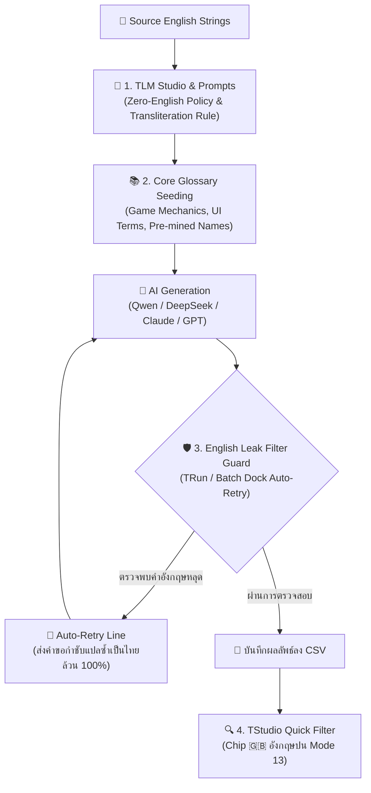

# 🛡️ ระบบป้องกันภาษาอังกฤษตกค้างและการแปลซ้ำอัตโนมัติ (TStudio & TRun Zero-English Leak Protection Guide)

เอกสารรวบรวมองค์ความรู้ด้านสถาปัตยกรรมและการทำงานของ **ระบบกำจัดคำภาษาอังกฤษตกค้าง (Zero-English Residual Policy & Leak Auto-Retry Guard)** สำหรับเครื่องมือ **TStudio** และ **TRun** ในการแปลม็อดเกมภาษาไทย

---

## 🌟 1. สาเหตุที่คำภาษาอังกฤษหลุดรอด (Root Causes)

1. **พฤติกรรม Code-Switching ของโมเดล LLM**:
   - ข้อมูลภาษาไทยบนอินเทอร์เน็ตที่โมเดลใช้เรียนรู้มักมีศัพท์เกมเมอร์แบบไทยปนอังกฤษ (เช่น *"ไปลง dungeon"*, *"ฟาร์ม exp"*, *"อัป stat"*, *"กด skill"*, *"บอส drop ของ"*) โมเดลจึงคิดว่าการตอบแบบนี้คือภาษาไทยที่เป็นธรรมชาติ
2. **ความลังเลในชื่อเฉพาะที่ไม่มีใน Glossary (Proper Nouns Dilemma)**:
   - เมื่อโมเดลพบชื่อตัวละคร, สถานที่, หรือไอเทมที่ไม่ได้ระบุไว้ใน Glossary โมเดลจะกลัวว่าแปลตรงตัวแล้วความหมายเพี้ยน จึงเลือกคงภาษาอังกฤษไว้
3. **คำสั้นและปุ่ม UI ถูกเข้าใจผิดว่าเป็นตัวแปรโค้ด (Short String Confusion)**:
   - คำสั้น 1–2 คำ เช่น *Inventory, Resume, Attack, Equip, Options* มักถูกมองว่าเป็น Code Constant หรือ ID ทำให้โมเดลไม่ยอมแปล
4. **ความล้าจากการแปลแบบ Batch ใน TRun**:
   - ใน Batch ขนาดยาว โมเดลอาจละเลยคำอุทานหรือสแลงสั้นๆ เช่น *Whoa!, Damn, Roger that, Hey guys*

---

## 🏛️ 2. สถาปัตยกรรมการแก้ปัญหา 4 ระดับ (Multi-Layered Architecture)



---

## 📝 3. ระดับที่ 1: การกำกับใน Prompt (Zero-English Policy)

ชุดคำสั่งมาตรฐานที่เพิ่มเข้าสู่แกนกลาง `DEFAULT_SINGLE_PROMPT`, `DEFAULT_OPTIONS_PROMPT` และ `assemble_prompts_from_context` ของ TLM Studio:

```markdown
STRICT LANGUAGE PURITY & ZERO-ENGLISH RESIDUAL:
1. ผลลัพธ์ต้องเป็นภาษาไทยล้วน 100% ห้ามมีคำภาษาอังกฤษหลงเหลือเด็ดขาด (ยกเว้นแท็กคำสั่ง เช่น {0}, %s, <tag>)
2. ห้ามเขียนแบบไทยคำอังกฤษคำ (No Code-Switching)
3. หากพบชื่อเฉพาะหรือคำศัพท์ที่ไม่มีใน Glossary ให้ "ถอดเสียงทับศัพท์เป็นภาษาไทย" ตามเสียงอ่านเสมอ (เช่น 'Quest' ➔ 'เควสต์', 'Night City' ➔ 'ไนท์ซิตี้', 'Attack' ➔ 'โจมตี', 'Inventory' ➔ 'ช่องเก็บของ')
```

---

## ⚙️ 4. ระดับที่ 2 & 3: ตัวตรวจจับและแปลซ้ำอัตโนมัติใน TRun (English Leak Guard)

### การทำงานของ `extract_english_leaks`:
1. **ตัดแท็กเกมและตัวแปรออกก่อน**: ลบแท็ก `<...>`, `{...}`, `[[...]]`, `%s`, `[TAG_...]`, และ URLs ออกจากสตริง
2. **ยกเว้นตัวย่อเกมสากล (Whitelisted Acronyms)**:
   - `HP`, `MP`, `SP`, `EXP`, `XP`, `AP`, `CP`, `DP`, `LV`, `LVL`, `UI`, `HUD`, `ID`, `OK`, `CD`, `FPS`, `NPC`, `AI`, `DPS`, `PVP`, `PVE`
3. **ยกเว้นคำเป้าหมายใน Glossary**: หากใน Glossary มีคำที่นักแปลกำหนดให้คงเป็นอังกฤษไว้ (เช่น *Nexus*, *HUD*) ระบบจะไม่นับเป็นคำหลุด
4. **สั่ง Reject & Auto-Retry ทันที**:
   - หากยังมีคำภาษาอังกฤษหลุดออกมาในโหมด Batch หรือ Single:
   - ระบบจะปฏิเสธบรรทัดนั้น และส่งคำสั่งแปลซ้ำพร้อมกำชับโมเดล:  
     `[CRITICAL: Previous translation left English words (...) untranslated. Translate or phonetically transliterate 100% of all English text into pure THAI!]`

### การตั้งค่าใน UI ของ TRun และ Batch Dock:
- เพิ่มช่องติ๊ก **`🇬🇧 กรอง/แปลซ้ำภาษาอังกฤษตกค้าง (English Leak Filter & Auto-Retry)`**
- เปิดใช้งานเป็นค่าเริ่มต้น (Enabled by default)

---

## 🔍 5. ระดับที่ 4: การคัดกรองด่วนใน TStudio (Quick Filter Chip)

บนแถบเครื่องมือของ **TStudio** ได้เพิ่มปุ่มชิปด่วน:
- **`🇬🇧 อังกฤษปน (X)`** (เชื่อมโยงกับ Filter Mode 13):
  - แสดงจำนวนแถวที่มีภาษาอังกฤษปะปนในคำแปลแบบเรียลไทม์
  - หากมีคำภาษาอังกฤษหลุด ตัวเลขจะแสดงเป็นสีส้มเด่นชัด (`#fab387`)
  - คลิก 1 ครั้งเพื่อกรองดูเฉพาะแถวที่มีปัญหา แล้วเลือกคลุมดำเพื่อกด **"📝 แปลทับศัพท์ (Transliterate)"** ได้ทันที

---

## 🩹 6. ฟังก์ชันแปลซ่อมคำอังกฤษเฉพาะจุดในบริบทประโยค (Contextual In-line English Patch)

เมื่อเลือกแถวหลายๆ แถว (Multiple Selection) แล้วพบว่าบางแถวมีคำภาษาอังกฤษหลุดรอดออกมา แทนที่จะแปลใหม่หมดทั้งประโยค (ซึ่งอาจทำให้สำนวนภาษาไทยเดิมที่แปลไว้ดีแล้วเปลี่ยนไป) ระบบมีฟังก์ชัน **แปลซ่อมคำอังกฤษเฉพาะจุด**:

### จุดเด่นและการทำงาน:
1. **คัดกรองอัตโนมัติ (Smart Filtering)**:
   - ตรวจจับแถวที่เลือกเฉพาะแถวที่มีคำภาษาอังกฤษตกค้าง แถวใดที่แปลเป็นภาษาไทยสมบูรณ์อยู่แล้วระบบจะข้าม (Skip) โดยอัตโนมัติ ไม่แตะต้องคำแปลเดิม
2. **แปลกลมกลืนกับรูปประโยค (Contextual In-Place Patching)**:
   - ส่งคำขอไปยัง AI พร้อมระบุ:
     - ประโยคภาษาอังกฤษต้นฉบับ (Original Source)
     - ประโยคภาษาไทยปัจจุบันที่มีคำอังกฤษหลุด (Current Thai with English)
     - รายชื่อคำภาษาอังกฤษเฉพาะจุดที่ต้องแก้ (English words to fix)
   - สั่งให้ AI แก้ไขเฉพาะคำอังกฤษเหล่านั้นให้กลมกลืนกับไวยากรณ์และบริบทของประโยคไทยเดิม เช่น:
     - *ต้นฉบับ*: `"Go to Night City to receive your Quest from Silverhand."`
     - *คำแปลเดิม*: `"เดินทางไปยัง Night City เพื่อรับ Quest จาก Silverhand"`
     - *ผลลัพธ์หลังแปลซ่อม*: `"เดินทางไปยังไนท์ซิตี้เพื่อรับเควสต์จากซิลเวอร์แฮนด์"`
     - (คำว่า *"เดินทางไปยัง"*, *"เพื่อรับ"*, *"จาก"* ยังคงสำนวนเดิมไว้ครบถ้วน ไม่แปลทิ้งใหม่ทั้งหมด)
3. **การเรียกใช้งาน (3 ช่องทาง)**:
   - **คลิกขวาที่ตาราง**: เลือก **`🩹 แปลซ่อมคำอังกฤษเฉพาะจุด (X แถว)`**
   - **ปุ่มบนหน้าต่างแปล**: กดปุ่ม **`🩹 ซ่อมคำอังกฤษ`** ด้านล่างกล่องแก้ไขคำแปล
   - **คีย์ลัดด่วน**: กด **`Ctrl + Shift + E`** ได้ทันที

